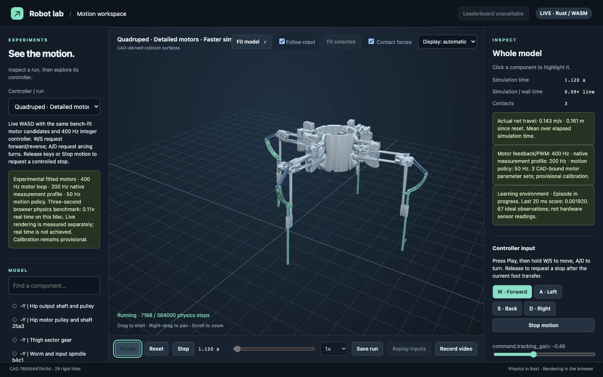
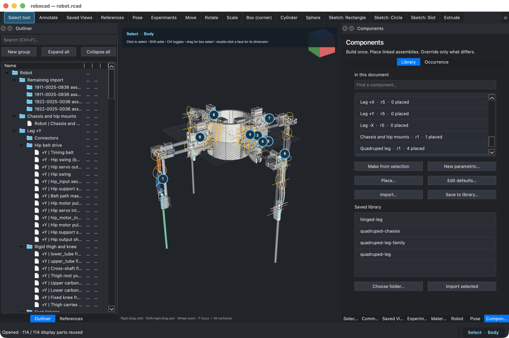
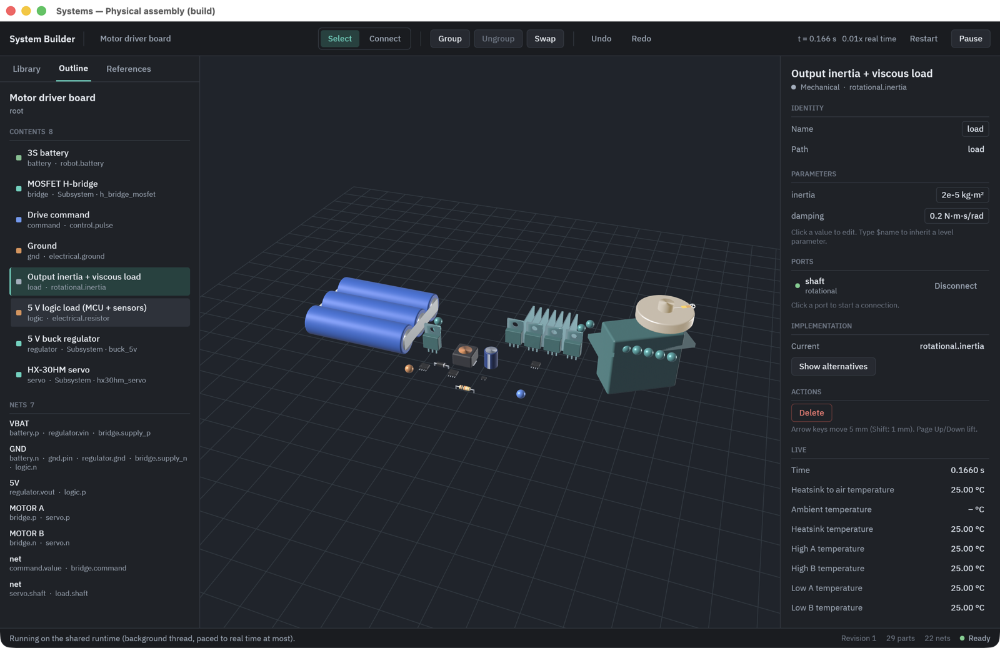
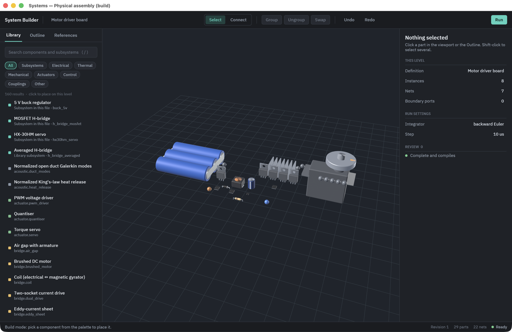
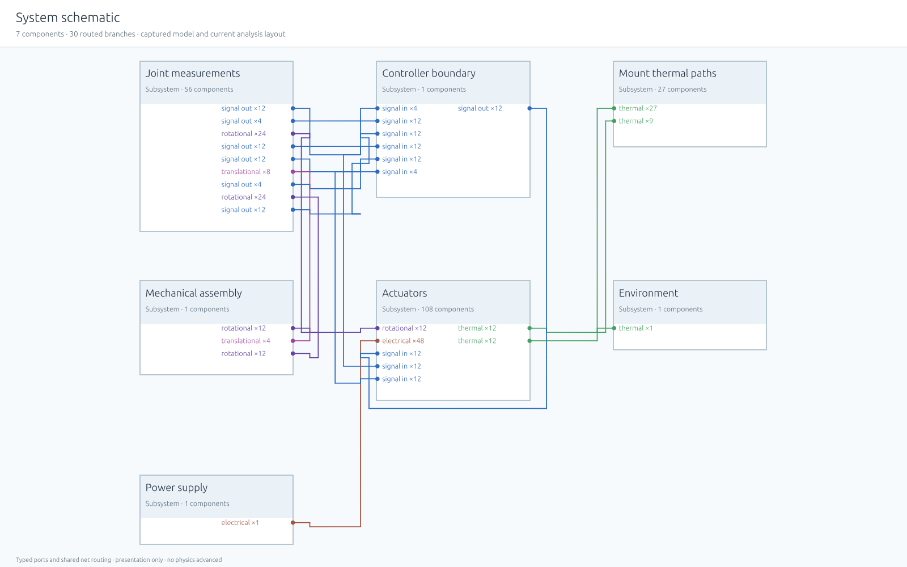

# Multiphysics Sim

**Design a robot in CAD, simulate every physical effect that matters, and run
the same controller on real hardware.**



A multiphysics simulator in Rust, built around one loop:
**CAD → physics → controller → measured result → back into CAD.** Mechanics,
motors, circuits, heat, magnetics, fluids, acoustics, sensors and controllers
connect through typed ports and are solved together. A quadruped robot proves
the loop end to end. It is designed in CAD, simulated with motors measured on
the bench, searched for gaits on cloud machines, walked in the browser and
driven on a physical leg through an FPGA.

## What's inside

- **One solver for many domains.** 17 domain libraries of reusable equation
  elements, one compiler and one implicit integrator. There is no special-case
  robot runtime.
- **CAD that owns the physics.** Compatible `.rcad` documents hold geometry,
  materials, joints, transmissions, actuators, sensors and limits, each with
  units and provenance. Native opening and mass inspection call OCCT from Rust;
  RoboCAD remains the behaviour reference for the remaining migration.
- **Linked viewers and a system builder.** A schematic view and a 3D physical
  view show one running system; select in one, see it in the other. Build
  hierarchical systems from a parts library, with component icons, responsive
  grid dragging and overlap checks. Placement is display-only; CAD owns physics.
- **Discussions on the model.** Click annotation pins that follow parts and
  groups, read Markdown replies, and ask Codex with project files and model
  context. Watch its activity or opt into automatic replies to new comments.
- **The same physics in the browser.** The Rust runtime compiles to
  WebAssembly. Drive the quadruped with WASD; commands go through its
  controller, never straight to the robot.
- **Gait search at scale.** Bayesian and CMA-ES optimizers explore thousands
  of gaits an hour on a qualified low-fidelity model. They scale to 96-core
  cloud machines. Gaits are also readable YAML files, so an LLM can write,
  score and refine them.
- **Real hardware in the loop.** HX-30HM servos behind an FPGA safety bridge,
  a calibration panel (native in the viewer's Robot mode, and in the
  browser), and a registry of measured motor models. What the bench measures
  is what the simulator uses.
- **Printable parts.** Split CAD parts to fit the printer and join them with
  pins, heat-set inserts or dovetails; check strength across the print layers
  under loads read from a running simulation; choose print direction and
  settings; lay out 3MF plates; write assembly steps; and break test coupons
  whose results replace the estimates in the print registry.
- **Controllers in any language.** Rust and Rhai natively; Python, C or any
  C-ABI library through a deterministic lockstep seam; a Gym-style interface
  for learning.

| | |
|---|---|
|  |  |
| **RoboCAD:** parametric legs, one edit updates all four | **Physical view:** a motor-driver board running live, tinted by temperature |
|  |  |
| **System builder:** place parts, wire typed ports, group, drill in | **Schematic:** the whole quadruped, 195 components in subsystems |

## Quick start

```sh
cargo run --release -p sim-spatial -- --phenomena --exhibit quadruped   # desktop exhibit (phenomena mode)
cargo run --release -p sim-phenomena --bin sim-phenomena -- list   # physics phenomena gallery
examples/systems-viewer/run-live.sh                           # linked schematic + physical views
cargo run -p sim-spatial -- examples/systems-builder/motor-driver-board/board.system.json   # native viewer; switch modes in the window
cad/run.sh examples/components/quadruped-parametric/model/robot.rcad   # CAD editor (RoboCAD, the reference)
cargo run -p sim-spatial -- examples/components/quadruped-parametric/model/robot.rcad   # the same document in the native viewer's CAD mode
```

Any window can open every mode's document from inside the window: pick a
mode in the switcher strip along the bottom, and if that mode has nothing
open, a document picker lists its robot presets, recent documents (kept in
your config directory, never in the repository), the repository's example
files and lesson or place folders, plus an "Open file…" path field.
`cargo run -p sim-spatial` with no arguments is enough to reach every mode.

The native viewer's global **Close viewer** control and ordinary window close
share an observable lifecycle: preserve study drafts, request hardware STOP,
then wait for acknowledged preferences and recent documents. Retry preferences,
Cancel close and an explicit preference-only exit remain visible while waiting.
The [close workflow source guide](docs/graceful-preference-exit.md) documents
commands, preservation rules and abrupt/platform-quit limits. This implementation
is reviewed by reading only; fixtures and interactive behavior remain unexecuted.

The browser workspace is built and served as described in
[web/README.md](web/README.md).

### CAD mode in the native viewer

`cargo run -p sim-spatial -- path/to/model.rcad` selects native CAD mode.
Opening, displayed B-rep bodies, body selection and mass/centroid/full inertia
inspection use shared Rust libraries and OCCT in the viewer process. The CAD
path picker and native REST `cad_open` use the same typed opening action.
No RoboCAD process, Python environment or CAD HTTP service belongs to these
paths. Building requires OCCT development headers and libraries; see
[the shared CAD crate](crates/sim-cad/README.md) for dependency setup and
[the source-review ledger](docs/cad-rust-physical-derivations.md) for supported
archive content and limitations. This implementation has not been built or run.

Full modelling, sketch editing, booleans, fillets, print/flex derivation and
physical simrobot export await Rust migration. Their native controls refuse
with a named migration status. Legacy RoboCAD and browser sources remain the
behaviour reference; their historical execution receipts do not establish
parity for this Rust replacement. See [the CAD ledger](docs/cad-parity.md).

### Leg calibration in the native viewer

Portable retained studies use **Open portable study** and **Save portable study**
in the existing offline Study panel. Transfer the one SIMSTUDY artifact, then reopen
at its new path; referenced exact inputs travel inside it. JSON saves still need
sibling `.study-inputs` companions, and HTML exports are inspection reports.
See the [portable Study guide](docs/portable-study-artifacts.md) for bounds,
compatibility and the source-only verification limits.
Legacy experiment review retains failed, cancelled and stale publication captures
for recovery as separate reviews. Publish recovered evidence to a fresh destination.
Portable limits are format-specific; JSON preserves its historical loading behavior
and checks reopening before publication.

Offline measured-PWM studies use **Build → Actuators → Measured evidence** in
this same window. Open an identification archive or saved review, edit exploratory
candidate parameters and conditions, evaluate captured trial sets, inspect comparison
traces, record decisions/notes, then save or export to a new filename. The
[source workflow guide](docs/native-identification-authoring.md) records the native
controls and REST path. T46 is implemented for reading-only review; compilation,
fixture execution and parity remain unverified. Controller/FPGA/power refinement
and accepted-model promotion still require their existing external workflows.

Native hardware runs in the viewer's process over shared Rust libraries:

```sh
sim-spatial --robot-preset robot-measured-400hz --hardware-config /absolute/path/calibration.json
# Add --motor-bench-config /absolute/path/bench.json for Sync motors.
```

These are launch instructions for a separately verified binary, not commands
executed in this batch. Open **Leg calibration**, then **Connect**. Configuration
names a direct serial device or an explicit simulated bench; no hardware server,
virtual socket server or acquisition executable is needed. Disconnect calibration
before Sync acquires the same device; pending release retains exclusive ownership.
The obsolete hardware URL/token flags refuse by name. Lessons lab steps use
`SIM_BENCH_CONFIG` with the same application; `SIM_BENCH_URL` is obsolete.
Physical motion needs the operator at the window. STOP remains independent during
long work, focus loss, panel close, disconnect and mode exit. A STOP latch does
not prove stationary readback; uncertain release requires motor power cutoff.

All five leg-in-process outcomes are implemented and reviewed by reading only:
no builds, tests, launches or hardware operation. See [source parity and operator
run sheets](docs/leg-in-process.md), [feature ledger](docs/hardware-parity.md)
and [hardware checklist](docs/hardware-checklist.md). Browser server examples
remain thin compatibility adapters. Virtual Sync is labelled host Bench simulation,
not FPGA equivalence. Native CAD opening and mass inspection now call OCCT
directly; the remaining CAD migration gaps are documented above.

## Principles

- **One execution path.** Desktop, browser, headless experiments and learning
  share one runtime and one observation/action contract.
- **Automatable editing.** Builder UI and REST controls share validation,
  commands and undo, including placement, discussions and agent controls.
- **Measured over assumed.** Every value states whether it was measured,
  derived or estimated. Uncalibrated physics is labelled as such.
- **Prove behavior, not animation.** Analytic cases, timestep sensitivity and
  real-time budgets are checked in CI.

## Learn more

| | |
|---|---|
| [CAD guide](cad/README.md) | Modelling, the CAD → sim loop, REST API |
| [Printable parts](cad/PRINTING.md) | Splitting, joints, strength from simulation, print settings, assembly, coupons |
| [System builder](examples/systems-builder/README.md) | Hierarchical systems and the motor-driver example |
| [Builder editing](examples/systems-builder/DISPLAY-EDITING.md) | Grid placement, discussions, Codex and REST control |
| [Browser workspace](web/README.md) | Building and serving the WebAssembly viewer |
| [Gait lab](examples/full-robot/measured-actuator-integration/gait-lab-2026-09-25/README.md) | YAML gaits, poses and LLM-driven search |
| [Motorized pendulum](examples/motorized-pendulum/README.md) | A small end-to-end CAD → controller → measurement example |
| [Control roadmap](control-roadmap.md) · [Domain roadmap](domain-roadmap.md) | Controller seam, sensing, domains and status |
| [Phenomena tests](surprise-tests.md) | The physics acceptance suite |
| [Project rules](AGENTS.md) | How the codebase is meant to grow |


Native offline electrical studies: use sim-spatial **Build → Actuators → Offline
measured-PWM study**, open an archive or saved review, then configure the source and
controller electrical feedback, simulate/predict, compare captured servo voltage or
a calibrated sidecar, review and save-new/reopen. See
[the bounded T52 navigation and source map](docs/native-power-authoring.md).
Implementation is source-reviewed only; no executed parity is claimed. FPGA refinement and Python/OCCT CAD retain their existing external workflows.
Native hardware acquisition/driving uses the shared in-process Rust sessions
described above; physical execution remains an operator check.
