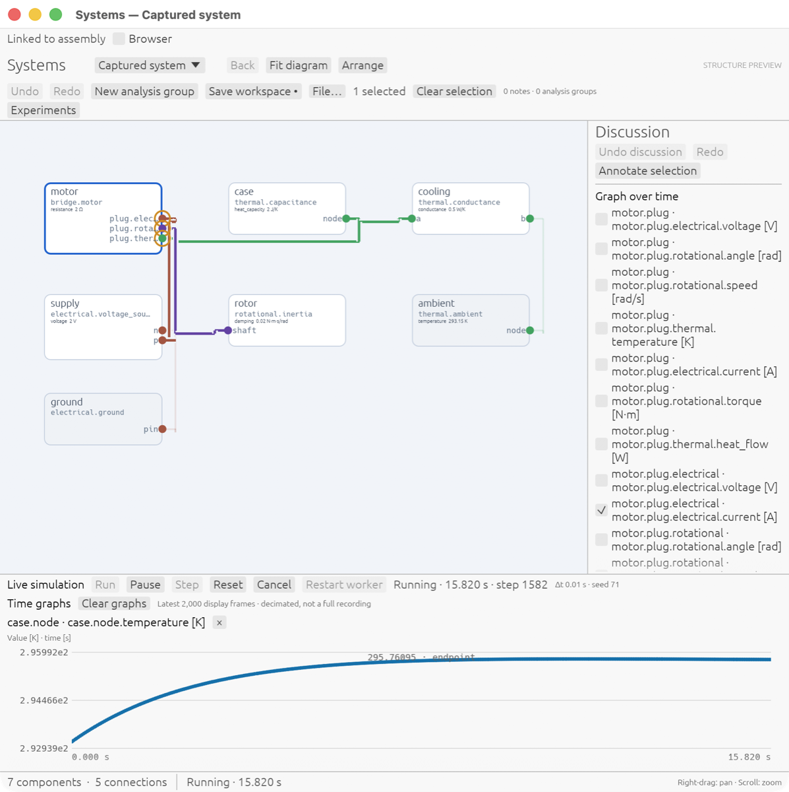
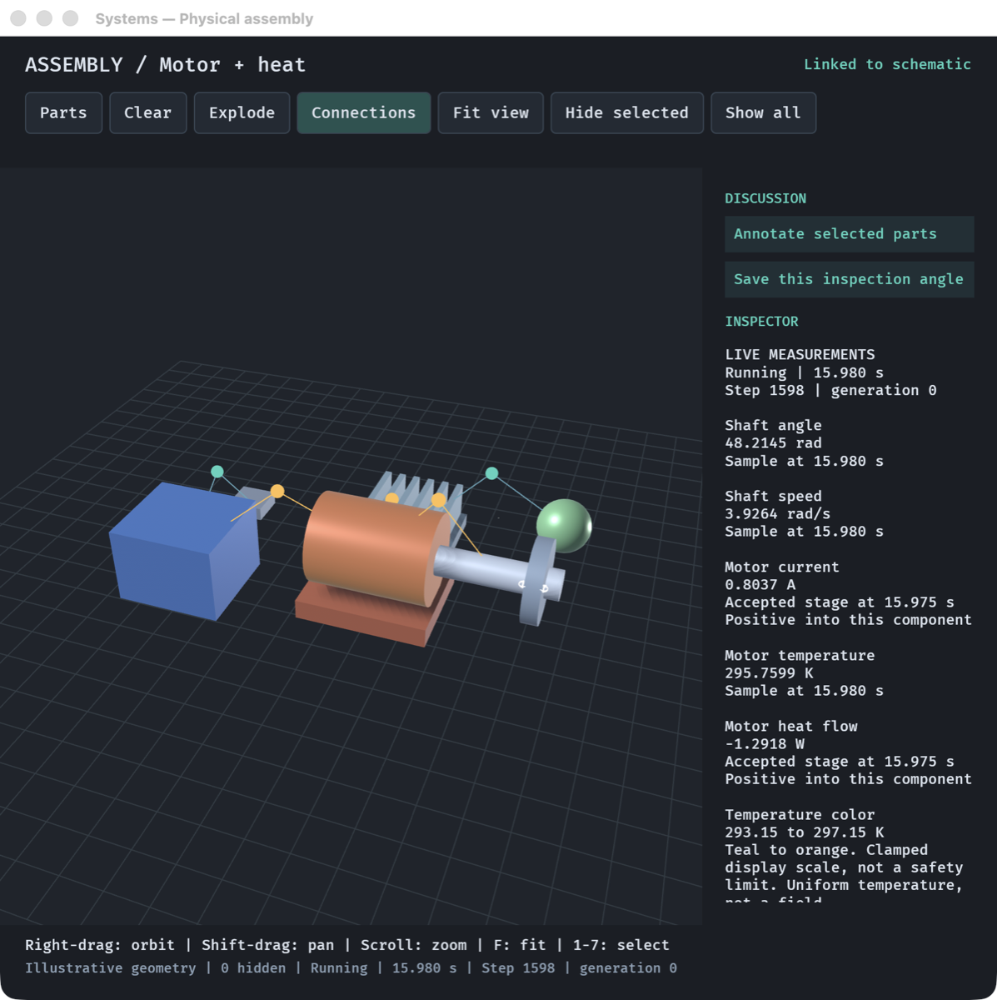

# Multiphysics Sim

A general multiphysics simulator in Rust. Any domain can join the solver
through reusable equation elements and typed ports: mechanics, motors,
electrical circuits, heat, fluids, acoustics, sensing and controllers so far.
A generic compiler and integrator runs the result. Around the solver sit a
CAD tool that owns the physical definition, linked schematic and physical
system viewers, and a browser workspace that runs the same Rust physics as
WebAssembly.

The quadruped robot is one instance of this system. It is designed in the CAD
tool, simulated with measured actuator models, and walked in the browser. It
exists to prove the whole CAD → physics → controller → measured-result loop
end to end.

The specialized actuator, three-joint leg and quadruped runtimes, their test
harnesses, fixed-topology dynamics and dedicated viewers have been removed.
All supported scenes use the generic runtime. The leg and quadruped phenomena
are models assembled from reusable elements.

## Tools

### CAD editor


RoboCAD (Python, OCCT, Qt) owns the robot's physical definition: geometry,
materials, joints, transmissions, actuators, sensors and limits, with units
and provenance. Legs are linked parametric components, so one edit updates all
four. Every window also serves a REST API on port 8420.

```sh
cad/run.sh examples/components/quadruped-parametric/model/robot.rcad
```

### Schematic and physical system viewers





Two linked Rust hosts present one compiled system. The schematic (egui) shows
components, typed ports and nets, and plots live measurements. The physical
view (Bevy) shows the assembly and animates it from the same run. Selecting a
component in one view selects it in the other. Both are driven by a background
simulation worker and expose REST control on ports 8422 and 8421.

```sh
examples/systems-viewer/run-live.sh     # live motor + heat example, both windows
cargo run -p sim-viewer -- --description examples/systems-viewer/full-robot.description.json
```

The full quadruped schematic groups 195 compiled components into subsystems:


### Browser robot workspace with WASD control


The browser runs the Rust runtime and controller as WebAssembly in a Web
Worker and renders the CAD-derived collision surfaces. Hold W, A, S or D to
drive the quadruped. Commands go through the controller rather than moving
the robot directly. Presets state their fidelity, calibration status and
measured speed relative to real time. Build and serve steps are in
[web/README.md](web/README.md).

```sh
node web/serve-viewer.mjs <built-viewer-dir> 4173   # then open http://127.0.0.1:4173
```

## Start with a reproducible CAD example

The [CAD + Rhai workspace](cad/EXPERIMENTS.md) adds captured system/controller
editing, background simulations, synchronized plots and CAD replay, candidate
review, comments and shared REST APIs. A registry-driven inspector and connection
view attach multiphysics components to CAD bodies with declared units and explicit
geometry derivations. Pendulum, two-joint and coupled electromechanical–thermal
examples exercise the loop with accuracy, reproducibility and CI performance
checks. The [delivery audit](experimentation-audit.md) maps requirements to evidence.

The [motorized pendulum](examples/motorized-pendulum/README.md) builds a CAD
assembly, exports its mass and inertia, runs a Python controller through
`sim-cad`, and checks the measured results. CI enforces analytic geometry checks,
tracking and torque tolerances, repeatability, timestep sensitivity and wall-time
budgets. It retains the CAD file, exchange model, controller logs and traces.

```sh
python3 -m venv cad/.venv
cad/.venv/bin/python -m pip install -r cad/requirements.txt
cargo build --release --locked --bin sim-cad
cad/.venv/bin/python examples/motorized-pendulum/run.py
cargo run --release -p sim-app -- --scene cad --model runs/motorized-pendulum/pendulum.simrobot.json
```

The CAD viewer uses the exported model's default zero target; use Up/Down to
change it. The benchmark supplies its two-step reference through the external
Python controller. See the example guide for Windows commands and tolerances.

## Explore and test

```sh
cargo run --release -p sim-app
cargo run --release -p sim-app -- --exhibit quadruped
cargo run --release -p sim-phenomena --bin sim-phenomena -- list
cargo run --release -p sim-phenomena --bin sim-phenomena -- kapitza-pendulum
cargo run --release -p sim-phenomena --bin sim-phenomena -- all --output runs/phenomena.json --html surprise-gallery.html
cargo test --release --workspace --exclude sim-app -- --skip every_exhibit_runs_in_real_time
```

The phenomena gallery shares model builders with the acceptance suite in
[surprise-tests.md](surprise-tests.md). `[`/`]` switch exhibits, Left/Right adjust
the knob, R resets, Space pauses, and Up/Down change speed. Drag to orbit and
scroll to zoom. The separate `every_exhibit_runs_in_real_time` test measures a
host-dependent viewer budget; the CAD example has its own explicit CI budget.

## Architecture and controller interfaces

Control code lives outside the plant. A `control.external` element is the plant's side of a seam: it samples its sensor channels at a fixed period, hands them to a `Coupler`, and holds the actuator channels that come back — in lockstep, on simulation time, so a run is reproducible to the bit whatever language the controller is written in. `sim-couple` carries the seam over a child process or a socket as newline-delimited JSON frames; `clients/python/simloop` and `clients/c/simloop.h` are stdlib-only clients (PI, leg and quadruped-gait examples in Python; P and quadruped-gait in C, the latter being what the viewer runs), `sim_couple::DynamicCoupler` loads a controller built as a shared library (any language with a C ABI) and calls it in-process at the cost of a Rust closure, and `sim_couple::RealTime` is the deliberately non-deterministic hardware-in-the-loop mode with a wall-clock deadline per sample. `sim-domain-sensing` supplies what a controller actually sees — encoders, tachometers, IMUs, current, voltage and force sensors with bandwidth, latency, sample-and-hold, quantisation, noise and faults — and the drivers and servos it commands. The plan and its status are in [control-roadmap.md](control-roadmap.md); plates 27–32 prove it.

Two solver facts worth knowing. Newton keeps its factorised Jacobian between iterations and between steps and rebuilds it only when a stale one stops halving the residual (a modified Newton; `sim_solve::solve_newton_cached`), and the Jacobian itself is assembled element by element — each behavior differentiated on its own inputs, analytically where it implements `Behavior::jacobian` (inertias, springs, dampers, sources, resistors, capacitors, inductors, brushed motors, rigid bodies, the seam) and by local differences elsewhere — rather than by whole-island differences. Together they cut solver-bound plates by two to six times. The factorisation is sparse (`faer`), so an island's step costs what its couplings cost rather than n³, and the compiler can eliminate the unknowns that are only bookkeeping — signal values, computed from their producers in dependency order, and rate lanes nobody provides or differentiates, taken as their base lane's rate — so the solver carries a reduced vector while the `StateStore` still sees every quantity (opt-in for now via `sim_compile::set_elimination(true)` or `SIM_REDUCE=1`: one plate's linearisation changes under it and the cause is still open). Plate 33 measures the scaling exponent on a ladder of a few thousand unknowns.

Environment mode turns the seam around for a learner: `sim_couple::Environment` is the contract (`reset(seed, level)`, `step(action)`, `snapshot`/`restore`), `sim_couple::serve` speaks it over stdio as newline-delimited JSON for a batch of environments stepped on parallel threads, `Runtime::snapshot`/`restore` save the plant state and clock (external controller state and island random-generator state are not included), and `simloop.Gym` is the Python side (`Gym.build(root, "walk-the-plank", envs=8)`, then `reset`, `step`, `snapshot`, `restore` on `(envs, ...)` arrays). The `sim-gym` binary serves the walk-the-plank task: a planar point-foot biped on procedurally generated stepping stones and stairs (`contact.point_terrain_compliant`, a curriculum `level` in `[0, 1]` opening the gaps), with the LIP stepping planner of "Walk the PLANC" running inside the environment and reporting its joint references and the CLF on the LIP error as privileged channels; `clients/python/examples/planc` trains a residual policy on them with a numpy PPO and a success curriculum, and plate 35 proves the pieces without learning.

Driving a plant from your own code, shortest path: author the model with a `control.external` element whose `sense.*` and `act.*` members are wired to sensors and actuators, compile it with `Runtime::new`, then `runtime.attach(seam, coupler)` with a `FnCoupler` closure, `sim_couple::python(...)`, `sim_couple::c(...)`, `DynamicCoupler::compile(...)`, `FrameCoupler::connect/accept(...)` or `RealTime::new(inner, deadline)`; step with `advance`, `advance_recording`, or `advance_adaptive`. Plates 27–32, 34 and 35 are worked examples.

The phenomena are authored as models of the system itself. `sim-core` gives behaviors an equation interface — states, a residual over their ports' across/through bundles, guards and jumps — and `sim-compile` turns a `ModelWorld` into one integrable island per connected component (`Runtime` steps it and commits every unknown to the `StateStore`). `sim-dynamics` is the domain-agnostic integration layer: a `System` is a residual over (state, rate), integrated by the implicit midpoint rule with coloured finite-difference Jacobians, consistent initialisation, event location and a linearisation for stability analysis. Domain crates (`sim-domain-*`) hold the reusable elements; `sim-phenomena` holds one model per phenomenon and the `Report` it produces.


See the [domain and connector roadmap](domain-roadmap.md), [control roadmap](control-roadmap.md), [architecture](index.html), and [CAD guide](cad/README.md).
