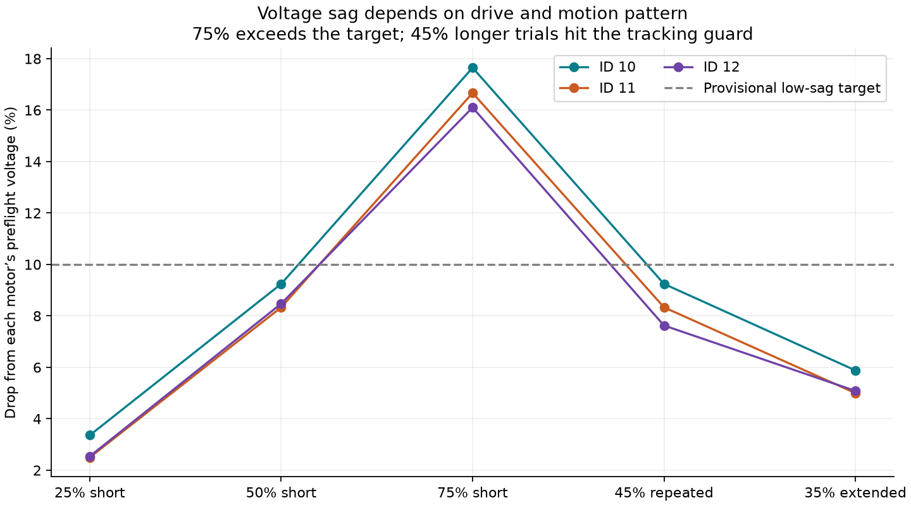
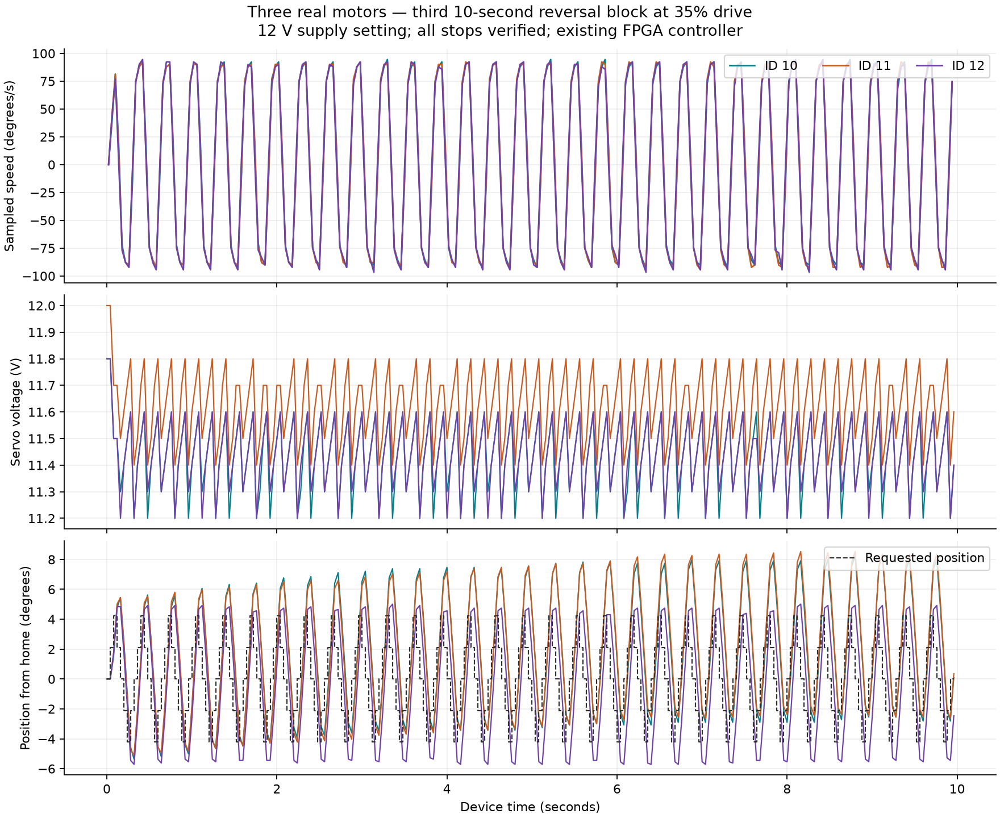
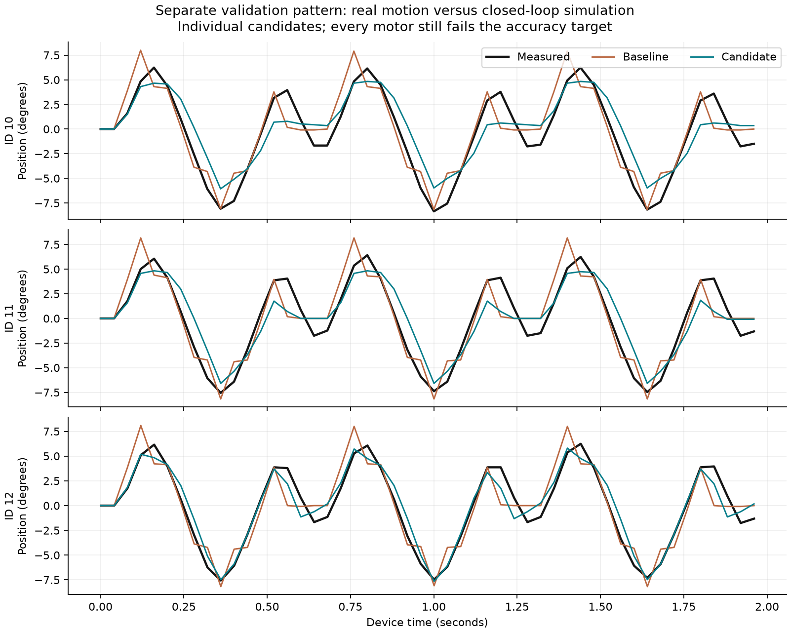

# Three-motor characterization — September 14, 2026

Actual FPGA-controlled motion was measured on IDs **10, 11 and 12** after the user
shortened the daisy chain and lowered the supply voltage. The initial 12.7 V report
prevented arming; subsequent preflight readings were 11.8–12.0 V. The current limit
was last reported as 3.5 A, not independently logged during this campaign.

**Main result:** less voltage sag with three motors, but aggressive repeated motion
exposes substantial controller overshoot and drift. No precise quadruped model or
controller is accepted from these unloaded tests.

## Physical results

| Pattern | Drive cap | Sampled peak speeds across motors | Minimum voltage | Worst drop from own preflight | Result |
| --- | --- | --- | --- | --- | --- |
| Short reversal, 0.20 s | 25% | 50.5–52.7 °/s | 11.5 V | 3.4% | Completed |
| Short reversal, 0.20 s | 50% | 96.7–98.9 °/s | 10.8 V | 9.2% | Completed |
| Short reversal, 0.20 s | 75% | 131.8–134.0 °/s | 9.8 V | 17.6% | Completed; further escalation withheld |
| Repeated reversals, 1 s | 50% | 125.3–131.8 °/s | 10.7 V | 10.1% | Completed; reduced drive for longer tests |
| Repeated reversals, 2 s | 45% | 114.3–116.5 °/s | 10.8 V | 9.2% | Completed |
| Reduced-amplitude reversals, three 10 s blocks | 35% | 90.1–96.7 °/s | 11.2 V | 5.9% | All three blocks completed |

The long 35% test totals **30 seconds of commanded time**, separated by stop,
review, fresh preflight, upload and rearm. It is not one uninterrupted 30-second
run. Maximum observed temperature was 50 °C. The cap is the maximum magnitude of
signed PWM, not a requested percentage of maximum shaft speed.

Eighteen device captures retain **1,402 complete frames / 4,206 audited motor
updates**: 16 completed captures (including one zero-drive check) and two retained
interruptions. All final stop checks passed. Three fresh independent watchdog
probes also passed at low drive on ID 12, verifying autonomous zero/off and
stationary tails. The same previously commissioned image and physical S2 behavior
were retained; no image or controller-gain change was made during this campaign.

Final independent inspection confirms all three motors PWM zero, torque disabled,
reported speed zero and supervisor latched with armed mask zero.

[Complete machine-readable campaign summary](campaign-summary.json) ·
[Final inspection](final-inspection-01/run.json)

## Shared power-path evidence

With only one motor moving through the same 45% pattern and all three controllers
armed, voltage sag was approximately 2.5–3.4%. With all three moving it was
7.6–9.2%. The other two motors' audited PWM stayed zero in each individual test.
This supports a shared electrical effect; it does not identify resistance or prove
where the voltage is lost. Servo voltage telemetry has 0.1 V increments and no
independent sensor-age or calibration bound.

At 50%, these same IDs previously reported minima of 9.4, 9.7 and 9.6 V on the
nine-motor chain; they now report 10.8, 11.0 and 10.8 V. The supply setting also
changed from reported 12.6 V to nominal 12.0 V, so this is not a controlled
measurement of wiring resistance. The old nine-motor 0.86 A / CV observation was
not a synchronized reading for these new tests.

A drop below 10% was used as a provisional low-sag diagnostic target, not a
manufacturer rating. The original hard voltage, temperature, current-register,
travel, tracking-error and watchdog limits were unchanged. A 100% plan remains
prepared but was **not executed** because of the 75% result.



## Controller limitations and retained failures

Two attempted 10-second 45% runs stopped at approximately 4.64 s and 3.36 s.
The supervisor reported broad bridge reason 11; the complete terminal event was
recovered from the quarantined stream into separate diagnostic artifacts. At the
interrupted control requests, motor 11's measured target error was respectively
**102 and 101 counts**, exceeding the compiled 100-count guard. This is consistent
with the controller error guard; the broad reason code alone does not expose its
internal subcondition. Both runs finished with independently verified stopping.
Neither was relabeled successful or admitted as completed fitting data.

[First fault analysis](extended-fast-group-450-01/fault-analysis.json) ·
[Reduced-amplitude fault analysis](extended-fast-small-group-450-01/fault-analysis.json)

The successful 35% runs still overshoot and show several degrees of center drift.
Their completion demonstrates bounded execution for those trials, not precise
tracking or indefinite reliability. The plot includes the requested position so
this limitation is visible.



[Exportable response plot](extended-response.pdf)

## What the measurements establish

Speed and acceleration estimates come from the shared Rust `motor_response`
analyzer, used for both physical and simulated traces. Reported peak speeds are
40 ms encoder interval averages. Acceleration compares separated speed intervals;
its estimates and uncertainty bounds are saved per capture. These are not
instantaneous maxima. Sample-age uncertainty remains unbounded.

The present ±80-count maximum target envelope, 40 ms cadence and oscillating
controller response do not establish a settled top-speed plateau, exact full
speed-up time, or complete reversal-and-settling time. Those remain unresolved.
Current-register values remain raw and uncalibrated: measured amps, watts, battery
behavior and loaded leg/joint behavior cannot be validated from this bench alone.

## Model comparison and remaining work

Separate 35–45% training captures include faster/slower synchronous motion and
one-moving-motor trials. A distinct hold/reversal pattern was recorded as validation.
Individual bounded model fits use only original training cases for optimization,
with the established three parameter bounds and an 80-evaluation budget per motor.
Prior validation influence is explicitly retained. Timing-only diagnostics and
interrupted captures remain excluded. Fit outcomes are recorded separately; a
candidate is not automatically promoted into CAD or accepted as calibrated physics.

The bounded fits completed in 48, 65 and 31 evaluations for IDs 10, 11 and 12.
Several coordinates reached or approached their bounds. We did not expand those
bounds or change the accuracy target to pass a candidate.

On the distinct validation pattern, the shared controller running on simulated
feedback produced these position-prediction RMS errors:

| Motor | Baseline | Candidate | 0.264° gate |
| --- | --- | --- | --- |
| 10 | 1.793° | 1.914° | Fail |
| 11 | 1.723° | 1.762° | Fail |
| 12 | 1.654° | 1.085° | Fail |

The recorded-PWM replay comparison improves for all three candidates, but the
closed-loop comparison regresses for IDs 10 and 11. **No candidate is promoted.**
This comparison uses independent axes at each motor's mean recorded voltage;
it does not yet reproduce the observed time-varying shared power path. New
candidates are exploratory and prior validation influence remains declared.

[Validation comparison](model-validation-summary.json) · [Full fit scores](fit-summary.json)



An identical frozen candidate replay in a fresh process reproduced every per-motor
RMS score exactly; [repeatability check](prediction-repeatability-check.json).

Next priorities are to address overshoot/drift in the shared controller, validate
that change in simulation and on hardware, and expand the commissioned measurement
envelope to resolve settled speed and reversal time. Power-path identification
needs independent electrical sensing; loaded quadruped validation needs the leg.

## Reproduction and provenance

The Rust autonomous acquisition adapter uses an explicitly declared physical
scope of IDs 10–12 and checks every scoped motor at preflight and stop. Missing
replies never silently reduce the scope. All active IDs must belong to that scope.
Thirty relevant Rust tests passed before this hardware campaign. Seven initial
plans compiled offline; acquisition also compiles and validates every executed
plan before arming. The older standalone fitting executable initially rejected
full-drive plans; rebuilding it from current Rust source resolved that mismatch.

Each capture retains the plan, uploaded bytes, image copy, device-clock packets,
PWM and torque audits, original UART stream, host source, cleanup and telemetry.
`analysis-source/` snapshots the shared analysis code. Failed original captures
remain untouched; supplemental terminal recovery is clearly labeled.

Run the shared motion analyzer through `review_capture.py`; its Python wrapper
only summarizes telemetry and calls Rust. Render figures with:

```sh
uv run --with matplotlib python examples/actuators/hx30hm/hardware/2026-09-14-three-motor-characterization/plot_results.py
```

`SHA256SUMS.json` inventories this evidence directory. No CAD, accepted model,
controller gains, firmware image or physical protection thresholds were changed.
