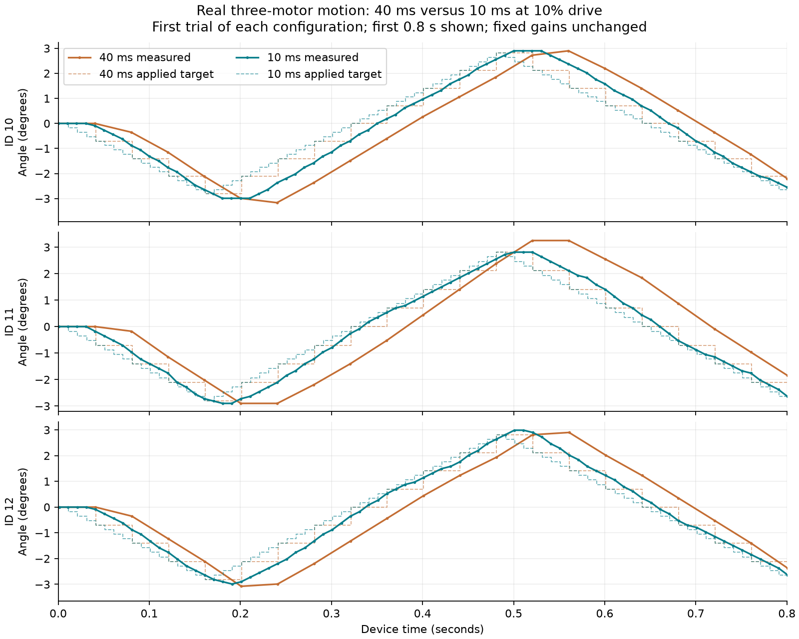

# Faster FPGA loop — September 15, 2026

**Actual 10 ms / 100 Hz motion now passes on IDs 10–12 at 5% and 10% drive.**
Seven physical captures completed: a two-second zero-drive check, one two-second
5% fast-loop run, three two-second 10% fast-loop runs, and two matched-duration
40 ms / 10% baseline runs. All stops were verified. No model was fitted/promoted.
The old 40 ms floor was a commissioning choice, not a measured motor limit.

## Measured outcome

- **1,100 complete frames / 3,300 audited motor updates**, with exact shared-controller
  arithmetic agreement and torque/PWM readback coverage.
- First-axis request intervals: 9.99822 ms once at startup, then 10.00000 ms.
  Per-axis minima/medians/maxima are in `results.json`; later axes remain serial.
- Complete three-axis read/control/audit transaction windows never exceeded 3.646 ms
  across the five 100 Hz captures. There were no observed missed frame deadlines.
- Minimum measured motor voltage across motion trials: 11.7 V. Maximum temperature:
  44 °C. Current registers remain uncalibrated; no amps/watts/battery claim.
- Fresh independent command-loss, telemetry-loss and all-host-traffic-loss watchdog
  tests passed at low drive. The physical S2 motion-stop result is inherited from
  the previous commissioning; this campaign did not repeat that manual motion test.
- Final inspection confirms all three motors PWM zero, torque disabled, speed zero
  and the supervisor latched with armed mask zero.

Pooled RMS error against each configuration's **previous applied discrete setpoint**:

| Motor | 40 ms, two trials | 10 ms, three trials | Reduction |
| --- | --- | --- | --- |
| 10 | 0.656° | 0.469° | 28.5% |
| 11 | 0.683° | 0.365° | 46.5% |
| 12 | 0.560° | 0.320° | 42.9% |

The faster configuration improves this metric, but every pooled RMS remains above
our unchanged 0.264° target. This is not a continuous-reference error comparison
on a common sample grid: the applied setpoint staircase and per-tick feedforward
change with cadence. It does not isolate the contribution of sample rate alone.

[Machine-readable results](results.json) · [Final inspection](final-inspection-01/run.json)

No 5 ms loop, high-drive fast-loop stress test, exact reversal/settling time,
or internal sensor-age bound is established. Encoder changes are retained per
capture, but repeated/changed quantized values alone cannot certify sensor freshness.

## Implementation

- Shared Rust plan/upload/receipt validation and the FPGA scheduler/trajectory
  store allow periods down to 10 ms only for masks selecting at most three motors.
  Larger masks retain the 40 ms floor. No sub-10 ms operation is enabled.
- PWM, voltage, temperature, raw-current, travel and tracking-error thresholds,
  independent 200 ms feedback / 300 ms command watchdogs, and S2 are unchanged.
- The compiled controller still uses the same 4096/0/4096 fixed gains. Its
  feedforward term consumes target change per tick, so matched physical trajectories
  at different cadences do not keep that term's physical effect identical.
  Cadence comparisons must not claim to isolate sampling rate from controller tuning.
- Stop verification now retains a time window rather than only 32 samples. The
  same minimum 150 ms stationary evidence and final PWM-zero/torque-off checks apply.
- The 256-frame capacity is unchanged: one 10 ms capture can last at most 2.56 s.
  The prepared matched-duration captures last two seconds.

## Verification and provenance

`verification/` retains Rust tests and complete UART simulations. Normal 10 ms
execution plus missing feedback, lost heartbeat, operator STOP, corrupt PWM audit
and slow-host/backpressure scenarios are reviewed through the shared Rust event
parser. Synthetic stationary replies exercise full-scale command arithmetic but
are not motor measurements or calibration data.

Two test failures were retained and addressed without weakening production guards:

1. The slow-link test armed motors before uploading 25 rows and correctly hit a
   feedback timeout during the upload. The test now matches the real host's
   upload-while-unarmed ordering.
2. The fast mocked host could read 32 stationary samples in less than 150 ms.
   Count-limited retention therefore could never verify the required duration.
   The host now retains at least 250 ms with a boundary predecessor.

`source/` freezes changed source and relevant unchanged protection code. The FPGA
image has independent output paths; September 14 images and measurements remain
preserved. `build/build.log` records synthesis, placement, routing and packing.

## Physical sequence

The first read-only attempt received no bridge reply. Restoring the previously
qualified supervised SRAM image restored communication. IDs 10–12 then reported
11.8–12.0 V, 37–39 °C, PWM zero, torque off and speed zero. This restoration was
within the user's standing authorization for powered image reloads.

The new image passed routing at 50 MHz (59.62 MHz reported maximum), was loaded
into SRAM, and passed the live watchdog, zero-command and bounded motion trials
reported above. Plans are bound to its frozen BLAKE3 image identity before execution.
The prepared 25% plans were not run in this initial low-drive qualification.

Faster UART transactions do not establish the servo's internal sensor refresh
rate. Record changed/unchanged encoder samples and timing windows; retain unknown
sensor age. Use both 10 ms differences and a 40 ms estimator window when comparing
velocity, so quantization is not mistaken for a performance change.

## Next work

1. Assess tracking on a declared common physical reference/time grid, then tune
   the shared controller explicitly for 10 ms rather than relying on unchanged
   per-tick gains. Preserve these baseline captures.
2. Measure how often the servo produces genuinely new internal feedback, and
   distinguish quantization from stale samples with appropriately varied motion.
3. Qualify progressively higher drive and longer captures, including fresh manual
   S2 motion stopping for the expanded operating envelope. The current 256-row
   storage limits 100 Hz runs to 2.56 seconds each.
4. Evaluate a 5 ms profile only after deadline, logging and sensor-freshness evidence
   supports it. No arbitrary protection thresholds were relaxed to pass these tests.
