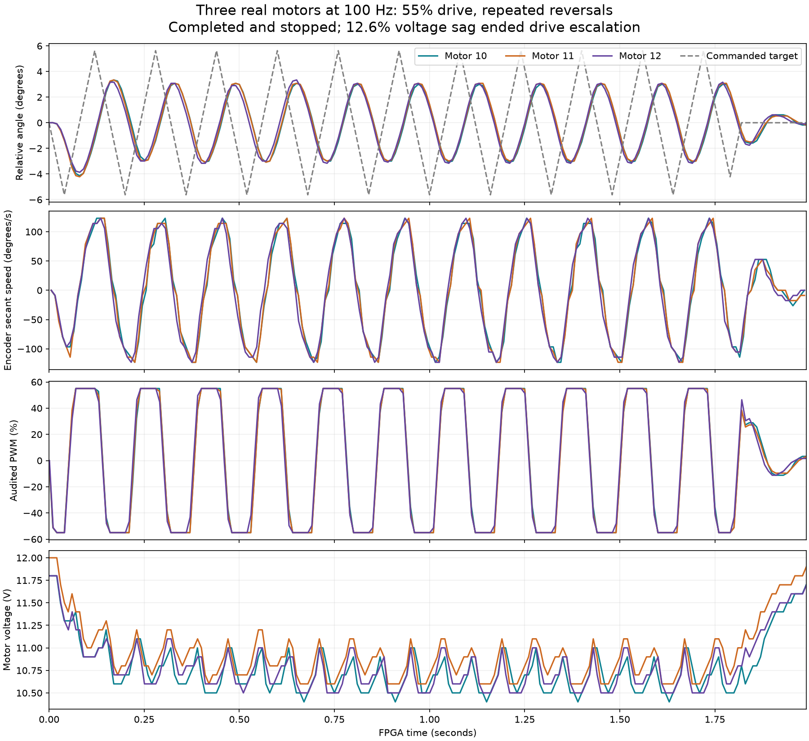

# Three-motor high-speed stress — September 15, 2026

**Nine physical 100 Hz reversal trials completed on IDs 10–12, reaching 55% PWM.**
All three motors moved together. Every capture contains 200 complete frames and
verified stopping: 1,800 frames / 5,400 audited motor updates in total. The commanded
motion totals 18 seconds in separate two-second bursts, with upload, preflight,
stop and review gaps; this is not an 18-second continuous endurance qualification.

## Results

| PWM cap | Bursts | Range of measured peak speeds across motors/trials | Worst voltage sag | Maximum temperature |
| --- | --- | --- | --- | --- |
| 20% | 1 | 53°/s | 1.7% | 45°C |
| 25% | 1 | 70°/s | 3.4% | 45°C |
| 35% | 3 | 88–114°/s | 5.9% | 45°C |
| 45% | 3 | 106–123°/s | 8.5% | 45°C |
| 55% | 1 | 123°/s | 12.6% | 45°C |

Speed values are peaks of encoder secants over approximately 10 ms, not sustained
or settled maximum speeds. The 114°/s sample in a 35% repeat illustrates why an
isolated peak should not be treated as a speed rating. Internal sensor sample age
remains unknown. Raw feedback and shared Rust estimator results are retained.

The 55% trial reached 10.4 V at motor 10, down from its 11.9 V preflight reading.
This exceeded our predeclared 10% sag gate for further escalation, so no higher-drive
trial was attempted. This was a post-capture escalation decision, not an FPGA fault:
all nine captures completed without protection trips. Lower-drive 35% and 45%
repeats followed and stayed below the gate. Final readback was PWM zero, torque
disabled, speed zero for all three, with supervisor armed mask zero.

At 55%, tracking RMS error was 3.90° / 3.83° / 3.59° for IDs 10 / 11 / 12,
respectively. Every stress capture fails the unchanged 0.264° RMS accuracy target.
The motors lag the rapid reversals and do not reach the target excursions. These
are useful stress observations, not accepted precise-controller or sim-to-real results.
Increasing drive from 45% to 55% on the same target pattern did not improve tracking.

[Per-capture/per-motor results](results.json) · [Verification](verification.json) ·
[Final hardware inspection](final-inspection/run.json) · [PDF trace](stress-trace.pdf)

## Experiment and provenance

- The FPGA image and fixed controller are unchanged from the
  [100 Hz qualification](../2026-09-15-fast-loop/README.md). Its frozen source,
  build logs and independent-watchdog evidence remain there. No reload was needed.
- Every motion plan is saved under `plans/`; each acquisition saves its actual
  homes, source identity, compiled upload, receipt, controller arithmetic checks,
  raw UART, telemetry, PWM/torque audits and stop recovery evidence.
- Fixed gains are Kp/Kd/Kv = 4096/0/4096 in Q8. Only the experiment's PWM ceiling
  and target trajectory change. The 45% and 55% trials use identical trajectories.
- Symmetric triangle targets use step/amplitude pairs 6/48, 8/64, 12/60 and
  16/64 encoder counts at 20%, 25%, 35% and 45–55%, respectively. At the highest
  settings the target changes direction every 80 ms during the repeated section.
  The final 200 ms returns toward zero. Full trajectories, including the initial
  negative quarter-cycle, are in the saved plans.
- Each complete read/control/audit transaction window was below 3.646 ms within
  the 10 ms cycle. Shared Rust arithmetic matched every frame and all three
  torque-enable registers were audited each frame.
- FPGA protections remain unchanged: 9.0–12.6 V, 60°C, raw-current threshold 2000,
  feedback/command watchdogs, tracking/travel guards and operator stop. The host
  retains its existing limits. Physical S2 evidence comes from prior commissioning;
  this campaign did not repeat the manual button test.
- The finite repeat script stops further trials after an incomplete run,
  unverified stop, >=10% observed sag or >=52°C. These are campaign escalation
  gates and do not alter FPGA trip thresholds.
- Servo current is recorded as an **uncalibrated raw register**. Any legacy
  `current_a_uncalibrated` field is not validated amperage. No measured total
  supply current, watts, battery impedance or wiring-resistance claim is made.

## What remains

Tune and validate reversal tracking at 100 Hz using these retained baselines,
measure bounded reversal/settling times with a suitable reference, and compare
per-motor model predictions against held-out captures. No model fitting or promotion
occurred in this campaign. Longer continuous 100 Hz captures require extending the
current 256-frame storage path; these bursts do not establish thermal endurance.

`SHA256SUMS.json` covers the campaign files; `provenance.json` links the existing
frozen FPGA image. `summarize.py` and `plot_results.py` only summarize/plot evidence;
kinematic estimates and tracking scores come from the shared Rust analyzer.
