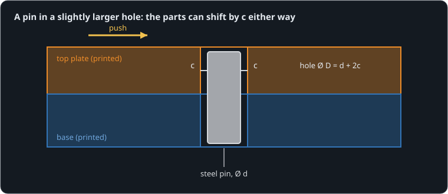
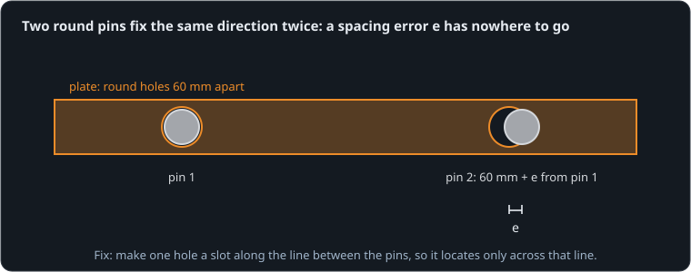

# Parts that go back where they were

**By the end of this lesson you will be able to:**

- size a hole for a pin, and say how far the parts can shift;
- predict how stiffly a pin holds once it touches;
- place two pins so they locate a part without fighting.

Screw two printed halves together, take them apart, and screw them back: they rarely sit exactly where they were. The screws pass through clearance holes that are a few tenths of a millimetre bigger than the screw, so the halves can land anywhere within that. Screws clamp; they do not locate. Here a [steel pin](part:pins/pin) in the [base](part:pins/base) fixes where the [top plate](part:pins/plate) sits, while a hand pushes the plate sideways.

## Room around the pin

A pin needs a hole a little larger than itself, or the parts will not go together. The difference is the **clearance**. On each side of the pin there is a gap c, so the plate can shift by c one way or the other before the pin touches the hole's wall.



```text
c = (D − d) / 2
```

Here D is the hole's diameter and d the pin's.

**Worked example.** A Ø3.0 mm pin in a Ø3.2 mm hole: c = (3.2 − 3.0) / 2 = 0.1 mm. The plate can sit anywhere in a band 2c = 0.2 mm wide. That is the model's pin: c = {{param pins/pin.clearance | 0.1 mm}}.

```sim-quiz
id: band
kind: numeric
question: A Ø3.0 mm pin sits in a Ø{hole} mm hole. How wide is the band the plate can sit in, side to side, in millimetres?
vary: { hole: { min: 3.05, max: 3.4, step: 0.05 } }
answer_expr: hole - 3.0
tolerance: 2%
unit: mm
hints:
  - "The band is the room on both sides together."
  - "Each side has c = (D − d)/2; the band is 2c."
  - "2c = D − d."
explain: "The band is 2c = D − d: for a Ø3.2 mm hole, **0.2 mm**. Each review asks with a different hole."
concepts: [clearance-fit]
```

## Once it touches, it is stiff

Past the clearance, the pin bears on the walls of both holes. A printed wall pressed along a length L acts like a stiff spring, roughly E·L, where E is the plastic's **stiffness modulus** (about 3.5 GPa for PLA). The pin's two holes give way in series, which halves it:

```text
k ≈ E · L / 2
```

**Worked example.** With 6 mm of pin in each part: k ≈ 3.5 GPa × 0.006 m / 2 ≈ 10 MN/m. A 20 N push then adds only 20 / 10 000 000 m = 0.002 mm beyond the clearance. The model's pin gives {{param pins/pin.engaged | 6 mm}} of engagement and walls of {{param pins/pin.wall_modulus | 3.5 GPa}}.

So nearly all the shift you can feel is the clearance; the pin itself hardly moves.

```sim-quiz
id: predict-shift
kind: predict
scene: push
question: The hand pushes the plate ±20 N. How far will the plate move to one side of centre at most, in millimetres?
observe: plate.axis.position
reduce: max
window: [2.0, 4.0]
tolerance: 5%
unit: mm
explain: "c + F/k = 0.1 + 0.002 ≈ **0.102 mm**: the clearance, plus a hair of the walls giving way."
concepts: [clearance-fit, locating-pins]
```

```sim-scene
id: push
system: pins
title: Pushing a pinned plate sideways
caption: "A hand pushes the plate ±20 N, once every two seconds. Its sideways movement is drawn 150 times larger so you can see it (0.1 mm would be invisible). The plot of push against position is flat while the plate crosses the gap, and almost vertical once it rests on the pin."
companion: { label: "Press fit (no clearance)", set: { pin.clearance: 0 }, mode: ghost }
camera: { preset: iso, zoom: 1.4 }
run: { duration_s: 4.0, frame_rate: 400 }
script: push.rhai
magnify: 150
plots: [plate.axis.position, push.force]
phase: [{ x: plate.axis.position, y: push.force, title: "Push against position: sideways runs are the clearance" }]
show: [forces]
sliders:
  - { parameter: pin.clearance, label: "Clearance per side (c)", min: 0, max: 0.0003, step: 0.00002, unit: m }
hints:
  - "Set c to 0: the flat runs vanish, and the plate hardly moves at all."
  - "Double c: the runs double, while the steep ends stay just as steep."
expect:
  - { observe: plate.axis.position, reduce: max, window: [2.0, 4.0], min: 0.000099, max: 0.000106, why: "Clearance plus the walls' give: 0.1 + 0.002 mm." }
  - { observe: pin.load, reduce: max, window: [2.0, 4.0], min: 19.0, max: 20.5, why: "At the far end the pin carries the whole 20 N push." }
  - { observe: plate.axis.position, reduce: change, window: [2.95, 3.25], max: -0.00018, why: "Just after the push reverses at 3 s, the plate slides across the whole 0.2 mm band." }
```

The plate reaches {{value scene=push observe=plate.axis.position reduce=max window=2..4 | 0.102 mm}} from centre while the pin carries {{value scene=push observe=pin.load reduce=max window=2..4 | 20 N}}.

```sim-quiz
id: steep
question: "On the plot of push against position, what does the almost vertical part at each end mean?"
options:
  - { text: "The plate is resting on the pin: more push hardly moves it", correct: true, feedback: "Yes. Once the wall meets the pin, 10 MN/m of stiffness means 20 N moves it only 0.002 mm." }
  - { text: "The plate is sliding freely", feedback: "That is the flat part: position changes while the push is small." }
  - { text: "The pin is bending", remedy: bending, feedback: "The pin barely bends: the printed walls give far more than steel does." }
moment: 1.6
explain: "Flat runs are the clearance being crossed; the steep ends are the pin bearing on the walls."
concepts: [locating-pins]
```

```sim-remedy
id: bending
misconception: "The play comes from the pin bending."
body: "A steel pin is about 60 times stiffer than printed PLA, and it is short. Almost all the give is the plastic wall, and almost all the movement you can feel is the clearance. Make the clearance smaller or the pin longer in the wall, not the pin thicker."
scene: push
then: steep
```

## Printed holes come out small

A printer draws a hole as a polygon, and the first layers squash outward into it, so printed holes usually come out 0.1–0.2 mm smaller than drawn. A hole drawn at exactly 3.0 mm may not take a 3.0 mm pin at all.

**Worked example.** You want 0.1 mm of clearance per side on a Ø3.0 mm pin (a Ø3.2 mm hole), and your printer makes holes 0.15 mm small. Draw the hole at 3.2 + 0.15 = 3.35 mm.

```sim-quiz
id: undersize
question: A test print shows your holes come out 0.2 mm under their drawn size. You want a sliding fit on a Ø4 mm pin with 0.1 mm of clearance per side. What diameter do you draw?
options:
  - { text: "4.4 mm", correct: true, feedback: "Yes: 4.0 + 2 × 0.1 = 4.2 mm wanted, plus 0.2 mm the printer takes away." }
  - { text: "4.2 mm", feedback: "That is the size you want the hole to come out; the printer will make it 4.0 mm, a tight press." }
  - { text: "4.1 mm", feedback: "0.1 mm is the clearance on one side; the hole needs it on both sides, plus the printer's shrinkage." }
explain: "Draw = wanted size + the printer's undersize: 4.2 + 0.2 = **4.4 mm**. Print a small fit coupon with a few sizes once, and keep the number."
concepts: [clearance-fit]
```

## Two pins, one direction

One pin locates a point, but the plate can still turn around it. A second pin stops the turning. Now suppose the holes are not quite as far apart as the pins, by an error e. Along the line between the pins, both now fix the same direction, and there is only 2c of room to absorb e. This is **over-constraint**: past that room, the pins push the plate between them, and the force stays locked in with no load applied.



```text
F ≈ k · (e/2 − c)
```

**Worked example.** Holes 0.2 mm too far apart, 0.05 mm of clearance per side: F ≈ 10.5 MN/m × (0.1 − 0.05) mm ≈ 525 N on each pin, enough to crack a printed wall or make the part impossible to press on.

```sim-quiz
id: predict-lock
kind: predict
scene: lock
question: The second pin is 0.2 mm off; each hole has 0.05 mm of clearance. With no load at all, how hard will the first pin push on the plate once it settles, in newtons?
observe: pin1.load
reduce: final
window: [0.05, 0.1]
tolerance: 5%
unit: N
explain: "k·(e/2 − c) = 10.5 MN/m × 0.05 mm ≈ **525 N**, and the second pin pushes back just as hard."
concepts: [over-constraint]
```

```sim-scene
id: lock
system: twopins
title: Two round pins, holes 0.2 mm off
caption: "The plate goes onto two pins that are 0.2 mm further apart than its holes. It settles in a millisecond, and the pins stay loaded."
companion: { label: "Second hole a slot", set: { pin2.clearance: 0.001 }, mode: split }
camera: { preset: iso, zoom: 1.3 }
run: { duration_s: 0.1, frame_rate: 2000 }
script: twopins.rhai
magnify: 150
plots: [pin1.load, pin2.load]
show: [forces]
sliders:
  - { parameter: second.position, label: "Hole spacing error (e)", min: 0, max: 0.0004, step: 0.00002, unit: m }
expect:
  - { observe: pin1.load, reduce: final, window: [0.05, 0.1], min: 500, max: 550, why: "k·(e/2 − c) = 10.5 MN/m × 0.05 mm ≈ 525 N locked in." }
  - { observe: pin2.load, reduce: final, window: [0.05, 0.1], min: -550, max: -500, why: "The second pin pushes back just as hard: the two cancel, so nothing moves." }
```

With round holes the first pin ends up pushing with {{value scene=lock observe=pin1.load reduce=final window=0.05..0.1 | 525 N}}. With the second hole a slot, the force is gone: the slot lets the spacing error through, and still stops the plate turning.

```sim-quiz
id: fix-lock
question: "You need two pins to stop a lid turning. Which layout locates it without fighting?"
options:
  - { text: "One round hole, and one slot pointing at the round hole", correct: true, feedback: "Yes. The round hole fixes the position; the slot only stops the turning, and absorbs any spacing error along its length." }
  - { text: "Two round holes, both with extra clearance", feedback: "That works, but the extra clearance is also play: the lid can shift by it. The slot keeps the location tight." }
  - { text: "Two round holes, printed very accurately", remedy: accurate, feedback: "Printed spacing is rarely better than ±0.1 mm, and it changes with shrinkage and temperature." }
explain: "Fix each direction once: a round hole for position, a slot along the line between the pins for rotation."
concepts: [over-constraint]
```

```sim-remedy
id: accurate
misconception: "Print the holes accurately enough and two round pins are fine."
body: "With 0.05 mm of clearance, the spacing must be right to within 0.1 mm, all the time. Printed parts shrink as they cool, differ from print to print and grow with temperature: 60 mm of PLA grows about 0.25 mm between 20 °C and 60 °C. Design the error out with a slot instead of hoping it stays small."
```

## In your own words

```sim-reflect
id: why-pins
prompt: A friend prints a two-part enclosure held by four screws and complains the halves never line up the same way twice. Explain what pins would change, and how to place two of them.
model_answer: "Screws pass through clearance holes, so they clamp the halves but let them sit anywhere within that play. A pin in a close-fitting hole decides where the parts sit: they can only move by the pin's small clearance, and past it the pin is stiff. Use two pins, far apart, to stop the halves turning too, but make one hole a slot pointing at the other pin, so any spacing error does not lock force into the pins. Draw the holes a bit oversize, because printers make holes small."
key_points:
  - { idea: "Screws clamp; pins locate", cues: ["clamp", "locate", "clearance hole", "screws"] }
  - { idea: "Clearance sets the play", cues: ["clearance", "play", "0.1", "gap"] }
  - { idea: "Two pins stop turning; one hole a slot", cues: ["slot", "two pins", "turn", "rotation"] }
  - { idea: "Printed holes come out small", cues: ["undersize", "oversize", "small", "coupon", "shrink"] }
```

## Going further

This part is optional.

**Three, two, one.** A rigid part has six ways to move. A classic locating scheme stops them with three points on a flat face (three), two on a side (two) and one on an end (one): each direction fixed exactly once. A round pin plus a slotted pin on a flat face does the same.

**Printed pins.** A pin printed as part of a plastic part is weak where it meets the part, because the layers there only stick to each other. If a pin must be printed, print it lying down, or use a steel dowel or a short length of filament.

**Press fits.** With no clearance at all, the pin must stretch the plastic around it. A little interference (0.05 mm) holds a pin firmly; too much splits the wall, especially along layer lines.

```sim-component
component: part.dowel_pin
show: [summary, equations, tradeoffs]
```

## Key ideas

- **Clearance**: a pin in a hole of diameter D leaves c = (D − d)/2 of room on each side; the parts can sit anywhere in 2c.
- Past the clearance the pin is stiff (about E·L/2), so nearly all the play you feel is clearance.
- Printed holes come out small: draw them oversize by what a test print shows.
- **Over-constraint**: two round pins fix one direction twice; make one hole a slot pointing at the other pin.
