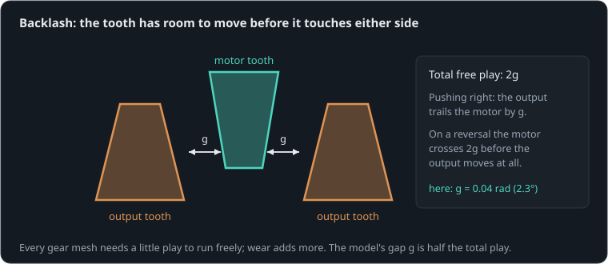

# A wobble you can feel

**By the end of this lesson you will be able to:**

- explain backlash as motion lost on every reversal;
- predict how far an output trails its input, and the position error it causes at a limb's tip;
- choose a way to remove or live with it.

Grab the foot of a small legged robot with its motors holding still, and you can often wiggle it by a few millimetres. That is backlash: free play between gear teeth. Here a [servo](part:gearhead/servo) rocks back and forth, driving an [output pointer](part:gearhead/pointer) through a [gear mesh](part:gearhead/mesh) with a little play.

## Room between the teeth

Gear teeth need a little room to mesh without jamming, and wear adds more. So the motor's tooth sits in the gap between two output teeth, with space on either side.



While the teeth are touching, the output follows the motor exactly (through the gear ratio). But reverse the motor, and for a moment it moves alone, crossing the gap, while the output stays where it was. That motion is simply lost.

```sim-quiz
id: reversal
question: The motor has been turning forward, teeth in contact. It reverses. What does the output do at first?
options:
  - { text: "Nothing, until the motor's tooth crosses the gap", correct: true, feedback: "Yes. Until the teeth touch on the other side, nothing drives the output." }
  - { text: "Reverses at once, with the motor", feedback: "Only if there were no play. With a gap, the motor must cross it first." }
  - { text: "Keeps turning forward by the gap", feedback: "Nothing pushes it forward once the motor reverses (friction here stops it quickly)." }
explain: "The output waits while the motor crosses the whole free play. How long that takes depends on how fast the motor reverses."
concepts: [backlash]
```

## How much is lost

In this model the mesh has a gap g = {{param mesh.gap | 0.04 rad}} on each side: 0.08 rad (4.6°) of play in all. While the motor pushes one way, the output trails it by g. After each reversal, the motor crosses 2g before the output moves again.

**Worked example.** The motor rocks ±0.30 rad. Pushing forward, the output trails by 0.04 rad, so it reaches only 0.30 − 0.04 = 0.26 rad; the same at the other end. Its swing is 0.08 rad smaller than the motor's.

```sim-quiz
id: predict-swing
kind: predict
scene: rock
question: The motor side rocks ±0.30 rad. How far will the output pointer swing to each side, in radians?
observe: output.shaft.angle
reduce: max
window: [1.0, 2.0]
tolerance: 2%
unit: rad
explain: "0.30 − g = 0.30 − 0.04 = **0.26 rad**: the output trails by the half-gap all the way out."
```

```sim-scene
id: rock
system: gearhead
title: Rocking through a worn mesh
caption: "The servo rocks ±0.3 rad once a second. After each reversal the pointer waits while the teeth cross the gap. The phase plot draws the loop of lost motion; the ghost has no play."
companion: { label: "No play", set: { mesh.gap: 0 }, mode: ghost }
camera: { preset: front, zoom: 1.5 }
run: { duration_s: 2.0, frame_rate: 120 }
script: rock.rhai
plots: [servo.shaft.angle, output.shaft.angle]
phase: [{ x: servo.shaft.angle, y: output.shaft.angle, title: "Output against motor: flat edges are lost motion" }]
show: [forces, trails]
sliders:
  - { parameter: mesh.gap, label: "Half the play (g)", min: 0, max: 0.1, step: 0.005, unit: rad }
hints:
  - "Double g: the flat edges of the loop double in length, and the output swing shrinks."
  - "Set g to 0: the loop collapses to a straight line."
expect:
  - { observe: output.shaft.angle, reduce: max, window: [1.0, 2.0], min: 0.253, max: 0.265, why: "Output swing = 0.30 − g = 0.26 rad." }
  - { observe: output.shaft.angle, reduce: change, window: [1.28, 1.36], min: -0.004, max: 0.004, why: "Just after the motor reverses (at 1.25 s), the output stands still while the teeth cross the gap." }
  - { observe: servo.shaft.angle, reduce: max, window: [1.0, 2.0], min: 0.29, max: 0.305, why: "The motor side follows its ±0.3 rad target closely." }
```

The pointer peaks at {{value scene=rock observe=output.shaft.angle reduce=max window=1..2 | 0.259 rad}} while the motor reaches {{value scene=rock observe=servo.shaft.angle reduce=max window=1..2 | 0.299 rad}}. On the phase plot, the loop's flat top and bottom are the lost motion.

```sim-quiz
id: flat-edge
question: "On the phase plot, what does a flat edge of the loop mean?"
options:
  - { text: "The motor moves while the output does not: the teeth are crossing the gap", correct: true, feedback: "Yes. Motor angle changes (x), output angle stays (y)." }
  - { text: "The output moves while the motor does not", feedback: "That would be a vertical edge. Here the output is the one that waits." }
  - { text: "The gears are slipping", feedback: "Gears cannot slip; they lose contact, and regain it on the other side." }
moment: 1.3
explain: "Along a flat edge the motor turns and the output stays still: that is the gap being crossed, 2g = 0.08 rad long."
concepts: [backlash]
```

## At the tip of a leg

Play at a joint is an angle; at the end of a limb it becomes a distance. The foot can sit anywhere within that angle times the leg's length, depending on which way the joint last moved or which way the ground pushes.

**Worked example.** 0.08 rad of play at a hip, with the foot 0.25 m away: 0.08 × 0.25 = 0.02 m. The foot can wander 20 mm with the motor perfectly still.

```sim-quiz
id: foot-slop
kind: numeric
question: A knee has {play} rad of total play, and the foot is 0.2 m from the knee. How far can the foot move with the motor held still, in millimetres?
vary: { play: { min: 0.01, max: 0.1, step: 0.005 } }
answer_expr: play * 0.2 * 1000
tolerance: 3%
unit: mm
hint: Arc length = angle × radius.
explain: "Distance = play × length: for 0.08 rad, 0.08 × 0.2 = 0.016 m = **16 mm**. Each review asks with a different play."
```

## Living with it, or removing it

Backlash matters most where the load changes direction, which in a walking robot is every step. The usual answers:

- keep the teeth always pressed one way: gravity, a spring, or two motors pulling against each other (preload);
- anti-backlash gears (a spring-loaded split gear), or drives without play such as harmonic drives and belts;
- put the position sensor on the output rather than the motor, so at least the error is seen, while accepting that a controller fighting play tends to hunt back and forth.

```sim-quiz
id: fix
question: An arm joint always carries its own weight in the same direction, even while moving slowly up and down. How much does its gear play hurt its accuracy?
options:
  - { text: "Little: gravity keeps the teeth pressed on one side", correct: true, feedback: "Yes. As long as the load never reverses, the teeth never cross the gap." }
  - { text: "As much as ever: the play is still there", feedback: "The play exists, but it only costs accuracy when the teeth cross it, which needs the load to reverse." }
  - { text: "More, because gravity pulls the teeth apart", feedback: "Gravity pushes them together, on one side, and keeps them there." }
explain: "A load that never changes direction acts as a preload. Trouble starts when it reverses: a leg swinging then landing, or an arm passing over its top."
```

## Putting it in your own words

```sim-reflect
id: why-play
prompt: A teammate's walking robot places its feet a centimetre off from where the controller thinks they are, and the error flips between steps. Explain what backlash has to do with it, in a few sentences.
model_answer: "Gear teeth have free play, so when the load on a joint reverses, the motor must cross the gap before the output follows; until then the output stays put or is pushed across the gap by the load. A motor-side encoder cannot see this. In a walking robot the load reverses every step (swinging the leg, then carrying the body), so the joint sits at one side of the play or the other, and the angle error times the leg's length gives the foot error, here a centimetre. Preload, anti-backlash gears or play-free drives, or an output-side encoder, would help."
key_points:
  - { idea: "Play means the output waits when the load reverses", cues: ["play", "gap", "reverse", "reversal", "lost motion"] }
  - { idea: "Walking reverses the load every step", cues: ["every step", "reverses", "swing", "stance", "direction"] }
  - { idea: "Angle error × leg length = foot error", cues: ["length", "× l", "arc", "at the foot", "centimetre"] }
  - { idea: "Fixes: preload, anti-backlash, output encoder", cues: ["preload", "anti-backlash", "harmonic", "output encoder", "spring"] }
```

## Going further

This part is optional.

**Why controllers hunt.** With the sensor on the output, a controller near its target pushes the motor across the gap, the output jumps, overshoots slightly, the controller reverses, and the motor crosses the gap again: a small, endless oscillation called a limit cycle. Dead bands in the controller or friction feed-forward calm it.

**Stiffness as well as play.** Even without play, teeth, shafts and belts bend a little under load. That compliance is a spring in series, which you met in the series-elastic lesson.

```sim-component
component: rotational.backlash_mesh
show: [summary, equations, tradeoffs]
```

## Key ideas

- **Backlash** is free play between gear teeth: on every reversal the motor crosses the gap before the output moves.
- Pushing one way, the output trails the motor by half the play, g.
- At a limb's tip, play × length becomes a position error that flips with the load's direction.
- Keep the teeth preloaded, use play-free drives, or measure at the output.
