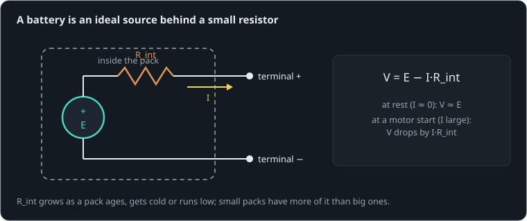

# The robot that resets

**By the end of this lesson you will be able to:**

- model a battery as a voltage source behind its internal resistance;
- predict how far a pack's voltage dips when a motor starts;
- keep a robot's controller alive through that dip.

A small walking robot works on the bench power supply, but on its battery it resets every time it tries to stand up. Here is why, on the smallest version of the problem: a small, worn [2S LiPo pack](part:pack/pack) (about 0.12 Ω inside, of which more soon) running a [controller board](part:pack/logic) and, through a [driver](part:pack/driver), a [540 motor](part:pack/motor) that starts at 0.1 s.

```sim-quiz
id: guess-dip
pretest: true
question: With nothing connected, the pack reads 8.0 V. Then the motor starts and draws about 17 A from it for a moment. What do you expect the pack's voltage to do?
options:
  - { text: "Stay at 8.0 V: a battery is a fixed voltage", feedback: "Keep this guess in mind and compare it with the next part." }
  - { text: "Dip by a few hundredths of a volt", feedback: "Keep this guess in mind and compare it with the next part." }
  - { text: "Dip by about 2 V", correct: true, feedback: "That is what the next part works out." }
concepts: [internal-resistance]
```

## A battery is not a perfect source

Inside a battery, the chemistry makes a fairly steady voltage E, but the current has to get out through electrodes, electrolyte and wiring that resist it. That resistance is the pack's **internal resistance**, R_int. Whatever current you draw, it takes its share:



```text
V = E − I·R_int
```

**Worked example.** Our pack sits at E ≈ 8.0 V and has R_int = {{param pack.internal_resistance | 0.12 Ω}} (small and worn; a fresh large pack might have 0.02 Ω). Drawing 5 A, it drops 5 × 0.12 = 0.6 V, to 7.4 V at its terminals.

```sim-quiz
id: drop
kind: numeric
question: Our pack (E = 8.0 V, R_int = 0.12 Ω) supplies {I} A. What is its terminal voltage, in volts?
vary: { I: { min: 2, max: 25, step: 1 } }
given: { R: pack.internal_resistance }
answer_expr: 8.0 - I * R
tolerance: 2%
unit: V
hint: V = E − I·R_int.
explain: "V = E − I·R_int: at 10 A, 8.0 − 1.2 = **6.8 V**. Each review asks with a different current."
concepts: [internal-resistance]
```

## The start is the worst moment

When a motor starts it is not yet turning, so it has no back-EMF: only resistances limit its current. That is the largest current it will ever draw: the stall current. Here every resistance in the loop counts: the motor's 0.3 Ω, the driver's 0.05 Ω and the pack's own 0.12 Ω.

```sim-quiz
id: start-steps
kind: steps
question: "The 540 motor starts at full drive from our pack (E = 8.0 V). How much current flows at the first instant, and what does the pack's voltage fall to?"
steps:
  - { prompt: "Total resistance in the loop", worked: "0.3 + 0.05 + 0.12 = 0.47 Ω" }
  - { prompt: "Start current, E / R_total", answer: 17, unit: A, tolerance: 4% }
  - { prompt: "Terminal voltage, E − I·R_int", answer: 5.96, unit: V, tolerance: 2% }
explain: "8.0/0.47 ≈ **17 A**, and 8.0 − 17 × 0.12 ≈ **5.96 V**: a 2 V dip, a quarter of the pack's voltage."
concepts: [internal-resistance, stall]
```

```sim-quiz
id: predict-dip
kind: predict
scene: start
question: What is the lowest voltage the controller will see at the pack's terminals when the motor starts, in volts?
observe: sense.reading
reduce: min
window: [0.1, 0.8]
tolerance: 2%
unit: V
explain: "About **5.95 V**, within a millisecond of the start. As the motor speeds up its back-EMF grows, its current falls, and the pack recovers toward 7.7 V."
```

```sim-scene
id: start
system: pack
title: Starting the motor
caption: "At 0.1 s the driver goes to full: 17 A flows into the still motor and the pack's voltage drops by 2 V. It recovers as the motor spins up. The ghost is a fresh, larger pack (R_int = 0.02 Ω)."
companion: { label: "Fresh pack (0.02 Ω)", set: { pack.internal_resistance: 0.02 }, mode: ghost }
camera: { preset: iso, zoom: 1.4 }
run: { duration_s: 0.8, frame_rate: 400 }
script: start.rhai
plots: [sense.reading, motor.p.current]
show: [current]
sliders:
  - { parameter: pack.internal_resistance, label: "Pack internal resistance", min: 0.01, max: 0.3, step: 0.01, unit: Ω }
  - { parameter: go.amplitude, label: "Drive command", min: 0.1, max: 1, step: 0.05 }
hints:
  - "Halve the drive command: the start current and the dip both halve."
  - "A fresh pack (0.02 Ω) barely dips at all."
challenge:
  goal: "Keep the pack above **6.5 V** at every moment of the start, so the controller never browns out."
  hint: "The dip is I·R_int. Reduce the resistance, or reduce the start current by starting with a smaller command."
  win:
    - { observe: sense.reading, reduce: min, window: [0.1, 0.8], min: 6.5, why: "The pack never falls below 6.5 V." }
expect:
  - { observe: sense.reading, reduce: min, window: [0.1, 0.8], min: 5.85, max: 6.05, why: "Start current ≈ 8.0/0.47 ≈ 17 A; 17 × 0.12 Ω ≈ 2 V below the pack's 8.0 V." }
  - { observe: motor.p.current, reduce: max, window: [0.1, 0.12], min: 16, max: 17.5, why: "The still motor has no back-EMF: only resistances limit the current." }
  - { observe: sense.reading, reduce: mean, window: [0.7, 0.8], min: 7.6, max: 7.8, why: "Spinning, the motor draws about 2 A: the pack recovers to about 7.7 V." }
```

```sim-equation
id: sag-now
scene: start
show: "V = E − I·R_int"
expr: E - I * R
result: { symbol: V, unit: V }
terms:
  E: { symbol: E, unit: V, value: 7.99 }
  I: { symbol: I, unit: A, observe: pack.n.current }
  R: { symbol: R_int, unit: Ω, param: pack.internal_resistance }
holds: { observe: sense.reading, tolerance: 1% }
caption: The pack's terminal voltage at the playhead, from the current it supplies (motor plus controller).
```

The pack fell to {{value scene=start observe=sense.reading reduce=min window=0.1..0.8 | 5.95 V}} while {{value scene=start observe=motor.p.current reduce=max window=0.1..0.12 | 16.8 A}} poured into the still motor.

## Brownout

The controller runs from a 5 V regulator, and a regulator needs some headroom: a typical linear one needs about 6 V in to give a steady 5 V out. Below that its output sags, and a microcontroller whose supply dips under its brownout threshold, even for a millisecond, resets. That is a **brownout**.

```sim-quiz
id: reset
question: The pack dips to 5.95 V for about 10 ms; the regulator needs 6.0 V in. What happens to the controller?
options:
  - { text: "It may reset: a few milliseconds below the threshold are enough", correct: true, feedback: "Yes. Microcontrollers watch their supply and reset within microseconds of it falling too low." }
  - { text: "Nothing: 10 ms is too short to matter", feedback: "Electronics react in microseconds. Even a millisecond below the brownout level can reset them." }
  - { text: "The motor stops", feedback: "The motor would keep trying; it is the controller that is at risk." }
explain: "A dip below the regulator's dropout is a brownout. The robot resets exactly when it asks for the most current: standing up, jumping, or starting all its motors together."
concepts: [brownout]
```

## Keeping the controller alive

Since the dip is I·R_int, there are two ways in: less resistance, or less current.

- A pack with lower R_int: larger capacity, a higher discharge rating, a fresh or warm pack, short thick leads.
- Limit the start current: ramp the command up (soft start), or use the driver's current limit. Starting motors one after another instead of all together.
- Give the controller its own margin: a regulator that works down to lower input (a buck-boost), a separate small battery, or a large capacitor with a diode that carries it through the dip.

```sim-quiz
id: four-motors
question: A robot has four of these motors and starts them all at once. Compared with one, the dip is…
options:
  - { text: "Much larger: the pack supplies all four start currents through the same R_int", correct: true, feedback: "Yes. Four motors pull roughly three times the current together (they share the sagging voltage), so the dip is several times bigger." }
  - { text: "The same: each motor has its own current", feedback: "They all flow through the one pack and its one internal resistance." }
  - { text: "Smaller: the load is shared", feedback: "Sharing the load adds the currents in the pack." }
explain: "The pack's R_int carries the sum of all the currents. Staggering the starts by a few tens of milliseconds, or soft-starting them, keeps the peak down."
concepts: [internal-resistance, brownout]
```

## Putting it in your own words

```sim-reflect
id: why-reset
prompt: Explain to a teammate, in a few sentences, why their robot resets every time it stands up on battery but not on the bench supply, and two things they could do.
model_answer: "A battery behaves like a voltage source behind an internal resistance, so its terminal voltage drops by I·R_int. Standing up starts several motors from rest, and a still motor has no back-EMF, so each draws its stall current; together that is tens of amps, and the pack's voltage dips by volts for a few milliseconds. The controller's regulator then drops out and the microcontroller browns out and resets. A bench supply with thick leads has far less resistance. Fixes: a pack with lower internal resistance, soft-starting or current-limiting the motors (or staggering them), and giving the controller a supply that tolerates the dip (buck-boost regulator, separate battery, or a capacitor and diode)."
key_points:
  - { idea: "Terminal voltage drops by I·R_int", cues: ["i·r", "ir", "internal resistance", "r_int", "drop", "sag"] }
  - { idea: "Starting motors draw stall current (no back-EMF)", cues: ["stall", "back-emf", "back emf", "start current", "inrush", "still"] }
  - { idea: "The dip browns out the regulator and resets the controller", cues: ["brownout", "brown-out", "regulator", "dropout", "reset"] }
  - { idea: "Fixes: lower R_int, soft start/current limit, separate or robust logic supply", cues: ["soft start", "current limit", "stagger", "buck-boost", "separate", "capacitor", "better pack"] }
```

## Going further

This part is optional.

**The pack's voltage also falls with charge.** E itself drops from 4.2 V per cell full to about 3.3 V nearly empty, and R_int rises as the pack empties and cools, so a robot that starts fine at full charge may reset at half charge.

**The motor's view.** The dip also costs the motor: it starts with 6 V instead of 8, so it accelerates about a quarter slower. Low-resistance packs make robots feel stronger.

```sim-compare
id: pack-sweep
system: pack
study: pack
title: Lowest pack voltage and peak current, for four packs
caption: "The dip grows almost in proportion to R_int; a large fresh pack (0.02 Ω) loses only a third of a volt."
```

```sim-component
component: robot.battery
show: [summary, equations, limits]
```

## Key ideas

- A battery is a source E behind its **internal resistance**: V = E − I·R_int.
- Motor starts draw stall current (no back-EMF): the worst moment for the pack.
- A dip below the regulator's needs is a **brownout**: the controller resets.
- Lower R_int, limit or stagger start currents, and give the logic its own margin.
