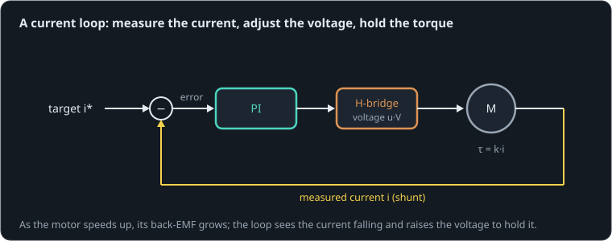

# Asking for a torque

**By the end of this lesson you will be able to:**

- explain why a voltage command does not give a steady torque, and a current command does;
- describe how a PI current loop holds the current against the back-EMF;
- predict the speed at which a current loop runs out of voltage.

A walking robot usually wants to decide the torque at each joint: push this hard on the ground, go this soft on landing. A motor's torque is k·i, so what it needs is control of **current**. Here a [current loop](part:drive/loop) reads a [current sensor](part:drive/shunt) and drives our 12 V [motor](part:drive/motor) through an [H-bridge](part:drive/driver), spinning up a [wheel](part:drive/load).

## A voltage command fades

Set a motor's voltage and its torque is only steady while it stands still. As it speeds up, its back-EMF takes more of that voltage, leaving less to push current through the winding: the torque fades. That is the torque–speed line again.

**Worked example.** A fixed 35 % command (4.2 V) with R = 2.05 Ω gives 2.05 A at standstill. At 200 rad/s the back-EMF is 2.4 V, leaving 1.8 V: 0.88 A, less than half the torque.

```sim-quiz
id: fade
kind: numeric
question: A fixed 4.2 V drives our motor (k = 0.012, R = 2.05 Ω with the bridge). What current flows at {w} rad/s?
vary: { w: { min: 0, max: 340, step: 20 } }
given: { k: motor.torque_constant }
answer_expr: (4.2 - k * w) / 2.05
tolerance: 3%
unit: A
hint: "i = (V − k·ω)/R."
explain: "i = (V − k·ω)/R: at 200 rad/s, (4.2 − 2.4)/2.05 = **0.88 A**. The faster it turns, the less torque a fixed voltage gives. Each review asks with a different speed."
concepts: [voltage-budget]
```

## A loop that holds the current

A current loop measures the current, compares it with the target, and adjusts the drive command to close the gap. Whenever the back-EMF grows and the current starts to fall, the loop sees it and raises the voltage. The current, and so the torque, stays where it was asked to be:



It is the PI controller from the PID lesson, acting on the current's error: the command is kp·(i* − i) plus ki times the error summed over time.

**Worked example.** Our loop has kp = {{param loop.kp | 0.3}} per amp and ki = {{param loop.ki | 300}} per amp-second. A 0.1 A shortfall immediately adds 0.03 to the command, and the integral keeps adding 30 per second of it until the shortfall is gone.

```sim-quiz
id: loop-sees
question: The wheel speeds up and its back-EMF rises by 1 V. What does the current loop do?
options:
  - { text: "Raises the drive voltage by about 1 V, keeping the current where it was", correct: true, feedback: "Yes. It sees the current start to fall and pushes the command up until it is back." }
  - { text: "Nothing: it only acts when the target changes", feedback: "It acts on the error, which a rising back-EMF creates." }
  - { text: "Lowers the voltage to protect the motor", feedback: "It raises it: holding current against a larger back-EMF needs more voltage." }
explain: "The integral term keeps growing the command while the current is short, so the command tracks R·i* + k·ω: exactly the voltage that current needs at that speed."
concepts: [current-loop]
```

## Holding 2 A while it spins up

The target switches to 2 A at 10 ms. The ghost drives the same motor with a fixed 35 % command instead, which also starts at 2 A.

```sim-quiz
id: predict-hold
kind: predict
scene: spin-up
question: "Under the current loop, what will the current be at 0.4 s, when the wheel has reached about 400 rad/s?"
observe: motor.p.current
reduce: mean
window: [0.39, 0.41]
tolerance: 3%
unit: A
explain: "Still **2.0 A**: the loop has raised the command from 0.35 to about 0.75 to hold it. The fixed-voltage ghost has fallen to about 0.6 A by then."
```

```sim-scene
id: spin-up
system: drive
title: Current control against a fixed voltage
caption: "The current loop (solid) holds 2 A, and so a steady torque, while the wheel speeds up; the wheel's speed climbs in a straight line. Past about 0.63 s the command reaches 100 % and the current finally falls. The ghost drives with a fixed 35 %: its current fades from the start."
companion: { label: "Fixed 35 % voltage", set: { loop.kp: 0, loop.ki: 0, loop.offset: 0.35 }, mode: ghost }
camera: { preset: iso, zoom: 1.4, yaw: 0.95, pitch: 0.45 }
run: { duration_s: 1.0, frame_rate: 500 }
script: spin-up.rhai
plots: [motor.p.current, load.shaft.speed, loop.command]
show: [current, forces]
sliders:
  - { parameter: loop.target, label: "Target current", min: 0.5, max: 5, step: 0.1, unit: A }
  - { parameter: loop.kp, label: "kp", min: 0, max: 2, step: 0.05, unit: "1/A" }
  - { parameter: loop.ki, label: "ki", min: 0, max: 2000, step: 10, unit: "1/(A·s)" }
hints:
  - "Double the target: the speed ramp is twice as steep, and the loop runs out of voltage sooner."
  - "Set ki to 0: with P alone the current settles short of the target, and sags further as the speed rises."
challenge:
  goal: "Make the wheel reach **400 rad/s by 0.3 s**, without ever drawing more than **3.5 A**."
  hint: "Constant current means constant acceleration: α = k·i/J. You need about 1400 rad/s² for 0.29 s."
  win:
    - { observe: load.shaft.speed, reduce: mean, window: [0.29, 0.31], min: 400, why: "At least 400 rad/s at 0.3 s." }
    - { observe: motor.p.current, reduce: max, window: [0.0, 1.0], max: 3.5, why: "Never more than 3.5 A." }
expect:
  - { observe: motor.p.current, reduce: mean, window: [0.1, 0.5], min: 1.98, max: 2.02, why: "The loop holds 2 A while the speed climbs." }
  - { observe: load.shaft.speed, reduce: mean, window: [0.49, 0.51], min: 495, max: 525, why: "Constant torque, constant acceleration: k·i/J = 0.024/2.3e-5 ≈ 1040 rad/s² for about 0.49 s." }
  - { observe: motor.p.current, reduce: mean, window: [0.95, 1.0], max: 0.9, why: "Past about 660 rad/s the supply cannot push 2 A against the back-EMF: the current falls." }
```

```sim-equation
id: command-needed
scene: spin-up
show: "u·V = R·i + k·ω"
expr: ((R + 0.05) * i + k * w) / 12
result: { symbol: u, unit: "" }
terms:
  R: { symbol: R, unit: Ω, param: motor.resistance }
  i: { symbol: i, unit: A, observe: motor.p.current }
  k: { symbol: k, unit: N·m/A, param: motor.torque_constant }
  w: { symbol: ω, unit: rad/s, observe: load.shaft.speed }
holds: { observe: loop.command, window: [0.02, 0.6], tolerance: 2% }
caption: The command the loop has found, from the voltage budget. It climbs with the back-EMF until it reaches 1 (full supply).
```

The loop held {{value scene=spin-up observe=motor.p.current reduce=mean window=0.1..0.5 | 2.0 A}} while the wheel climbed to {{value scene=spin-up observe=load.shaft.speed reduce=mean window=0.49..0.51 | 510 rad/s}} at 0.5 s, in a straight line: constant current, constant torque, constant acceleration.

```sim-quiz
id: straight-line
question: "Under the current loop, the wheel's speed climbs in a straight line until about 0.63 s. Why a straight line?"
options:
  - { text: "Constant current means constant torque, and so constant acceleration", correct: true, feedback: "Yes: τ = k·i, and τ = J·α." }
  - { text: "The voltage rises in a straight line", feedback: "It does, but only because the loop raises it to keep the current, and so the torque, constant." }
  - { text: "The wheel has no friction", feedback: "No friction helps, but the straight line comes from the constant torque." }
moment: 0.3
explain: "The loop holds i, so the torque k·i is constant, and so is α = k·i/J ≈ 1040 rad/s². Under the fixed voltage (ghost) the torque fades and the speed curve bends over."
concepts: [current-loop, rotational-inertia]
```

## Where it runs out

The loop can raise the command only to 100 %. The voltage the current needs is R·i + k·ω (the voltage budget from the motor lesson), so once the back-EMF has eaten the rest of the supply, the loop can no longer hold the current. That happens above the speed where the full supply is just enough: ω_max = (V − R·i*)/k.

**Worked example.** V = 12 V, i* = 2 A, R = 2.05 Ω: ω_max = (12 − 4.1)/0.012 = 658 rad/s. The scene's current starts falling at about 0.63 s, right there.

```sim-quiz
id: omega-max
kind: numeric
question: Our current loop holds {i} A from a 12 V supply (R = 2.05 Ω with the bridge, k = 0.012). Above what speed can it no longer hold it, in rad/s?
vary: { i: { min: 0.5, max: 5, step: 0.25 } }
given: { k: motor.torque_constant }
answer_expr: (12 - 2.05 * i) / k
tolerance: 2%
unit: rad/s
hint: "At the limit the command is 100 %: V = R·i* + k·ω."
explain: "ω_max = (V − R·i*)/k: for 2 A, **658 rad/s**. More current, less speed range: the same torque–speed line, seen from the controller."
concepts: [current-loop]
```

## Putting it in your own words

```sim-reflect
id: why-current
prompt: Explain to a teammate, in a few sentences, why their robot's joints should take torque commands through a current loop rather than voltage commands, and what the loop cannot do.
model_answer: "A motor's torque is k·i. With a voltage command the current, and so the torque, depends on the speed as well, because the back-EMF k·ω takes part of the voltage; the same command gives less torque the faster the joint moves. A current loop measures the current and adjusts the voltage to hold it at the target, raising it as the back-EMF grows, so the joint gets the torque it was asked for whatever its speed: essential for controlling forces at the feet. It cannot exceed the supply: once R·i + k·ω reaches the supply voltage (ω_max = (V − R·i)/k) the current falls, and it cannot make more torque than the motor's current limit allows."
key_points:
  - { idea: "Torque is k·i, so controlling current controls torque", cues: ["k·i", "torque", "current", "proportional"] }
  - { idea: "A voltage command's torque fades with speed (back-EMF)", cues: ["back-emf", "back emf", "fades", "speed", "voltage"] }
  - { idea: "The loop raises the voltage to hold the current", cues: ["raises", "adjusts", "feedback", "measure", "pi"] }
  - { idea: "Limit: the supply voltage, ω_max = (V − R·i)/k", cues: ["supply", "saturat", "ω_max", "runs out", "limit", "100 %"] }
```

## Going further

This part is optional.

**How fast the loop is.** The winding's inductance sets how quickly current can change: L/R = 1 ms here. Real current loops run at 10–40 kHz inside the motor driver, so they settle in a millisecond or two, much faster than any joint motion. That is what lets a slower outer loop (position, or force at the foot) treat the motor as an ideal torque source.

**Wind-up.** Past ω_max the loop's integral keeps growing while the command is stuck at 100 %; if the speed then falls, it overshoots. Real drivers clamp the integral (anti-wind-up). This part does not, so the lesson stops at 1 s.

```sim-component
component: part.pi_current
show: [summary, equations, tradeoffs, limits]
```

## Key ideas

- Torque is k·i: to command torque, command **current**.
- A fixed voltage gives a torque that fades as the back-EMF grows.
- A **current loop** measures the current and raises the voltage to hold it, whatever the speed.
- It runs out at ω_max = (V − R·i*)/k, where the supply can no longer beat the back-EMF.
