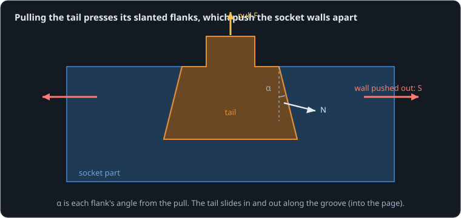

# A joint that locks itself

**By the end of this lesson you will be able to:**

- work out how hard a pull presses a dovetail's slanted faces;
- predict how hard those faces push the socket's walls apart, and pick an angle the walls can take;
- choose a fit that holds firmly and still slides in by hand.

A dovetail is a tapered tongue (the tail) in a matching undercut groove (the socket). It slides in from one end and then cannot be pulled straight out. Printed parts use it to join panels without screws. But printed sockets often split along their walls. On the left, a [tail](part:dovetail/tail) is pulled out of its [socket](part:dovetail/socket); on the right, a [tight dovetail](part:dovetail/fit) is pushed along its groove.

## Why pulling presses the flanks

The tail's sides are slanted: each is a **flank** at an angle α from the direction of pull. Pulling the tail out drags each flank against the socket's matching face, which pushes back with a force N square to the flank. Only the part of N along the pull holds the tail, so N has to be large.



```text
F = 2 · N · sin α
```

**Worked example.** Flanks at 15° (sin 15° ≈ 0.26) and a 100 N pull: N = 100 / (2 × 0.26) ≈ 193 N on each flank. A 100 N pull makes almost 200 N on each face.

```sim-quiz
id: flank-force
kind: numeric
question: A dovetail with flanks at {deg}° from the pull is pulled with 100 N. How hard does each flank press, in newtons?
vary: { deg: { min: 10, max: 45, step: 5 } }
answer_expr: 100 / (2 * sin(deg * 3.14159265 / 180))
tolerance: 3%
unit: N
hints:
  - "Two flanks share the pull, and each only helps by its component along the pull."
  - "F = 2·N·sin α, so N = F / (2·sin α)."
  - "For 15°: N = 100 / (2 × 0.259)."
explain: "N = F / (2·sin α): for 15°, **193 N**. The shallower the flanks, the harder they press."
concepts: [dovetail-wedge]
```

## The walls are pushed apart

The flank force N also has a part across the joint, N·cos α, pushing each socket wall outward. That is the **spreading force**, S. Putting the two together:

```text
S = F / (2 · tan α)
```

**Worked example.** 200 N of pull on 15° flanks (tan 15° ≈ 0.27): S = 200 / (2 × 0.27) ≈ 373 N on each wall. A wall 4 mm thick, 6 mm tall and 20 mm long, bent at its root, cracks at about σ·b·t² / (6·h) = 30 MPa × 20 mm × (4 mm)² / (6 × 6 mm) ≈ 270 N, using an estimated 30 MPa for printed PLA bent across its layers. This joint would split before it held 200 N. The model's flanks are at {{param dovetail/joint.angle | 0.2618 rad}}.

```sim-quiz
id: predict-spread
kind: predict
scene: pull
question: The tail is pulled harder and harder, up to 200 N. How hard will each socket wall be pushed outward at the end, in newtons?
observe: joint.spread
reduce: final
window: [1.9, 2.0]
tolerance: 5%
unit: N
explain: "S = F / (2·tan α) = 200 / (2 × 0.268) ≈ **373 N**: nearly twice the pull, on each wall."
concepts: [dovetail-wedge]
```

```sim-scene
id: pull
system: dovetail
title: Pulling a dovetail apart
caption: "The tail is pulled out harder and harder, up to 200 N (its 1.5 mm of give is drawn 5 times larger). Watch the wall spreading force climb nearly twice as fast as the pull."
companion: { label: "Flanks at 30°", set: { joint.angle: 0.5236 }, mode: split }
camera: { preset: front, zoom: 1.3 }
run: { duration_s: 2.0, frame_rate: 100 }
script: pull.rhai
magnify: 5
plots: [joint.holding, joint.spread]
show: [forces]
sliders:
  - { parameter: joint.angle, label: "Flank angle (α)", min: 0.1, max: 0.8, step: 0.02, unit: rad }
challenge:
  goal: "Choose a flank angle so neither wall is pushed out with more than 270 N at 200 N of pull."
  win:
    - { observe: joint.spread, reduce: max, window: [0.0, 2.0], max: 270, why: "The estimated strength of a 4 mm printed wall." }
  hint: "tan α must be at least 200 / (2 × 270)."
expect:
  - { observe: joint.holding, reduce: final, window: [1.9, 2.0], min: 195, max: 201, why: "The joint holds the whole 200 N pull." }
  - { observe: joint.spread, reduce: final, window: [1.9, 2.0], min: 360, max: 385, why: "S = F / (2·tan α) = 373 N at 15°." }
```

At 200 N of pull each wall is pushed out with {{value scene=pull observe=joint.spread reduce=final window=1.9..2 | 373 N}}. With 30° flanks it would be about 173 N.

```sim-quiz
id: steeper
question: "Steeper flanks push the walls apart less. Why not make them 45° or more?"
options:
  - { text: "For the same width, the tail's neck gets narrower and weaker, and the joint holds less before the flanks slip out", correct: true, feedback: "Yes. The angle trades wall spreading against the neck's strength and grip; about 20–30° is common for printed dovetails." }
  - { text: "Steep flanks cannot be printed", feedback: "They print easily; the flank angle is set by the joint, not the printer." }
  - { text: "Steep flanks spread the walls more", remedy: steep-more, feedback: "The other way round: S = F / (2·tan α) shrinks as α grows." }
explain: "S falls as α grows, but a steep tail is narrow at its neck, and a smooth, steep flank lets the tail cam out. Pick the shallowest angle the walls can take."
concepts: [dovetail-wedge]
```

```sim-remedy
id: steep-more
misconception: "Steeper flanks push harder on the walls."
body: "Picture the extremes. Flanks almost along the pull (small α) are a wedge: a small pull makes a huge sideways push, like splitting wood. Flanks almost across the pull (α near 90°) are a shelf: the pull just presses straight down on it. S = F / (2·tan α): small α, large S."
scene: pull
then: steeper
```

## Tight or loose

A dovetail with clearance slides in easily but wobbles by that clearance. With an **interference fit**, the tail is a touch wider than the groove, so both flanks are pressed even at rest, by N = k·i (k is how stiffly a flank and its wall resist, i the overlap). Sliding the tail along then rubs both flanks with friction μ on each:

```text
F_slide = 2 · μ · k · i
```

**Worked example.** Here k ≈ 1.46 MN/m and μ ≈ 0.3 (PLA on PLA). With an overlap of i = 0.03 mm, each flank is pressed with N = 1 460 000 × 0.000 03 ≈ 44 N, and sliding takes 2 × 0.3 × 44 ≈ 26 N. The scene's fit is a little looser: {{param dovetail/fit.interference | 0.02 mm}}.

```sim-quiz
id: predict-breakaway
kind: predict
scene: slide
question: "With the scene's 0.02 mm overlap, how much friction will the flanks give before the tail breaks free, in newtons?"
observe: fit.rubbing
reduce: max
window: [0.0, 3.4]
tolerance: 5%
unit: N
explain: "N = k·i = 1.46 MN/m × 0.02 mm ≈ 29 N per flank, so 2·μ·N = 2 × 0.3 × 29 ≈ **17.5 N**. The push reaches that at 3.5 s."
concepts: [fit-friction]
```

```sim-scene
id: slide
system: dovetail
title: Sliding a tight dovetail home
caption: "A tight dovetail pushed along its groove, 5 N harder every second (up to 40 N). It stays put until the push beats the friction on its preloaded flanks, then slides home."
companion: { label: "Loose fit (no overlap)", set: { fit.interference: 0 }, mode: ghost }
camera: { preset: front, zoom: 1.3 }
run: { duration_s: 9.0, frame_rate: 100 }
script: slide.rhai
plots: [push.force, fit.rubbing, slider.axis.position]
show: [forces]
sliders:
  - { parameter: fit.interference, label: "Overlap (i)", min: 0, max: 0.00006, step: 0.000005, unit: m }
challenge:
  goal: "Find a fit tight enough to press each flank with at least 40 N that still slides fully home with a 40 N push."
  win:
    - { observe: slider.axis.position, reduce: final, window: [8.9, 9.0], min: 0.049, why: "Fully home: 50 mm in." }
    - { observe: fit.flank, reduce: final, window: [8.9, 9.0], min: 40, why: "Tight: each flank pressed with at least 40 N." }
  hint: "The slide force 2·μ·k·i must stay under 40 N."
expect:
  - { observe: slider.axis.position, reduce: max, window: [0.0, 3.3], max: 0.0003, why: "Held by friction until the push reaches 17.5 N at 3.5 s (the model's friction lets it creep a fraction of a millimetre)." }
  - { observe: fit.rubbing, reduce: max, window: [0.0, 3.4], min: 16.5, max: 18.0, why: "Breakaway friction 2·μ·k·i ≈ 17.5 N." }
  - { observe: slider.axis.position, reduce: final, window: [8.9, 9.0], min: 0.049, why: "Once free, it slides the full 50 mm home." }
  - { observe: fit.flank, reduce: final, window: [8.9, 9.0], min: 28, max: 30.5, why: "N = k·i = 1.46 MN/m × 0.02 mm ≈ 29 N on each flank." }
```

Each flank is pressed with {{value scene=slide observe=fit.flank reduce=final window=8.9..9 | 29 N}}. Push past about 44 N of friction (an overlap of about 0.05 mm) and a hand can no longer slide it in.

```sim-quiz
id: which-fit
question: "A drawer's dovetail runners are slid in and out every day; a panel joint is assembled once and must never rattle. Which fits suit them?"
options:
  - { text: "Runners: a little clearance; panel: a slight interference", correct: true, feedback: "Yes. Clearance slides easily (and wobbles by its size); interference is firm but needs force, once." }
  - { text: "Both: as tight as will go in", feedback: "A tight runner needs that full force every day, and wears." }
  - { text: "Both: generous clearance", feedback: "The panel would rattle by the clearance." }
explain: "Match the fit to the use: clearance for moving joints, a small interference for joints assembled once."
concepts: [fit-friction]
```

## In your own words

```sim-reflect
id: why-dovetails-split
prompt: A printed dovetail joint keeps splitting the socket along its walls when someone pulls on it. Explain why, and two changes that would help.
model_answer: "Pulling the tail presses its slanted flanks against the socket, and each flank pushes back square to its face. Only a small part of that force (N·sin α) resists the pull, so the flank force is much larger than the pull, and its sideways part pushes the walls apart with S = F / (2·tan α), nearly twice the pull at 15°. Printed walls are weakest bending across their layers, so they split. Steeper flanks (20–30°), thicker or taller walls, or a wall printed so its layers do not run along the crack would help, as would a joint that does not rely on the dovetail for pulling loads."
key_points:
  - { idea: "Pulling presses the flanks much harder than the pull", cues: ["flank", "presses", "wedge", "sin", "larger"] }
  - { idea: "The flanks push the walls apart: S = F / (2·tan α)", cues: ["spread", "apart", "walls", "tan", "sideways"] }
  - { idea: "Printed walls are weak across layers", cues: ["layers", "layer", "print", "weak"] }
  - { idea: "Fixes: steeper flanks, thicker walls", cues: ["steeper", "angle", "thicker", "wall", "30"] }
```

## Going further

This part is optional.

**Printing the socket.** With the groove opening upward, each undercut flank overhangs by α from vertical: 15–30° prints without support. Printing the groove on its side instead turns a flank into a bridge.

**A lead-in and a taper.** A small chamfer at the groove's entrance lets the tail find its way in. A groove that narrows slightly along its length (a sliding taper) goes in loosely and tightens only at the end.

**Clearance on a printer.** Sliding fits that work first time on FDM printers usually need about 0.15–0.25 mm between the faces; test with a short coupon before printing the real part.

```sim-component
component: part.dovetail
show: [summary, equations, tradeoffs]
```

## Key ideas

- A **flank** at angle α from the pull holds with N·sin α, so it presses with N = F / (2·sin α): much more than the pull when α is small.
- The **spreading force** on each wall is S = F / (2·tan α); shallow flanks split printed walls.
- An **interference fit** preloads the flanks, N = k·i, and sliding needs 2·μ·k·i.
- Clearance slides easily and wobbles; interference is firm but takes force.
