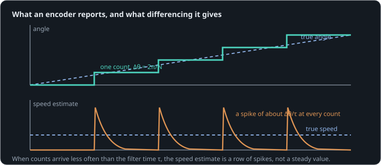

# A speed reading that will not sit still

**By the end of this lesson you will be able to:**

- work out an encoder's angle resolution, and what it means at a limb's tip;
- predict how noisy a speed worked out from counts will be, and how late;
- choose an encoder and a filter for a controller.

A robot joint turns slowly and smoothly, yet its speed reading jumps between 0 and 30 rad/s. Its controller's derivative term, fed that reading, makes the motor buzz. Here a gentle torque spins a [wheel](part:enc/wheel) up from rest, a 64-count [encoder](part:enc/encoder) reports its angle every millisecond, and the firmware's [speed estimate](part:enc/estimate) works out the speed from the counts.

## An angle in whole counts

An encoder does not measure a smooth angle. It counts marks going past, magnetic poles or slots in a disc, and reports how many. Between two counts it cannot see any motion at all. Its **resolution**, the smallest step it can see, is one turn divided by its counts per turn:

```text
Δθ = 2π / N
```

**Worked example.** Our encoder has N = {{param encoder.counts | 64}}: Δθ = 6.283/64 = 0.098 rad, or 5.6°. A knee with this encoder, and a foot 0.2 m away, cannot place the foot better than 0.098 × 0.2 = 20 mm.

```sim-quiz
id: resolution
kind: numeric
question: An encoder has {N} counts per turn. What is its resolution, in degrees?
vary: { N: { min: 12, max: 4096, step: 4 } }
answer_expr: 360 / N
tolerance: 2%
unit: °
hint: One turn is 360°, split into N counts.
explain: "Δθ = 360°/N: 64 counts is **5.6°**; a 4096-count magnetic encoder, 0.088°. Each review asks with a different encoder."
concepts: [quantization]
```

## Speed from counts

Firmware works out speed by how much the angle changed over a short time τ. Our estimate does it smoothly, with a filter of time constant {{param estimate.tau | 0.005 s}}. As long as many counts arrive within τ, that works well. But when counts come less often than τ, each count arrives as a sudden jump of Δθ, and the estimate leaps by about Δθ/τ, then decays until the next count.



```sim-quiz
id: spike-size
kind: numeric
question: A 64-count encoder (Δθ = 0.098 rad) feeds a speed estimate with τ = {tau} s. About how big is the jump in the estimate at each count, in rad/s?
vary: { tau: { min: 0.002, max: 0.05, step: 0.001 } }
answer_expr: 0.098 / tau
tolerance: 3%
unit: rad/s
hint: One count is Δθ; spread over τ, that is Δθ/τ.
explain: "Δθ/τ: at τ = 5 ms, 0.098/0.005 ≈ **20 rad/s** per count. For a wheel turning at 8 rad/s, that is a jump more than twice the true speed."
concepts: [speed-estimation]
```

## Watching the estimate

The wheel's speed rises steadily from 0 to 58 rad/s over 3 s. The ghost uses a slower filter, τ = 50 ms.

```sim-quiz
id: predict-noise
kind: predict
scene: counts
question: While the wheel turns at around 10 rad/s, what will the 5 ms speed estimate look like?
options:
  - { text: "Close to 10 rad/s, a little noisy", feedback: "Counts arrive every 10 ms, slower than the 5 ms filter: far worse than a little noise." }
  - { text: "Spikes of about 20 rad/s at each count, sagging toward zero between them", correct: true, feedback: "Yes: every count jumps it by Δθ/τ, and it decays before the next count arrives." }
  - { text: "Exactly zero until it speeds up", feedback: "Counts do arrive, just rarely; each one kicks the estimate." }
explain: "Around 10 rad/s the estimate swings between about 2 and 29 rad/s. Its average is right; any single reading is not."
```

```sim-scene
id: counts
system: enc
title: Counts and a speed estimate
caption: "True speed (a straight ramp) against the speed worked out from 64 counts per turn with a 5 ms filter. Slow, it is a row of spikes; faster, the counts crowd together and it steadies. The ghost filters over 50 ms: smooth, but late."
companion: { label: "50 ms filter", set: { estimate.tau: 0.05 }, mode: ghost }
camera: { preset: iso, zoom: 1.5 }
run: { duration_s: 3.0, frame_rate: 500 }
script: counts.rhai
plots: [wheel.shaft.speed, estimate.speed]
show: [trails]
sliders:
  - { parameter: encoder.counts, label: "Counts per turn", min: 16, max: 4096, step: 16 }
  - { parameter: estimate.tau, label: "Filter time τ", min: 0.001, max: 0.1, step: 0.001, unit: s }
hints:
  - "Raise the counts to 1024: the spikes shrink sixteen times."
  - "Raise τ to 50 ms: smooth, but the estimate trails the true speed by about τ × acceleration."
challenge:
  goal: "Make the estimate stay within **16–30 rad/s** between 1.0 and 1.5 s (true speed 18–28 rad/s)."
  hint: "The spikes are about Δθ/τ. Shrink Δθ (more counts) or grow τ, but a long τ lags."
  win:
    - { observe: estimate.speed, reduce: max, window: [1.0, 1.5], max: 30, why: "Never above 30 rad/s." }
    - { observe: estimate.speed, reduce: min, window: [1.0, 1.5], min: 16, why: "Never below 16 rad/s." }
expect:
  - { observe: estimate.speed, reduce: max, window: [0.5, 1.0], min: 25, why: "At 8–18 rad/s, single counts kick the estimate to about 29 rad/s." }
  - { observe: estimate.speed, reduce: min, window: [0.5, 1.0], max: 4, why: "Between counts it sags to a few rad/s." }
  - { observe: estimate.speed, reduce: mean, window: [2.5, 3.0], min: 50, max: 56, why: "On average it is right: about 53 rad/s, the true mean." }
```

```sim-equation
id: speed-resolution
scene: counts
show: "Δω ≈ 2π / (N·τ)"
expr: 6.283185 / (N * tau)
result: { symbol: Δω, unit: rad/s }
terms:
  N: { symbol: N, unit: "", param: encoder.counts }
  tau: { symbol: τ, unit: s, param: estimate.tau }
caption: The size of one count's kick to the speed estimate. Move the sliders and watch the spikes follow it.
```

Between 0.5 and 1.0 s the estimate swung up to {{value scene=counts observe=estimate.speed reduce=max window=0.5..1.0 | 29.3 rad/s}} and down to {{value scene=counts observe=estimate.speed reduce=min window=0.5..1.0 | 1.8 rad/s}}, around a true speed of 8–18 rad/s.

```sim-quiz
id: filter-cost
question: The 50 ms filter (the ghost) is smooth. What does it cost?
options:
  - { text: "It is late: it trails the true speed by about 50 ms", correct: true, feedback: "Yes. A filter averages the past, so it reports where the speed was." }
  - { text: "Nothing: smooth is simply better", feedback: "A controller acting on a late speed reacts late, which can make it overshoot or oscillate." }
  - { text: "It is less accurate on average", feedback: "Its average is fine; its timing is not." }
moment: 2.0
explain: "Noise against delay: a long τ quiets the estimate but delays it by about τ. Controllers can tolerate some delay but not much, as the loop-rate lesson shows."
concepts: [speed-estimation]
```

## Choosing resolution

The spikes scale as 2π/(N·τ): more counts per turn shrink them directly, without adding delay. That is why robot joints use high-resolution magnetic encoders (4096 counts or more), or put the encoder on the motor before the gearbox, where it turns N times more per joint turn. When counts are rare, measuring the time between counts gives a better low-speed estimate than counting within a fixed window.

## Putting it in your own words

```sim-reflect
id: why-noisy
prompt: A teammate's joint controller buzzes at low speed, and its logged speed jumps between 0 and 30 rad/s. Explain in a few sentences why, and two ways to fix it.
model_answer: "The encoder reports angle only in whole counts, Δθ = 2π/N. The firmware differentiates the angle over a short time τ to get speed, so when counts arrive less often than τ, each count kicks the estimate by about Δθ/τ and it sags between counts: at low speed the estimate is a row of spikes, even though its average is right. The controller's derivative term amplifies those spikes into the motor, which buzzes. Fixes: more counts per turn (or an encoder on the motor side of the gearbox), a longer filter (at the cost of delay), or measuring the time between counts at low speed."
key_points:
  - { idea: "Counts quantize the angle (Δθ = 2π/N)", cues: ["count", "resolution", "2π/n", "quantiz", "steps"] }
  - { idea: "Differencing makes spikes of about Δθ/τ", cues: ["differen", "derivative", "spike", "δθ/τ", "jump"] }
  - { idea: "Worst at low speed, when counts are rare", cues: ["low speed", "slow", "rare", "few counts"] }
  - { idea: "Fix: more counts, longer filter (delay), or time between counts", cues: ["more counts", "higher resolution", "filter", "delay", "time between", "motor side"] }
```

## Going further

This part is optional.

**Sampling.** Our firmware reads the encoder every millisecond. Even with perfect counts, a speed computed from two readings 1 ms apart is quantized to Δθ/1 ms, here 98 rad/s. Differencing over one sample is almost never usable; filters and longer windows exist for this reason.

**Interpolation.** Analog encoders (sine and cosine outputs) and magnetic encoders with many-bit outputs interpolate between marks, which is how cheap chips reach 4096 counts per turn or more.

```sim-component
component: sensor.encoder
show: [summary, equations, limits]
```

## Key ideas

- An encoder reports whole counts: its **resolution** is Δθ = 2π/N, and no finer motion is seen.
- Speed from counts, over a time τ, jumps by about Δθ/τ at each count: worst at low speed.
- A longer τ is smoother but later: noise against delay.
- More counts (or an encoder before the gearbox) improve both at once.
