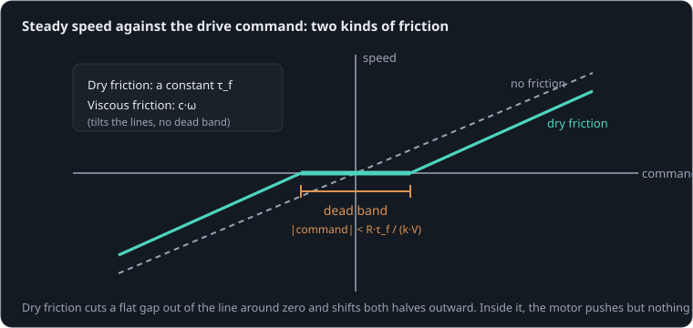

# A joint that ignores you

**By the end of this lesson you will be able to:**

- tell dry friction from viscous friction by what each does;
- predict the smallest command that makes a motor turn against friction;
- explain why a position controller stops short of its target, and what fixes it.

Command a small robot joint to move a little, and often nothing happens. The motor hums, and the joint stays put. Push the command a bit further and it jumps into motion. Here a slow sweep of [commands](part:joint/wave), through an [H-bridge](part:joint/driver), drives our 12 V [motor](part:joint/motor) against the [friction](part:joint/friction) of a small gearbox.

## Dry friction holds

Rub two dry surfaces together and the friction force barely depends on how fast they slide. The same is true of a gearbox, a shaft seal or a brush on a commutator. Referred to the motor shaft, that **dry friction** is a torque of fixed size τ_f that always opposes the motion.

What makes it troublesome is standstill. Push a still shaft with less than τ_f, and friction pushes back exactly as hard: nothing moves.

**Worked example.** Our gearbox has τ_f = {{param friction.torque | 0.015 N·m}}. A motor torque of 0.01 N·m on the still shaft is met by 0.01 N·m of friction, and it stays put. At 0.02 N·m it turns, and friction takes 0.015 N·m of that, leaving 0.005 N·m to accelerate it.

```sim-quiz
id: holds
question: Our shaft is still. The motor pushes with 0.012 N·m against the 0.015 N·m friction. What does friction do?
options:
  - { text: "Pushes back with exactly 0.012 N·m, and nothing moves", correct: true, feedback: "Yes. Standing still, friction matches whatever push it gets, up to its limit." }
  - { text: "Pushes back with 0.015 N·m, turning the shaft backwards", feedback: "Friction only opposes; it cannot drive anything. It matches the push, up to 0.015 N·m." }
  - { text: "Nothing, until the shaft moves", feedback: "Friction acts at standstill too: that is exactly what holds the shaft still." }
explain: "At standstill, dry friction supplies whatever torque is needed to keep the shaft still, up to τ_f. Only a push larger than τ_f gets it moving."
concepts: [coulomb-friction]
```

## Where the motor breaks free

A still motor has no back-EMF. So from the voltage budget, a command d on a supply V puts all of d·V across the winding's resistance R (2.05 Ω here, with the bridge), and a current d·V/R flows.

```sim-quiz
id: still-current
kind: numeric
question: Our motor is held still. The command is 0.2 on the 12 V supply, and the winding plus the bridge have R = 2.05 Ω. What current flows, in amps?
answer: 1.17
tolerance: 3%
unit: A
hint: No back-EMF, so i = d·V/R.
explain: "i = 0.2 × 12 / 2.05 = **1.17 A**, with the shaft still."
concepts: [voltage-budget]
```

That current makes a torque k·i = k·d·V/R. The motor breaks free when that reaches τ_f:

```text
d_min = R·τ_f / (k·V)
```

**Worked example.** R = 2 Ω (plus 0.05 Ω in the bridge), τ_f = 0.015 N·m, k = 0.012 N·m/A, V = 12 V: d_min = 2.05 × 0.015 / (0.012 × 12) = 0.21. Any command under 21 % does nothing at all. That flat stretch is the **dead band**.

```sim-quiz
id: dmin
kind: numeric
question: With gearbox friction of {tf} N·m, what is the smallest command (0…1) that turns our motor from 12 V? (R = 2.05 Ω with the bridge, k = 0.012 N·m/A.)
vary: { tf: { min: 0.005, max: 0.03, step: 0.001 } }
given: { k: motor.torque_constant }
answer_expr: 2.05 * tf / (k * 12)
tolerance: 3%
unit: ""
hints:
  - "At the moment it breaks free the motor is still: no back-EMF."
  - "Stall current d·V/R must make torque k·i = τ_f."
  - "d = R·τ_f / (k·V) = 2.05 × τ_f / 0.144."
explain: "d_min = R·τ_f/(k·V). For 0.015 N·m: 0.0308/0.144 = **0.21**. Double the friction, double the dead band. Each review asks with a different friction."
concepts: [dead-band]
```

## The sweep

The scene sweeps the command slowly from 0 up to 0.6, down through 0 to −0.6, and back, over 8 s. Draw the speed you expect first.

```sim-quiz
id: sketch-sweep
kind: sketch
scene: sweep
observe: load.shaft.speed
window: [0, 8]
range: [-350, 350]
question: "Sketch the shaft's speed over the 8 s sweep. The command follows a sine: 0 → 0.6 at 2 s → 0 at 4 s → −0.6 at 6 s → 0 at 8 s."
explain: "Flat at zero until the command passes about 0.21 (at 0.5 s), then a hump up to about 300 rad/s, a flat zero again around 4 s, and the mirror image below. The flats are the dead band."
```

```sim-scene
id: sweep
system: joint
title: A slow sweep of commands
caption: The command rises slowly; nothing moves until it passes about 0.21. The dot on the phase plot traces speed against command.
camera: { preset: iso, zoom: 1.3, yaw: 0.95, pitch: 0.45 }
run: { duration_s: 8.0, frame_rate: 60 }
script: sweep.rhai
plots: [load.shaft.speed, motor.p.current]
phase: [{ x: driver.command, y: load.shaft.speed, title: "Speed against command: the flat stretch is the dead band" }]
show: [forces, current]
companion: { label: "No friction", set: { friction.torque: 0 }, mode: ghost }
sliders:
  - { parameter: friction.torque, label: "Dry friction", min: 0, max: 0.04, step: 0.001, unit: "N·m" }
  - { parameter: load.damping, label: "Viscous friction", min: 0, max: 0.0001, step: 0.000005, unit: "N·m·s/rad" }
hints:
  - "Double the dry friction: the flat stretch on the phase plot doubles in width."
  - "Raise the viscous friction instead: the lines tilt, but they still pass through zero."
expect:
  - { observe: load.shaft.speed, reduce: peak, window: [0.0, 0.42], max: 0.5, why: "Below the dead band (command under 0.2), friction holds the shaft still." }
  - { observe: load.shaft.speed, reduce: mean, window: [1.9, 2.1], min: 290, max: 330, why: "At a command of 0.6 it runs near (0.6·12 − 2.05·τ_f/k)/k, less viscous drag: about 310 rad/s." }
  - { observe: load.shaft.speed, reduce: peak, window: [4.0, 4.42], max: 0.5, why: "Stuck again in the dead band on the way through zero." }
```

The shaft sat still for the first {{value scene=sweep observe=load.shaft.speed reduce=peak window=0..0.42 | 0 rad/s}} while the command rose to 0.2 and the motor already drew over an amp. On the phase plot the dot runs along the zero line, then leaps off it.

```sim-quiz
id: current-without-motion
question: "At 0.4 s the command is 0.19 and the shaft is still. What is the motor's current doing?"
options:
  - { text: "Flowing, about 1.1 A: the stall current for that command", correct: true, feedback: "Yes. Standing still there is no back-EMF, so d·V/R flows, and all of it goes into heat." }
  - { text: "Nothing: no motion, no current", feedback: "Current is set by the voltage budget, not by motion. With no back-EMF, it is at its largest for that command.", remedy: no-motion-no-current }
  - { text: "Rising without limit", feedback: "It is limited by the winding's resistance: i = d·V/R." }
moment: 0.4
explain: "i = d·V/R = 0.19 × 12 / 2.05 ≈ 1.1 A, making 0.013 N·m, just under the friction. A joint sitting in its dead band warms its motor while doing nothing."
```

```sim-remedy
id: no-motion-no-current
misconception: "If the motor does not turn, no current flows"
body: "The voltage budget is V = R·i + k·ω. With ω = 0 there is no back-EMF at all, so the whole commanded voltage drives current through the winding: **more** current than when turning, not less. That current makes torque, and friction absorbs it. Look at the current chart between 0 and 0.5 s: it climbs while the speed stays at zero."
scene: sweep
then: dmin
```

## Viscous friction is different

Oil, air and the motor's own iron losses make a second kind of friction: a drag proportional to speed, **viscous friction**, τ = c·ω. It slows a fast shaft more than a slow one, and it never holds anything still. The figure contrasts the two.



```sim-quiz
id: which-friction
question: A joint moves smoothly for even the smallest command, but its top speed is lower than expected. Which friction is it?
options:
  - { text: "Viscous: it grows with speed, and has no dead band", correct: true, feedback: "Yes. Drag proportional to speed costs the most at top speed and nothing at standstill." }
  - { text: "Dry: it is always there", feedback: "Dry friction would show up as a dead band: small commands would not move it." }
  - { text: "Neither: friction always makes a dead band", feedback: "Only dry friction does. Viscous drag vanishes at zero speed." }
explain: "Viscous friction c·ω vanishes at standstill and grows with speed; dry friction is the same at any speed, and holds a still shaft. Most real joints have both."
concepts: [viscous-friction]
```

## What it does to position control

A simple position controller commands d = kp·e, where e is the angle error. As the joint nears its target, e shrinks, and so does d. Once d falls inside the dead band, the motor stops pushing hard enough to move, and the joint stops short, with an error of d_min/kp.

**Worked example.** With kp = 2 per radian and d_min = 0.21, the joint stops up to 0.21/2 = 0.1 rad (6°) from its target, on whichever side it came from.

```sim-quiz
id: stops-short
kind: numeric
question: "A proportional controller with kp = {kp} per radian drives our joint (dead band 0.21). How far short of the target can it stop, in radians?"
vary: { kp: { min: 1, max: 10, step: 0.5 } }
answer_expr: 0.21 / kp
tolerance: 3%
unit: rad
hint: It stops where kp·e falls to the dead band.
explain: "e = d_min/kp. At kp = 2: **0.105 rad**. Raising kp shrinks the error but, with inertia and delay, soon makes the joint overshoot and hunt around the target."
```

The usual fixes: add the friction back as a feed-forward, a small extra command in the direction of motion ("friction compensation"); add integral action, which keeps growing the command until the joint moves; or add a small high-frequency wiggle ("dither") that keeps the joint from ever quite sticking.

## Putting it in your own words

```sim-reflect
id: why-hum
prompt: A servo hums and warms up while holding still, a few degrees away from where it was told to go. Explain, in a few sentences, what is happening, using this lesson's ideas.
model_answer: "The controller's command is proportional to the remaining error. Close to the target the command is inside the dead band: the motor's torque, k·d·V/R, is less than the gearbox's dry friction, so nothing moves and the error stays. Because the shaft is still there is no back-EMF, so the command's full stall current flows and turns into heat (and the PWM makes the hum). Friction feed-forward, integral action or dither would move it the rest of the way."
key_points:
  - { idea: "Near the target the command is small, inside the dead band", cues: ["dead band", "deadband", "small command", "too small", "proportional"] }
  - { idea: "Motor torque below the dry friction: nothing moves", cues: ["friction", "stiction", "threshold", "break free"] }
  - { idea: "Still shaft: no back-EMF, so current flows and heats", cues: ["back emf", "back-emf", "heat", "current", "warm"] }
  - { idea: "Fixes: feed-forward, integral action or dither", cues: ["feed-forward", "feedforward", "integral", "dither", "compensation"] }
```

## Going further

This part is optional.

**Stiction.** Real surfaces often need more force to start sliding than to keep sliding (static friction above kinetic). The shaft then sticks, breaks free with a lurch, and may stick again: stick–slip, the cause of juddering slow motions. This model has one friction value, so it shows the dead band but not the lurch.

**Friction depends on load.** Gear friction rises with the torque transmitted, and dry friction with the force pressing surfaces together, so a joint's dead band is wider when it carries a load.

```sim-component
component: rotational.coulomb_friction
show: [summary, equations, tradeoffs]
```

## Key ideas

- **Dry friction** is a fixed torque opposing motion; at standstill it holds anything pushed less hard.
- The **dead band**: commands below d_min = R·τ_f/(k·V) do nothing, while still drawing current.
- **Viscous friction** c·ω grows with speed and has no dead band.
- A proportional controller stops short by d_min/kp; feed-forward, integral action or dither close the gap.
