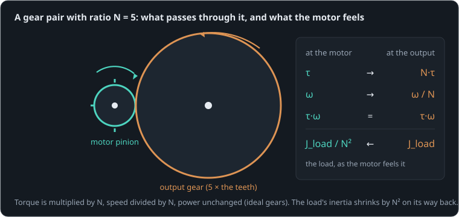

# A small motor and a heavy load

Before the new idea, bring back the last one.

```sim-recall
id: recall-inertia
of: inertia-acceleration
prompt: "Without looking back: what sets how fast a torque spins something up, and what makes a body hard to spin? Write a few lines, then tick what you remembered."
key_points:
  - { idea: "Torque sets the acceleration: τ = J·α", cues: ["j·α", "jα", "j*a", "acceleration", "τ = j"] }
  - { idea: "No torque, no change of speed", cues: ["stays", "keeps", "constant speed", "no friction"] }
  - { idea: "Inertia counts mass by distance squared", cues: ["square", "r²", "r^2", "distance", "rim"] }
```

**By the end of this lesson you will be able to:**

- work out the torque and speed after a gear ratio;
- say how large a load's inertia looks from the motor's side;
- pick the ratio that swings a given load fastest.

Our 12 V can [motor](part:gear/motor) makes at most {{param motor.torque_constant | 0.012 N·m/A}} × 6 A = 0.072 N·m. Its job here is to swing a [load](part:gear/load) whose inertia is 25 times its own [rotor](part:gear/rotor)'s, through a [gear pair](part:gear/gear) of ratio {{param gear.ratio | 5}}.

## Torque up, speed down

A gear pair with ratio N has N times more teeth on the output gear than on the motor's pinion. For every turn of the output, the pinion turns N times. So the output turns N times slower, and pushes N times harder:

```text
τ_out = N·τ_motor          ω_out = ω_motor / N
```

**Worked example.** Through our 5:1 pair, the motor's 0.072 N·m stall torque becomes 0.36 N·m, and its 1000 rad/s no-load speed becomes 200 rad/s.

With ideal gears (no friction) the power τ·ω is the same on both sides: the gear trades one for the other, and makes no energy.



```sim-quiz
id: out-torque
kind: numeric
question: A motor making 0.05 N·m turns a load through a {N}:1 gear. What torque reaches the load, in N·m? (Ideal gears.)
vary: { N: { min: 3, max: 30, step: 1 } }
answer_expr: 0.05 * N
tolerance: 2%
unit: N·m
hint: The output torque is N times the motor's.
explain: "τ_out = N·τ_motor: at 5:1, 0.05 × 5 = **0.25 N·m**. Each review asks with a different ratio."
```

```sim-quiz
id: power-through
question: Through ideal gears, the output torque is five times the motor's. What about the output power?
options:
  - { text: "The same as the motor's", correct: true, feedback: "Yes. Torque ×5, speed ÷5: τ·ω is unchanged." }
  - { text: "Five times the motor's", feedback: "Gears cannot make energy. The speed falls by the same factor the torque rises." }
  - { text: "A fifth of the motor's", feedback: "Ideal gears lose nothing. Real ones lose a few percent per stage, as heat." }
explain: "Power in = power out for ideal gears: τ·ω = (5τ)·(ω/5). Real gears lose some to friction, which is why gearboxes have an efficiency, usually 60–95 %."
```

## The inertia the motor feels

Now the surprising part. When the motor accelerates, it must accelerate the load too, through the gears. How heavy does the load feel from the motor's side?

For the output to speed up by α, the motor must speed up N times as much (N·α). The load needs a torque J_load·α at the output, which the gear asks of the motor divided by N. Put together, the load feels like an inertia divided by N twice:

```text
J_seen = J_load / N²
```

This is the **reflected inertia**: the load as the motor feels it.

**Worked example.** A 0.0003 kg·m² load through 10:1 looks like 0.0003 / 100 = 0.000003 kg·m² from the motor: about the size of our motor's rotor.

```sim-quiz
id: reflected-steps
kind: steps
question: "Our load is 7.5e-5 kg·m², behind a 5:1 gear. The rotor is 3e-6 kg·m². How much inertia does the motor have to accelerate in all?"
steps:
  - { prompt: "N²", worked: "5² = 25" }
  - { prompt: "The load, as the motor feels it", answer: 3e-6, unit: "kg·m²", tolerance: 3% }
  - { prompt: "Rotor and load together", answer: 6e-6, unit: "kg·m²", tolerance: 3% }
explain: "7.5e-5 / 25 = **3e-6 kg·m²**, the same as the rotor, so the motor accelerates **6e-6 kg·m²** in all. Direct (1:1), it would have to accelerate 7.8e-5: thirteen times more."
concepts: [reflected-inertia]
```

## Direct, or through the gear?

The scene runs the geared drive beside a copy with no reduction (1:1), both switched on at 0 s.

```sim-quiz
id: predict-race
kind: predict
scene: race
question: "Which swings the load through its first radian sooner: the motor driving it directly (1:1), or through the 5:1 gear?"
options:
  - { text: "Direct: no gear slows it down", feedback: "Direct, the motor must accelerate the whole load inertia with 0.072 N·m at most." }
  - { text: "Through the 5:1 gear", correct: true, feedback: "The gear makes five times the torque on a load that the motor feels as 25 times lighter." }
  - { text: "They tie", feedback: "Watch the angle chart: they separate within milliseconds." }
explain: "Through the gear, about {{value scene=race observe=load.shaft.angle reduce=final window=0..0.03 | 0.95 rad}} in the first 30 ms; directly, less than half of that. The gear loses on top speed (200 against 1000 rad/s), but a joint rarely lives there."
```

```sim-scene
id: race
system: gear
title: Direct drive against a 5:1 gear
caption: "The load, through a 5:1 gear (left) and directly (right, purple curves). Both motors switch on at 0 s."
companion: { label: "Direct drive (1:1)", set: { gear.ratio: 1 }, mode: split }
camera: { preset: iso, zoom: 1.35, yaw: 0.95, pitch: 0.45 }
run: { duration_s: 0.12, frame_rate: 500 }
script: race.rhai
plots: [load.shaft.angle, load.shaft.speed]
show: [forces]
sliders:
  - { parameter: gear.ratio, label: "Gear ratio N", min: 1, max: 20, step: 0.5 }
hints:
  - "Try N = 2, 5, 12 and 20. The angle after 30 ms rises, peaks, then falls."
  - "At high ratios the motor spends its effort spinning its own rotor, N² times heavier as the load sees it."
challenge:
  goal: "Choose a **ratio** that swings the load at least **0.9 rad** in the first 30 ms."
  hint: "The best ratio makes the load, as the motor feels it, about equal to the rotor: J_load/N² ≈ J_rotor."
  win:
    - { observe: load.shaft.angle, reduce: final, window: [0.0, 0.03], min: 0.9, why: "At least 0.9 rad after 30 ms." }
expect:
  - { observe: load.shaft.angle, reduce: final, window: [0.0, 0.03], min: 0.92, max: 0.98, why: "Through 5:1 the motor accelerates only 6e-6 kg·m² with its full torque: 0.95 rad in 30 ms." }
  - { observe: load.shaft.speed, reduce: final, window: [0.0, 0.12], min: 145, max: 160, why: "Three quarters of the way to its 200 rad/s top speed at the output (1000 / 5) after 0.12 s." }
```

The geared load swings {{value scene=race observe=load.shaft.angle reduce=final window=0..0.03 | 0.95 rad}} in 30 ms. On the chart, the purple direct drive is still crawling: the whole 7.8e-5 kg·m² sits on the motor's shaft.

```sim-equation
id: speed-through
scene: race
show: "ω_out = ω_motor / N"
expr: w / N
result: { symbol: ω_out, unit: rad/s }
terms:
  w: { symbol: ω_motor, unit: rad/s, observe: motor.shaft.speed }
  N: { symbol: N, unit: "", param: gear.ratio }
holds: { observe: load.shaft.speed, tolerance: 1% }
caption: The output speed at the playhead is the motor's divided by the ratio, throughout the run.
```

```sim-quiz
id: why-gear-won
question: Why did the geared drive swing the load so much sooner?
options:
  - { text: "Five times the torque on a load that felt 25 times lighter to the motor", correct: true, feedback: "Both effects together. The second one is the bigger." }
  - { text: "The gear stores energy and releases it", feedback: "Gears store nothing (ideal ones lose nothing either). They trade torque for speed.", remedy: gear-energy }
  - { text: "The geared motor draws more current", feedback: "Both motors start at the same stall current, 6 A. The difference is what that current's torque has to move." }
explain: "The motor's torque is multiplied by 5 on the way out, and the load's inertia divided by 25 on the way back. At startup that lets the motor spin up quickly and hand the load five times its torque."
moment: 0.03
```

```sim-remedy
id: gear-energy
misconception: "A gearbox gives extra energy"
body: "A gear pair passes power through: τ·ω is the same on both sides (less friction). What it changes is the **mix**: more torque, less speed. The geared load here gets 5× the torque, and never goes faster than 200 rad/s, a fifth of the motor's 1000."
scene: race
then: power-through
```

## Too much of a good thing

If a little ratio helps, why not a lot? Because the motor must also spin its own rotor, N times faster than the load. From the load's side, the rotor feels N² times heavier. At 20:1, our rotor alone weighs in at 400 × 3e-6 = 0.0012 kg·m², sixteen times the load itself.

The sweet spot is where the load, as the motor feels it, equals the rotor:

```text
N_best = √(J_load / J_rotor)
```

**Worked example.** √(7.5e-5 / 3e-6) = √25 = 5: our gear. The saved sweep in the system file shows it: the angle after 30 ms peaks at 5:1.

```sim-compare
id: ratio-sweep
system: gear
study: ratio
title: Load angle after 30 ms, and speed at 0.2 s, against the ratio
caption: "The quickest start is near N = 5; higher ratios are slower to start and have a lower top speed."
```

```sim-quiz
id: best-ratio
kind: numeric
question: A new arm has an inertia of {JL} kg·m² at the joint. With our motor (rotor 3e-6 kg·m²), what gear ratio swings it fastest from rest?
vary: { JL: { min: 0.0001, max: 0.003, step: 0.0001 } }
given: { Jr: rotor.inertia }
answer_expr: sqrt(JL / Jr)
tolerance: 5%
unit: ""
hints:
  - "The best ratio makes the reflected load equal to the rotor."
  - "J_load / N² = J_rotor, so N = √(J_load / J_rotor)."
  - "Divide the arm's inertia by 3e-6, then take the square root."
explain: "N = √(J_load/J_rotor). For 0.0012 kg·m²: √400 = **20**. Heavier loads want higher ratios. In practice designers go a little lower, to keep top speed."
```

## Putting it in your own words

```sim-reflect
id: why-ratio
prompt: A robot arm's joint uses a 100:1 gearbox. In a few sentences, explain what that ratio gives the joint and what it costs, using this lesson's ideas.
model_answer: "The ratio multiplies the motor's torque by 100 (less friction losses), so a small, light motor can hold and move a heavy arm, and the arm's inertia looks 10 000 times smaller to the motor, which lets it accelerate quickly. The costs: the output is 100 times slower than the motor, and the motor's own rotor looks 10 000 times heavier from the arm's side, so the joint is hard to push back by hand and a collision or a landing hits the gearbox hard. Friction in so many gear stages also wastes power and hides small forces."
key_points:
  - { idea: "Torque is multiplied, speed divided", cues: ["torque", "×100", "100 times", "slower", "speed"] }
  - { idea: "The load looks N² lighter to the motor", cues: ["n²", "n^2", "10 000", "10000", "squared", "lighter"] }
  - { idea: "The rotor looks N² heavier from the arm (hard to back-drive, impacts)", cues: ["back-drive", "backdrive", "push back", "impact", "rotor", "heavier"] }
  - { idea: "Friction and efficiency losses", cues: ["friction", "efficiency", "loss", "heat"] }
```

## Going further

This part is optional.

**Real gears lose power.** Each stage costs a few percent: the output torque is η·N·τ. A 100:1 gearbox of three stages at 90 % each passes about 73 %.

**Legged robots and low ratios.** Many walking robots use large, flat motors with ratios of only 6–10 ("quasi-direct drive"). Their small reflected rotor inertia lets the leg be pushed back by the ground on landing, and the motor current then shows the force at the foot, which a 100:1 gearbox would hide.

```sim-component
component: rotational.ideal_gear
show: [summary, equations, tradeoffs]
```

## Key ideas

- A **gear ratio** N multiplies torque by N and divides speed by N; power passes through unchanged (less friction).
- **Reflected inertia**: a load J looks like J/N² to the motor, and the rotor looks N² times heavier to the load.
- The quickest start comes near N = √(J_load/J_rotor).
- High ratios buy torque and stiffness at the price of speed, efficiency and back-drivability.
