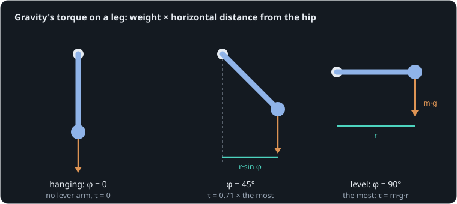

# Lifting a leg

**By the end of this lesson you will be able to:**

- work out gravity's torque on a leg or arm at any angle;
- find the angle where a joint must work hardest, and the torque it needs there;
- predict how far a position servo sags under that torque, and when it gives up.

A servo's datasheet says "12 kg·cm". Is that enough for a leg? Here a [hip servo](part:leg/servo) lifts a 0.4 kg [leg](part:leg/leg), its centre of mass 0.15 m below the hip, from hanging straight down to level.

## Gravity pulls with a lever

Gravity pulls the leg's centre of mass straight down with its weight, m·g. How much that turns the hip depends on how far out sideways the centre of mass is: the lever arm. Hanging straight down, the weight pulls right through the hip and has no lever at all. Level, the lever is the whole distance r.



Measure the leg's angle φ from hanging straight down. Gravity's torque τ about the hip grows as the leg rises and its lever arm lengthens.

```sim-quiz
id: hardest
question: As the servo lifts the leg from hanging to level, where must it push hardest just to hold still?
options:
  - { text: "Level", correct: true, feedback: "Yes: the lever arm r·sin φ is largest at 90°." }
  - { text: "Hanging straight down, where it starts", feedback: "Hanging, the weight pulls straight through the hip: no lever, no torque." }
  - { text: "The same everywhere: the leg weighs the same", feedback: "The weight is the same, but its lever arm is not." }
explain: "τ = m·g·r·sin φ is zero hanging and largest level. A joint's holding torque must be sized for its worst angle."
concepts: [gravity-torque]
```

The lever arm is r·sin φ, so:

```text
τ_g = m·g·r·sin φ          (φ measured from hanging down)
```

**Worked example.** Our leg: m = {{param leg.mass | 0.4 kg}}, r = {{param leg.arm | 0.15 m}}. Level (φ = 90°, sin φ = 1): τ = 0.4 × 9.81 × 0.15 = 0.59 N·m. At 30° (sin φ = 0.5): half that, 0.29 N·m.

```sim-quiz
id: peak-torque
kind: numeric
question: A leg of {m} kg has its centre of mass 0.15 m from the hip. What torque does the hip need to hold it level, in N·m?
vary: { m: { min: 0.2, max: 1.2, step: 0.05 } }
answer_expr: m * 9.81 * 0.15
tolerance: 2%
unit: N·m
hint: Level, sin φ = 1, so τ = m·g·r.
explain: "τ = m·g·r: for 0.4 kg, 0.4 × 9.81 × 0.15 = **0.59 N·m**, about 6 kg·cm. Each review asks with a different leg."
concepts: [gravity-torque]
```

## A servo holds by leaving an error

A position servo pushes toward its target in proportion to how far away it is, like a torsion spring between the target and the shaft. It can only push back against a steady load by being off target: the heavier the load, the bigger the error. This is its **stiffness**, k_s, in N·m per radian of error:

```text
error = τ_load / k_s
```

**Worked example.** Our servo has k_s = {{param servo.stiffness | 8 N·m/rad}}. Holding the leg level takes 0.59 N·m, so it sits 0.59 / 8 = 0.074 rad (4.2°) below its target.

```sim-quiz
id: sag
kind: numeric
question: With our servo (k_s = 8 N·m/rad), how far below the target will the level leg sit, in degrees? (Holding torque 0.59 N·m.)
answer: 4.2
tolerance: 5%
unit: °
hints:
  - "The error is the load torque over the stiffness, in radians."
  - "0.59 / 8 = 0.074 rad."
  - "Convert: × 180/π."
explain: "0.59 / 8 = 0.074 rad = **4.2°**. A stiffer servo (bigger k_s) would sag less."
concepts: [holding-torque]
```

## Lifting it

The target rises at 1 rad/s from 0.3 s and stops at level (1.571 rad) at 1.87 s.

```sim-quiz
id: predict-level
kind: predict
scene: lift
question: Once the target reaches level and stops, what angle will the leg settle at, in radians?
observe: leg.shaft.angle
reduce: mean
window: [2.2, 2.5]
tolerance: 1%
unit: rad
explain: "1.571 − 0.074 = **1.497 rad**: 4.2° short of level, exactly the sag the stiffness predicts."
```

```sim-scene
id: lift
system: leg
title: Hanging to level
caption: The target sweeps to level. The servo's torque follows gravity's, and the leg lags the target by τ/k_s.
companion: { label: "0.8 kg leg", set: { leg.mass: 0.8, leg_inertia.inertia: 0.018 }, mode: ghost }
camera: { preset: front, zoom: 1.4 }
run: { duration_s: 2.5, frame_rate: 60 }
script: lift.rhai
plots: [leg.shaft.angle, servo.torque]
show: [forces, trails]
sliders:
  - { parameter: leg.mass, label: "Leg mass", min: 0.1, max: 1.0, step: 0.05, unit: kg }
  - { parameter: servo.stiffness, label: "Servo stiffness", min: 2, max: 40, step: 1, unit: "N·m/rad" }
hints:
  - "Make the leg heavier: the servo torque at level rises in proportion, and so does the sag."
  - "Past about 0.82 kg the servo's 1.2 N·m stall torque is not enough: it cannot reach level."
expect:
  - { observe: leg.shaft.angle, reduce: mean, window: [2.2, 2.5], min: 1.485, max: 1.51, why: "Level needs 0.587 N·m; 0.587/8 = 0.073 rad of sag below 1.571." }
  - { observe: servo.torque, reduce: mean, window: [2.2, 2.5], min: 0.57, max: 0.6, why: "Held still, the servo supplies exactly gravity's torque, m·g·r·sin φ ≈ 0.587 N·m." }
  - { observe: servo.torque, reduce: mean, window: [0.45, 0.55], min: 0.05, max: 0.15, why: "Near hanging, gravity barely resists: a small torque." }
```

```sim-equation
id: gravity-now
scene: lift
show: "τ_g = m·g·r·sin φ"
expr: m * g * r * sin(phi)
result: { symbol: τ_g, unit: N·m }
terms:
  m: { symbol: m, unit: kg, param: leg.mass }
  g: { symbol: g, unit: m/s², value: 9.80665 }
  r: { symbol: r, unit: m, param: leg.arm }
  phi: { symbol: φ, unit: rad, observe: leg.shaft.angle }
holds: { observe: leg.shaft.torque, tolerance: 1% }
caption: Gravity's torque at the playhead, from the leg's angle. It grows like sin φ as the leg rises.
```

The run settles at {{value scene=lift observe=leg.shaft.angle reduce=mean window=2.2..2.5 | 1.497 rad}}, with the servo pushing {{value scene=lift observe=servo.torque reduce=mean window=2.2..2.5 | 0.587 N·m}}. The purple ghost, a 0.8 kg leg, sags twice as far.

```sim-quiz
id: why-lag
question: During the lift (say at 1 s), the leg trails the target by about 0.07 rad even low down, where gravity is still small. What else is the servo pushing against?
options:
  - { text: "Its own damping, which resists the lift speed", correct: true, feedback: "Yes: the servo's damping (0.25 N·m·s/rad × 1 rad/s) adds 0.25 N·m while moving." }
  - { text: "Gravity alone", feedback: "At 0.63 rad gravity is only 0.35 N·m, which gives 0.044 rad of error. Something else adds the rest." }
  - { text: "Nothing: the lag is just delay", feedback: "This servo model has no delay; its error comes from the torque it must produce." }
moment: 1.0
explain: "error = (gravity + damping·speed)/k_s = (0.35 + 0.25)/8 ≈ 0.074 rad. Once the target stops, the damping term vanishes and only gravity's sag is left."
concepts: [holding-torque]
```

## When it cannot hold

Every servo has a **stall torque**, the most it can make at all: ours is {{param servo.stall_torque | 1.2 N·m}}. If gravity needs more than that, no error is large enough: the leg stops where m·g·r·sin φ equals the stall torque, and goes no higher.

**Worked example.** A 0.9 kg leg needs 0.9 × 9.81 × 0.15 = 1.32 N·m level: more than 1.2. It stalls where sin φ = 1.2/1.32 = 0.91, at about 65°.

```sim-quiz
id: max-mass
kind: numeric
question: With r = 0.15 m and a stall torque of 1.2 N·m, what is the heaviest leg this servo can just hold level, in kg?
answer: 0.815
tolerance: 2%
unit: kg
hint: "m·g·r = τ_stall, so m = τ_stall/(g·r)."
explain: "m = 1.2/(9.81 × 0.15) = **0.82 kg** — with no margin at all. Designers keep at least a factor of 2 on the worst angle, because the leg must also accelerate (τ = J·α) and the servo weakens as it heats."
concepts: [gravity-torque, holding-torque]
```

## Fix the leg

```sim-task
id: heavy-leg
kind: fault
scene: lift
title: The new leg will not lift
goal: "The robot's leg was rebuilt with a bigger foot and now weighs **0.9 kg**. The hip servo can no longer lift it to level. Change the **leg** (not the servo) so the servo holds it within 10° of level (≥ 1.40 rad)."
start: { leg.mass: 0.9, leg_inertia.inertia: 0.02 }
win:
  - { observe: leg.shaft.angle, reduce: mean, window: [2.2, 2.5], min: 1.40, why: "Held within 10° of level." }
report:
  - { label: "Angle held", observe: leg.shaft.angle, reduce: mean, window: [2.2, 2.5], unit: rad }
  - { label: "Servo torque", observe: servo.torque, reduce: mean, window: [2.2, 2.5], unit: N·m }
hints:
  - "Gravity's torque is m·g·r. Which of those can the leg's design change?"
  - "Mass and the distance of the centre of mass from the hip both count equally."
  - "Moving the heavy foot's mass closer to the hip shortens r: try r = 0.1 m."
solution: { leg.arm: 0.1 }
```

## Putting it in your own words

```sim-reflect
id: size-servo
prompt: A teammate picked a hip servo whose stall torque exactly equals m·g·r for the leg. In a few sentences, explain why the leg may still droop or fail to lift, using this lesson's ideas.
model_answer: "At the worst angle (level) gravity needs m·g·r, which here is the stall torque itself, so there is no margin. A position servo only produces torque by leaving an error, so it sags by τ/k_s even below stall; near stall the error grows large. Lifting also needs extra torque to accelerate the leg (J·α) and to overcome damping and friction, and a warm motor makes less torque. The servo should have about twice the worst-case gravity torque, or the leg's mass should move closer to the hip."
key_points:
  - { idea: "Worst case is level, m·g·r", cues: ["level", "m·g·r", "mgr", "90", "worst"] }
  - { idea: "A servo holds by sagging (error = τ/k)", cues: ["sag", "error", "stiffness", "τ/k", "droop"] }
  - { idea: "Accelerating and friction need extra torque", cues: ["accelerat", "j·α", "friction", "damping", "moving"] }
  - { idea: "Keep a margin (about 2×) or reduce m·r", cues: ["margin", "twice", "2×", "factor", "closer", "lighter", "shorter"] }
```

## Going further

This part is optional.

**Gravity compensation.** A spring or counterweight arranged to push up like m·g·r·sin φ can cancel gravity at every angle, leaving the servo only the dynamic work. Robot arms and desk lamps use this.

**Datasheet units.** "12 kg·cm" means 12 kg hanging 1 cm from the shaft: 12 × 9.81 × 0.01 = 1.18 N·m. Our servo's 1.2 N·m is that class.

```sim-compare
id: leg-mass
system: leg
study: leg_mass
title: Angle held at level, for five leg masses
caption: "The sag grows in proportion to the mass until the stall torque is reached; beyond about 0.8 kg the leg cannot reach level at all."
```

```sim-component
component: part.pendulum_gravity
show: [summary, equations, limits]
```

## Key ideas

- **Gravity torque** on a link is m·g·r·sin φ: zero hanging, largest level.
- Size a joint for its worst angle, with margin (about 2×) for acceleration, friction and heat.
- A position servo holds a load by sagging: error = τ/k_s (its **stiffness**).
- Past its **stall torque** nothing helps: reduce m·r, add a gear, or compensate gravity.
