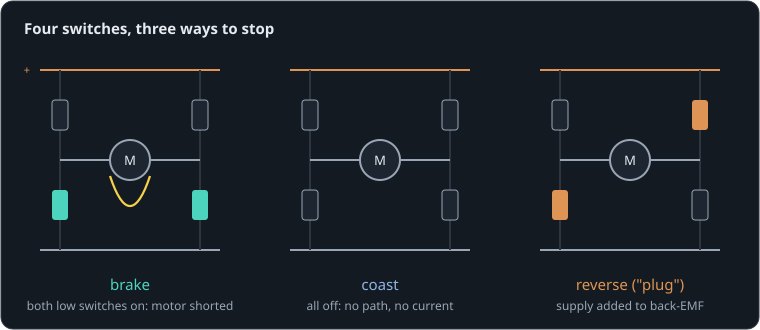

# Stopping at the edge

**By the end of this lesson you will be able to:**

- say what each switch pattern of an H-bridge does to a spinning motor;
- predict how quickly a motor stops when braked or coasting;
- choose the stopping mode for a job, and know when it costs current.

A rover sees the edge of a table and must stop its wheels now. Its motor driver has no brake pads, only four switches. Here an [H-bridge](part:bridge/bridge) spins our 12 V [motor](part:bridge/motor) and a [wheel](part:bridge/load) up for 0.4 s, then stops driving.

## Four switches

An H-bridge puts two switches on each side of the motor: one to the supply, one to 0 V. Turning on the top-left and bottom-right drives the motor forward; the other diagonal drives it backward. But the switches can also be set so that neither side is driven:



- **Brake**: both low switches on. The motor's terminals are joined: shorted.
- **Coast**: all switches off. The motor is disconnected.

```sim-quiz
id: which-brake
question: A spinning motor's H-bridge turns on both low-side switches. What does the motor feel?
options:
  - { text: "Its terminals shorted: its back-EMF drives a current that brakes it", correct: true, feedback: "Yes: generator braking, with only the winding (and two switches) limiting the current." }
  - { text: "Nothing: neither side is connected to the supply", feedback: "The supply is not involved, but the terminals are joined to each other, which is what matters." }
  - { text: "It is driven backward", feedback: "Driving needs the supply across it. Here it only sees a short." }
explain: "Both low switches on joins the motor's terminals through 0 V: the back-driving lesson's short, with the braking time constant J·R/k²."
concepts: [bridge-modes]
```

## Brake and coast, side by side

Braking uses the motor as a generator into a short, as in the last lesson. Coasting leaves it no path: the switches are off, and their built-in diodes only conduct if the back-EMF climbs above the supply (it cannot, here). With no current there is no electrical torque; only friction slows the wheel.

```sim-quiz
id: predict-stop
kind: predict
scene: stop
question: "At 0.4 s the wheel spins at about 420 rad/s. How fast will it spin at 1.0 s when braked?"
observe: load.shaft.speed
reduce: mean
window: [0.99, 1.01]
tolerance: 8%
unit: rad/s
hint: "τ_stop = J·R/k² ≈ 5e-5 × 2/0.000144 ≈ 0.69 s. After 0.6 s, e^(−0.6/0.69) ≈ 0.42, a little less with friction."
explain: "About **160 rad/s**: the brake takes off more than half the speed in 0.6 s. Coasting, the wheel is still at about 390 rad/s: only bearing friction slows it."
```

```sim-scene
id: stop
system: bridge
title: Brake against coast
caption: "Drive for 0.4 s, then stop driving. Left: the bridge shorts the motor (brake). Right (purple): the bridge turns everything off (coast)."
companion: { label: "Coast (bridge off at 0.4 s)", set: { enable.duration: 0.4 }, mode: split }
camera: { preset: iso, zoom: 1.4, yaw: 0.95, pitch: 0.45 }
run: { duration_s: 1.5, frame_rate: 120 }
script: stop.rhai
plots: [load.shaft.speed, motor.p.current]
show: [current]
sliders:
  - { parameter: load.inertia, label: "Wheel inertia", min: 0.00001, max: 0.0002, step: 0.00001, unit: "kg·m²" }
hints:
  - "Double the wheel's inertia: braking takes twice as long (τ = J·R/k²)."
  - "Watch the current chart: braking current flows backward, coasting has none."
expect:
  - { observe: load.shaft.speed, reduce: mean, window: [0.99, 1.01], min: 145, max: 175, why: "Braked with τ = J·R/k² ≈ 0.69 s (plus friction): about 160 rad/s at 1.0 s." }
  - { observe: motor.p.current, reduce: min, window: [0.4, 0.45], min: -2.6, max: -2.35, why: "Braking current at 417 rad/s: −k·ω/R_m ≈ −5.0/2 ≈ −2.5 A." }
```

```sim-equation
id: brake-current
scene: stop
show: "i = −k·ω / R_m"
expr: -k * w / Rm
result: { symbol: i, unit: A }
terms:
  k: { symbol: k, unit: N·m/A, param: motor.torque_constant }
  w: { symbol: ω, unit: rad/s, observe: load.shaft.speed }
  Rm: { symbol: R_m, unit: Ω, param: motor.resistance }
holds: { observe: motor.p.current, window: [0.42, 1.5], tolerance: 3% }
caption: "While braking, the current is the back-EMF over the winding's 2 Ω (this averaged bridge shorts the motor with ideal switches when braking)."
```

Braked, the wheel is down to {{value scene=stop observe=load.shaft.speed reduce=mean window=0.99..1.01 | 160 rad/s}} at 1.0 s. On the current chart, the braking current flows backward, and fades with the speed.

```sim-quiz
id: coast-why
question: Why does the coasting wheel keep turning so long, even though its motor is still a generator?
options:
  - { text: "With every switch off there is no closed path, so no current and no torque", correct: true, feedback: "Yes. A generator only brakes when its current can flow." }
  - { text: "The diodes let current flow and speed it up", feedback: "The diodes would conduct only if the back-EMF rose above the supply, and a coasting motor never gets there by itself." }
  - { text: "The motor stores energy and gives it back", feedback: "The wheel stores the energy; with no current, the motor takes none of it." }
explain: "Open circuit: no current, no electrical torque. Only friction, 2 mN·m here, slows the wheel: about 40 rad/s every second."
concepts: [bridge-modes]
```

## Reverse: the hardest stop

A third way: drive the motor backward (plugging). The supply then adds to the back-EMF instead of the two cancelling, so the current is (V + k·ω)/R, more than a stall.

**Worked example.** At 417 rad/s the back-EMF is 5 V. Reversing the 12 V supply puts 17 V across 2.05 Ω: 8.3 A, 1.4 times the stall current, and the supply pours energy in on top of the wheel's.

```sim-quiz
id: plug-current
kind: numeric
question: The wheel spins at {w} rad/s when the bridge reverses the 12 V supply. What current flows at that instant, in amps? (k = 0.012, R = 2.05 Ω)
vary: { w: { min: 100, max: 900, step: 50 } }
given: { k: motor.torque_constant }
answer_expr: (12 + k * w) / 2.05
tolerance: 3%
unit: A
hint: "Supply and back-EMF add: i = (V + k·ω)/R."
explain: "i = (V + k·ω)/R: at 417 rad/s, 17/2.05 = **8.3 A**. At full speed (1000 rad/s) it would be 24/2.05 = 11.7 A: twice the stall current. Reversing stops fastest, but only with a current limit."
concepts: [bridge-modes]
```

## Which stop when

- Coast to save energy and stop gently: a wheel that should roll to a halt, a leg that should swing freely.
- Brake to stop quickly without drawing from the supply: the table edge. It fades as the speed falls, and it cannot hold anything still.
- Reverse, with a current limit, for the fastest stop or to hold against a push; it costs supply current and heats the motor most.

## Putting it in your own words

```sim-reflect
id: choose-stop
prompt: A teammate asks why "stop" in their motor driver library has two options, brake and coast. Explain the difference in a few sentences, and when to use each.
model_answer: "A spinning motor is a generator. Brake turns on both low-side switches, shorting its terminals, so its back-EMF drives a current limited only by the winding's resistance; that current's torque opposes the motion, slowing it with a time constant J·R/k², and the energy becomes heat in the winding. Coast turns all switches off, so there is no path for current, no electrical torque, and only friction slows it. Brake for quick stops (it fades at low speed and cannot hold); coast to save energy or let a joint swing freely. Reversing stops fastest but draws more than stall current, so it needs a current limit."
key_points:
  - { idea: "Brake shorts the motor; its back-EMF current brakes it", cues: ["short", "low side", "low-side", "back-emf", "generator"] }
  - { idea: "Coast leaves no path: no current, only friction", cues: ["open", "no current", "all off", "friction", "no path"] }
  - { idea: "Brake stops quickly (J·R/k²) but fades and cannot hold", cues: ["quick", "fast", "j·r/k²", "fades", "hold"] }
  - { idea: "Reverse is hardest, more than stall current", cues: ["reverse", "plug", "stall current", "current limit", "twice"] }
```

## Going further

This part is optional.

**PWM decay modes.** Between PWM pulses a driver must let the motor's current keep flowing somewhere. "Slow decay" lets it circulate through the low switches (a brief brake); "fast decay" sends it back to the supply (a brief reverse). The choice changes how the motor responds to small commands and how much current ripples.

**Dead time.** Turning one switch off and the other on at exactly the same instant would briefly short the supply through both. Drivers wait a few hundred nanoseconds between them.

```sim-component
component: robot.switchable_h_bridge
show: [summary, equations, limits]
```

## Key ideas

- An H-bridge's four switches can drive either way, **brake** (both low on: shorted) or **coast** (all off).
- Braking is generator braking: fast at first, fading with speed, time constant J·R/k².
- Coasting gives no current and no torque: only friction slows the load.
- Reversing stops fastest but draws (V + k·ω)/R, more than stall: use a current limit.
