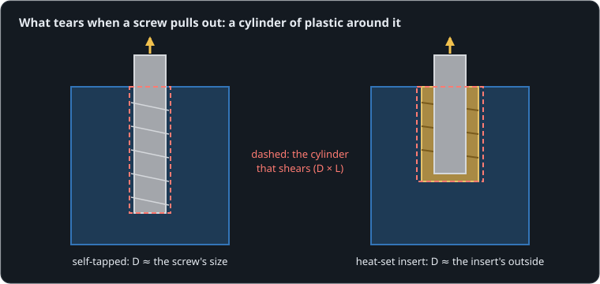

# Threads in plastic

**By the end of this lesson you will be able to:**

- estimate how hard a screw can pull before it tears out of printed plastic;
- explain why a heat-set insert holds more than a self-tapped thread;
- size a boss so the insert's strength is not wasted.

Printed parts are often held together by screws driven straight into the plastic. They work, until one strips while you tighten it, or tears out when the part is loaded. A **heat-set insert** is a small brass sleeve with a thread inside and knurls outside: pressed in with a hot soldering iron, it melts its way into the plastic, which then sets around the knurls. Here the same growing pull acts on an [M3 screw cut into the plastic](part:pullout/tapped) and on an [M3 screw in an insert](part:pullout/insert).

## What tears

When a screw pulls out, the screw does not break: a thin cylinder of plastic around it shears off, the plastic that was gripping it. Its diameter D is where the grip is (the thread's crests for a self-tapped screw, the knurls for an insert), and its length L is how deep the grip goes. That cylinder's side is the **shear surface**:



```text
surface = π · D · L
```

**Worked example.** An M3 screw cut 6 mm deep: surface = π × 3 mm × 6 mm ≈ 57 mm².

```sim-quiz
id: area
kind: numeric
question: An M3 screw is cut {depth} mm deep into a printed boss. How big is its shear surface, in square millimetres?
vary: { depth: { min: 4, max: 12, step: 1 } }
answer_expr: 3.14159265 * 3 * depth
tolerance: 3%
unit: mm²
hints:
  - "The surface is the side of a cylinder."
  - "surface = π · D · L, with D the screw's size."
  - "For 6 mm: π × 3 × 6."
explain: "π·D·L: for 6 mm deep, **57 mm²**. Deeper screws tear out a longer cylinder."
concepts: [thread-pullout]
```

## How much it takes

The surface tears when the stress on it reaches the plastic's shear strength, τ. Only part of the surface really grips (a thread fills only some of it), a share η:

```text
F = τ · surface · η
```

For printed PLA pulled along the direction the layers are stacked, τ is about 15–20 MPa. That is an estimate, and lower than solid PLA, because the layers only partly fuse. The model uses {{param pullout/tapped.shear_strength | 17 MPa}}.

**Worked example.** The self-tapped M3 screw: 57 mm² of surface, with the thread gripping about 40 % of it: F = 17 MPa × 57 mm² × 0.4 ≈ 385 N. That is its **pull-out strength**, about the weight of 39 kg.

```sim-quiz
id: strength
kind: numeric
question: "A self-tapped M3 screw 6 mm deep grips {share} % of its shear surface in PLA with τ = 17 MPa. How hard can it pull before it tears out, in newtons?"
vary: { share: { min: 30, max: 60, step: 5 } }
answer_expr: 17 * 3.14159265 * 3 * 6 * share / 100
tolerance: 3%
unit: N
hints:
  - "First the surface, then the stress it can take."
  - "The surface is π × 3 × 6 ≈ 57 mm²; MPa × mm² gives newtons."
  - "F = 17 × 57 × (share / 100)."
explain: "F = τ × surface × η: at 40 %, 17 × 57 × 0.4 ≈ **385 N**."
concepts: [thread-pullout]
```

## An insert grips a wider cylinder

An insert's knurls sit at its outside, 5.6 mm across for M3, and melted plastic fills around them. So the shear surface is wider, and the insert grips a larger share of it.

**Worked example.** An M3 insert 5.7 mm long: surface = π × 5.6 mm × 5.7 mm ≈ 100 mm². Gripping about half: F = 17 MPa × 100 mm² × 0.5 ≈ 850 N, over twice the self-tapped screw.

```sim-quiz
id: predict-insert
kind: predict
scene: tearout
question: The pull on both screws grows by 150 N every second. What is the largest force the insert will hold before it tears out, in newtons?
observe: insert.load
reduce: max
window: [0.0, 8.0]
tolerance: 5%
unit: N
explain: "τ·π·D·L·η = 17 MPa × π × 5.6 × 5.7 mm² × 0.5 ≈ **852 N**, reached at about 5.7 s."
concepts: [heat-set-inserts]
```

```sim-scene
id: tearout
system: pullout
title: Pull-out test
caption: "Both screws are pulled by the same force, growing by 150 N every second. Each holds until its cylinder of plastic shears, then it escapes onto a catch 8 mm up."
camera: { preset: front, zoom: 1.4 }
run: { duration_s: 8.0, frame_rate: 400 }
script: pull.rhai
plots: [tapped.load, insert.load]
show: [forces]
sliders:
  - { parameter: insert.length, label: "Insert length (L)", min: 0.003, max: 0.01, step: 0.0005, unit: m }
  - { parameter: tapped.length, label: "Self-tapped depth", min: 0.003, max: 0.015, step: 0.0005, unit: m }
hints:
  - "Make the self-tapped hole 12 mm deep: does it catch up with the insert?"
  - "Halve the insert's length: its strength halves too."
expect:
  - { observe: tapped.load, reduce: max, window: [0.0, 8.0], min: 375, max: 392, why: "τ·π·D·L·η = 17 MPa × π × 3 × 6 mm² × 0.4 ≈ 385 N." }
  - { observe: insert.load, reduce: max, window: [0.0, 8.0], min: 840, max: 862, why: "17 MPa × π × 5.6 × 5.7 mm² × 0.5 ≈ 852 N." }
  - { observe: tapped_screw.axis.position, reduce: final, window: [3.2, 3.3], min: 0.007, why: "After tearing out near 2.6 s, the self-tapped screw has escaped onto the catch." }
  - { observe: insert_screw.axis.position, reduce: final, window: [4.9, 5.0], max: 0.001, why: "At 5 s (750 N) the insert still holds." }
```

The self-tapped screw holds {{value scene=tearout observe=tapped.load reduce=max window=0..8 | 385 N}}; the insert holds {{value scene=tearout observe=insert.load reduce=max window=0..8 | 852 N}}.

```sim-quiz
id: deeper
question: "The self-tapped screw would hold as much as the insert if you made its hole deeper. Why still use inserts?"
options:
  - { text: "The insert keeps a metal thread: it can be screwed in and out many times, and cannot strip while tightening", correct: true, feedback: "Yes. A plastic thread wears and strips after a few assemblies; brass does not. And the insert does it in a short boss." }
  - { text: "Deeper holes are always weaker", feedback: "Deeper is stronger: the surface grows with L. It just takes more depth, and a longer screw." }
  - { text: "Inserts are lighter", feedback: "Brass is much heavier than plastic; weight is not the reason." }
explain: "Strength per millimetre of depth favours inserts, but the bigger win is a thread that survives repeated assembly and a firm tightening torque."
concepts: [heat-set-inserts]
```

## The boss around it

The **boss** is the post of plastic that holds the insert. The cylinder that shears lies just outside the knurls, so the plastic there must be solid: printed walls, not sparse infill. If the boss is thin, it splits while the hot insert is pressed in, or bulges and cracks under load.

**Worked example.** For an M3 insert 5.6 mm across, a boss about twice that, 11 mm across, leaves (11 − 5.6) / 2 ≈ 2.7 mm of wall: six perimeters of a 0.45 mm line, all solid plastic around the knurls.

```sim-quiz
id: boss-design
question: "An insert keeps tearing out of a boss printed with 2 perimeters and 15 % infill. What change helps most?"
options:
  - { text: "More perimeters (or 100 % infill) around the insert, so the plastic it grips is solid", correct: true, feedback: "Yes. The shear surface sits just outside the knurls; with 2 perimeters much of it cuts through sparse infill." }
  - { text: "A longer screw", feedback: "The screw only reaches the insert's thread; the insert's own grip in the plastic is what tears." }
  - { text: "Tighten the screw harder", feedback: "That adds load; it does not make the plastic stronger." }
explain: "Give the knurls solid plastic to grip: enough perimeters (or local 100 % infill) and a boss about twice the insert's diameter."
concepts: [heat-set-inserts]
```

## In your own words

```sim-reflect
id: why-inserts
prompt: A teammate asks whether they should bother with heat-set inserts for a printed robot arm that is taken apart often. Explain what decides how well a screw holds in plastic, and what an insert changes.
model_answer: "A screw in plastic pulls out when the cylinder of plastic around its grip shears. Its strength is roughly the plastic's shear strength times the cylinder's side area (π × diameter × depth) times how much of it really grips. A self-tapped thread grips at the screw's own diameter, and its plastic thread wears and strips when taken apart often. A heat-set insert's knurls grip a wider cylinder, so it holds about twice as much in the same depth, and its brass thread survives many assemblies. The boss must be thick and solid (several perimeters) around the insert, or the insert's strength is wasted."
key_points:
  - { idea: "It tears a cylinder of plastic: strength ≈ τ·π·D·L·η", cues: ["cylinder", "shear", "area", "π", "depth"] }
  - { idea: "An insert grips a wider cylinder", cues: ["wider", "outside", "knurl", "diameter", "twice"] }
  - { idea: "Brass threads survive repeated assembly", cues: ["repeated", "strip", "brass", "many times", "wear"] }
  - { idea: "The boss must be thick and solid", cues: ["boss", "perimeter", "solid", "walls", "infill"] }
```

## Going further

This part is optional.

**Installing inserts.** Use the hole size the insert's maker gives (for M3 about 4.0–4.2 mm, a little tapered), an iron at about 220–240 °C for PLA, and press straight and slowly until the insert is flush. Too hot or too fast, and molten plastic rises into the thread.

**Layer direction.** Pulling an insert out along the direction the layers are stacked relies on how well the layers bonded, which is the weakest direction of a print. Where you can, arrange the part so the pull runs along the layers.

**Creep.** PLA slowly gives way under steady load, faster when warm (it softens near 55–60 °C). A screw's clamping force relaxes over weeks; PETG or ASA, or metal-to-metal clamping, hold better in warm places.

```sim-component
component: part.threaded_joint
show: [summary, equations, tradeoffs]
```

## Key ideas

- A screw in plastic tears out a cylinder of plastic: its **shear surface** is π·D·L.
- Its **pull-out strength** is F = τ × surface × η, with τ the plastic's shear strength (lower along the layer stacking) and η the share that grips.
- A **heat-set insert** grips a wider cylinder and keeps a brass thread: about twice the strength, and many assemblies.
- The **boss** must be thick (about twice the insert's diameter) and solid where the knurls grip.
