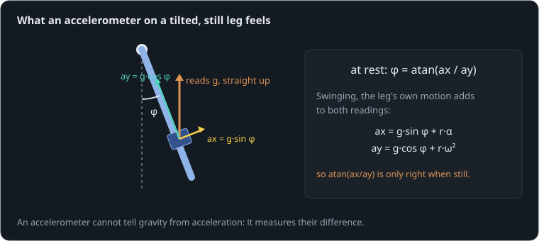

# Which way is down?

**By the end of this lesson you will be able to:**

- work out tilt from an accelerometer, and say when it is wrong;
- predict how far an integrated gyro drifts;
- blend the two with a complementary filter, and choose its time constant.

A balancing or walking robot must know which way is down, all the time, while it moves. It carries an IMU: an accelerometer and a gyro on one chip. Here a [leg](part:leg/leg) swings on its hip after a short [kick](part:leg/kick), carrying an [IMU](part:leg/imu) 18 cm below the hip, and a [tilt filter](part:leg/filter) turns its readings into three estimates of the leg's angle.

## Gravity, measured sideways

Held still, an accelerometer feels gravity (it reads 9.81 m/s² pointing up, the push that keeps it from falling). Tilt it by φ, and that reading splits between its two axes: g·sin φ across the leg and g·cos φ along it. The tilt follows from their ratio:



```text
φ = atan(ax / ay)
```

**Worked example.** Still, the IMU reads ax = 2.0 m/s² and ay = 9.6 m/s²: φ = atan(2.0/9.6) = atan(0.208) = 0.205 rad, or 11.8°.

```sim-quiz
id: acc-tilt
kind: numeric
question: A still IMU reads ax = {ax} m/s² and ay = 9.6 m/s². What tilt does that give, in degrees?
vary: { ax: { min: 0.5, max: 6, step: 0.1 } }
answer_expr: atan(ax / 9.6) * 57.29578
tolerance: 2%
unit: °
hint: φ = atan(ax/ay), then × 57.3 for degrees.
explain: "φ = atan(ax/ay): for 2.0 m/s², **11.8°**. Each review asks with a different reading."
concepts: [accelerometer-tilt]
```

## Swinging fools the accelerometer

An accelerometer cannot tell gravity from acceleration; it measures their difference. On a swinging leg, the IMU also accelerates: along the swing (r·α) and toward the hip (r·ω²). Those add to both readings, and atan(ax/ay) then reports an angle that is simply wrong. A motor's vibration adds a buzz on top (the tuning scene later has a slider for it).

```sim-quiz
id: why-wrong
question: The leg is swinging fastest as it passes straight down (φ = 0). Why might the accelerometer's tilt still be wrong, just before it gets there?
options:
  - { text: "The leg is slowing its swing (α ≠ 0), and that acceleration adds to ax", correct: true, feedback: "Yes: r·α appears in ax exactly as a tilt would." }
  - { text: "The accelerometer is broken", feedback: "It reads correctly. It is the formula atan(ax/ay) that assumes the leg is still." }
  - { text: "Gravity changes during a swing", feedback: "Gravity is constant. The IMU's own acceleration is what changes." }
explain: "Tilt from the accelerometer assumes the only acceleration is gravity. Any motion breaks that: the tilt is right on average, but wrong from moment to moment."
concepts: [accelerometer-tilt]
```

## The gyro: good at motion, bad at memory

A gyro measures turning rate, ω. Adding it up over time (integrating) follows every swing faithfully, because rate is exactly what changes during motion. But every gyro has a small **bias**: a reading when still that should be zero. Integrated, a constant bias becomes an angle error that grows without end:

```text
error = bias × t
```

**Worked example.** Our cheap MEMS gyro has a bias of {{param imu.bias | 0.05 rad/s}} (3°/s). After 6 s, the integrated angle is off by 0.3 rad (17°); after a minute, by 3 rad.

```sim-quiz
id: drift
kind: numeric
question: A gyro with a bias of {b} rad/s is integrated for 10 s. How far off is the angle, in radians?
vary: { b: { min: 0.002, max: 0.2, step: 0.002 } }
answer_expr: b * 10
tolerance: 2%
unit: rad
hint: error = bias × time.
explain: "error = bias × t: 0.05 rad/s for 10 s is **0.5 rad**. Calibrating the bias at startup helps, but it wanders with temperature."
concepts: [gyro-drift]
```

## Watching both

After a kick at 0.2 s the leg swings about ±0.3 rad and settles within a few seconds.

```sim-quiz
id: predict-both
kind: predict
scene: swing
question: At 6 s, the leg hangs still at 0 rad. Which estimate is right?
options:
  - { text: "The accelerometer's: still, it reads gravity again", correct: true, feedback: "Yes. The gyro's is off by about 0.3 rad." }
  - { text: "The gyro's: it followed every motion", feedback: "It did, but its bias has added 0.05 rad every second." }
  - { text: "Both", feedback: "The gyro has drifted by about 0.3 rad." }
explain: "Still, the accelerometer reads gravity and is right; the gyro has drifted by bias × 6 s ≈ 0.3 rad. During the swing it was the other way round."
```

```sim-scene
id: swing
system: leg
title: Accelerometer and gyro, each alone
caption: "The leg swings after a kick at 0.2 s (motor vibration switched off here, to show the motion's effect alone). The accelerometer's tilt is wrong while it moves; the integrated gyro follows every swing but drifts away steadily."
set: { imu.vibration: 0 }
camera: { preset: front, zoom: 1.3 }
run: { duration_s: 6.0, frame_rate: 120 }
script: swing.rhai
plots: [leg.shaft.angle, filter.accel_tilt, filter.gyro_tilt]
show: [trails]
expect:
  - { observe: filter.accel_tilt, reduce: max, window: [0.45, 0.5], max: 0.06, why: "At the top of the swing (leg at 0.31 rad) the accelerometer reads almost no tilt: the swing's own acceleration cancels most of gravity's sideways part." }
  - { observe: filter.accel_tilt, reduce: max, window: [0.2, 0.33], min: 0.25, why: "During the kick (leg still near 0) the kick's acceleration reads as a tilt of about 0.3 rad." }
  - { observe: filter.gyro_tilt, reduce: mean, window: [5.5, 6.0], min: 0.26, max: 0.32, why: "Integrated bias: 0.05 rad/s × about 5.8 s ≈ 0.29 rad of drift, with the leg at rest at 0." }
  - { observe: leg.shaft.angle, reduce: max, window: [0.3, 1.0], min: 0.28, max: 0.34, why: "The kick swings the leg to about 0.31 rad." }
```

At the top of the swing, with the leg at 0.31 rad, the accelerometer read only {{value scene=swing observe=filter.accel_tilt reduce=max window=0.45..0.5 | 0.04 rad}}; during the kick, with the leg still near 0, it read about 0.3 rad. By the end the gyro had drifted to {{value scene=swing observe=filter.gyro_tilt reduce=mean window=5.5..6 | 0.29 rad}} while the leg hung still.

```sim-quiz
id: during-swing
question: "At 0.45 s, at the top of the first swing, which estimate is closer to the leg's true angle?"
options:
  - { text: "The gyro's", correct: true, feedback: "Yes: only about 0.02 rad off, while the accelerometer's hardly registers the swing." }
  - { text: "The accelerometer's", feedback: "At that moment it reads about 0.01 rad, while the leg is at 0.31." }
  - { text: "Both are equally good", feedback: "Compare the charts at 0.4 s: they are far apart." }
moment: 0.45
explain: "During motion the gyro wins; at rest the accelerometer wins. The next part combines them."
concepts: [gyro-drift, accelerometer-tilt]
```

## The complementary filter

The two fail in opposite ways: the accelerometer is right over long times and wrong over short ones; the gyro is right over short times and wrong over long ones. A **complementary filter** takes each where it is good, and a time constant τ says where "short" ends and "long" begins.

```sim-quiz
id: which-when
question: "In a complementary filter, which sensor should decide how the estimate changes during a quick swing lasting a fraction of a second?"
options:
  - { text: "The gyro", correct: true, feedback: "Yes: over short times its drift is negligible and it follows motion exactly." }
  - { text: "The accelerometer", feedback: "Over short times it is fooled by the motion itself." }
  - { text: "Their average, equally", feedback: "An equal average would take half of each sensor's errors." }
concepts: [complementary-filter]
```

It integrates the gyro, and gently pulls the result toward the accelerometer's tilt:

```text
dθ/dt = gyro + (θ_acc − θ) / τ
```

Motions faster than τ come from the gyro; the slow truth comes from the accelerometer. A constant gyro bias leaves only a small steady error, bias × τ.

**Worked example.** τ = {{param filter.time_constant | 0.5 s}}, bias 0.05 rad/s: the estimate settles about 0.05 × 0.5 = 0.025 rad off, instead of drifting away.

```sim-quiz
id: tau-choice
question: A worse gyro (bias 0.2 rad/s) sits behind a filter with τ = 1 s. What happens at rest, and what should change?
options:
  - { text: "It sits 0.2 rad off (bias × τ); shorten τ", correct: true, feedback: "Yes: a shorter τ trusts the accelerometer sooner. Too short, though, and the swing's errors leak through." }
  - { text: "It drifts away without limit; lengthen τ", feedback: "The accelerometer's pull stops the drift; the error settles at bias × τ, which grows with τ." }
  - { text: "It is exact: the filter removes the bias", feedback: "It limits it to bias × τ; it does not remove it." }
explain: "Steady error = bias × τ = 0.2 × 1 = 0.2 rad. Shorten τ to about 0.15 s: 0.03 rad at rest, while still riding through the swings on the gyro."
concepts: [complementary-filter]
```

```sim-scene
id: blend
system: leg
title: Tuning the filter
caption: "A worse gyro (bias 0.2 rad/s) behind a filter with τ = 1 s. At rest the estimate sits 0.19 rad off. Tune τ."
set: { imu.bias: 0.2, filter.time_constant: 1.0 }
camera: { preset: front, zoom: 1.3 }
run: { duration_s: 6.0, frame_rate: 120 }
script: swing.rhai
plots: [leg.shaft.angle, filter.tilt]
show: [trails]
sliders:
  - { parameter: filter.time_constant, label: "Filter time constant τ", min: 0.02, max: 2, step: 0.01, unit: s }
  - { parameter: imu.bias, label: "Gyro bias", min: 0, max: 0.3, step: 0.01, unit: rad/s }
  - { parameter: imu.vibration, label: "Vibration", min: 0, max: 4, step: 0.1, unit: m/s² }
hints:
  - "Shorten τ to 0.05 s: accurate at rest, but the swing's accelerometer errors come through."
  - "Lengthen it to 2 s: smooth through the swing, but the bias error doubles."
challenge:
  goal: "Tune **τ** so the estimate is within **0.03 rad** of the truth at rest (5–6 s) and never reads above **0.34 rad** during the swing (the leg peaks at 0.31)."
  hint: "At rest the error is bias × τ; during the swing a short τ lets the accelerometer's errors in. Somewhere near 0.1–0.2 s both are met."
  win:
    - { observe: filter.tilt, reduce: peak, window: [5.0, 6.0], max: 0.03, why: "Within 0.03 rad of 0 at rest." }
    - { observe: filter.tilt, reduce: max, window: [0.3, 1.0], max: 0.34, why: "Never above 0.34 rad during the swing." }
expect:
  - { observe: filter.tilt, reduce: mean, window: [5.0, 6.0], min: 0.17, max: 0.2, why: "With τ = 1 s the bias leaves bias × τ ≈ 0.19 rad of error at rest." }
```

```sim-equation
id: filter-error
scene: blend
show: "steady error = bias × τ"
expr: b * tau
result: { symbol: error, unit: rad }
terms:
  b: { symbol: bias, unit: rad/s, param: imu.bias }
  tau: { symbol: τ, unit: s, param: filter.time_constant }
caption: The error the filter settles to when the leg is still. Move τ and watch the estimate's resting level follow.
```

## Putting it in your own words

```sim-reflect
id: explain-filter
prompt: A teammate's balancing robot uses only the accelerometer for tilt and wobbles when it moves; switching to only the gyro, it slowly falls over. Explain both failures and the fix, in a few sentences.
model_answer: "An accelerometer measures gravity minus the robot's own acceleration, so tilt from atan(ax/ay) is right only when the robot is still: every motion, and vibration, corrupts it, which makes the controller react to false tilts and wobble. A gyro measures turning rate, and integrating it follows motion well, but its small bias integrates into an angle error that grows without limit, so the robot slowly balances around a wrong 'upright' and falls. A complementary filter integrates the gyro for fast changes and pulls the result toward the accelerometer's tilt with time constant τ, so the bias only leaves an error of bias × τ and brief accelerations are ignored. τ is chosen between the two: shorter for a worse gyro, longer for more motion and vibration."
key_points:
  - { idea: "Accelerometer: right when still, fooled by motion and vibration", cues: ["accelerometer", "motion", "vibration", "still", "gravity"] }
  - { idea: "Gyro: follows motion, but its bias integrates into drift", cues: ["gyro", "bias", "drift", "integrat"] }
  - { idea: "Complementary filter: gyro short-term, accelerometer long-term", cues: ["complementary", "blend", "short", "long", "filter"] }
  - { idea: "τ trades bias error (bias × τ) against motion errors", cues: ["τ", "time constant", "bias × τ", "trade", "tune"] }
```

## Going further

This part is optional.

**Kalman filters.** A Kalman filter is a complementary filter that chooses its blend from how noisy each sensor is, and can estimate the gyro's bias as it goes, removing even the bias × τ error.

**Why it barely saw the swing.** For a freely swinging leg, α = −(m·g·r_c/J)·sin φ, so ax = g·sin φ·(1 − r·m·r_c/J). Our IMU sits at r = 0.18 m, and J/(m·r_c) = 0.2 m: the bracket is only 0.1, so the accelerometer registers a tenth of the tilt. At r = 0.2 m (the leg's centre of percussion) it would see none at all.

**Where to mount it.** The motion terms r·α and r·ω² grow with the IMU's distance from the pivot. Mounting it near the joint it measures (or near the robot's centre of mass) keeps the accelerometer honest for longer.

```sim-component
component: part.complementary_tilt
show: [summary, equations, tradeoffs]
```

## Key ideas

- Still, an accelerometer gives tilt from gravity: φ = atan(ax/ay). Moving, its own acceleration corrupts it.
- An integrated gyro follows motion but its bias drifts: **error = bias × t**.
- A **complementary filter** uses the gyro over short times and the accelerometer over long ones.
- Its time constant τ trades the bias error (bias × τ) against letting motion errors through.
