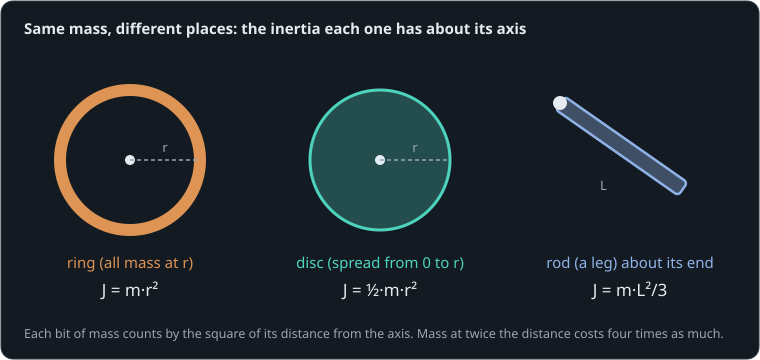

# Torque changes speed

**By the end of this lesson you will be able to:**

- predict how fast a torque spins up a shaft, from τ = J·α;
- estimate the inertia of a disc, a ring and a leg;
- explain why a robot's designers keep heavy parts close to its joints.

A robot leg's motor may have plenty of torque on paper, yet the leg still swings slowly. The reason is inertia: how hard a body is to set turning. Here it is on the simplest machine there is, a [flywheel](part:flywheel/wheel) pushed by a known [torque](part:flywheel/drive).

## Torque makes speed change

Before reading on, take a guess. You are not expected to know yet: guessing first makes the next paragraph easier to hold on to.

```sim-quiz
id: guess-double
pretest: true
question: A steady torque spins a flywheel for one second. The same torque now pushes a flywheel twice as heavy (same size, same shape) for one second. How fast does the heavy one end up turning?
options:
  - { text: "Half as fast", correct: true, feedback: "That is what the next paragraph shows." }
  - { text: "Just as fast, only later", feedback: "Keep this guess in mind and compare it with the next paragraph." }
  - { text: "A quarter as fast", feedback: "Keep this guess in mind and compare it with the next paragraph." }
concepts: [rotational-inertia]
```

A torque does not set a speed. It sets how quickly the speed **changes**, the angular acceleration α. How much acceleration a given torque buys depends on the body's **inertia** J:

```text
τ = J·α          (τ in N·m, J in kg·m², α in rad/s²)
```

Twice the inertia, half the acceleration. And while no torque acts, α = 0: the speed simply stays where it is.

**Worked example.** A torque of 0.02 N·m on a flywheel of J = 0.0002 kg·m² gives α = 0.02 / 0.0002 = 100 rad/s². After 2 s it turns at 200 rad/s.

Our flywheel is an aluminium disc, J = {{param wheel.inertia | 0.00013 kg·m²}}, pushed with a steady {{param push.step | 0.013 N·m}} for one second.

```sim-quiz
id: alpha
kind: numeric
question: A steady torque of {tau} N·m pushes our flywheel (J = 0.00013 kg·m²). What is its angular acceleration, in rad/s²?
vary: { tau: { min: 0.005, max: 0.03, step: 0.001 } }
given: { J: wheel.inertia }
answer_expr: tau / J
tolerance: 2%
unit: rad/s²
hints:
  - "Which of τ, J and α do you know, and which do you want?"
  - "τ = J·α, so α = τ / J."
  - "Divide the torque by 0.00013."
explain: "α = τ / J. For 0.013 N·m that is 0.013 / 0.00013 = **100 rad/s²**: the speed grows by 100 rad/s every second. Each review asks with a different torque."
```

## Watching it spin up

Before the scene plays, draw what you expect. The push starts at 0.1 s and stops at 1.1 s.

```sim-quiz
id: sketch-spin
kind: sketch
scene: spin-up
observe: wheel.shaft.speed
window: [0, 1.5]
range: [0, 150]
question: Sketch the flywheel's speed from 0 to 1.5 s. There is no friction at all.
explain: "A straight ramp while the torque pushes (constant α), then a flat line: with no torque, nothing changes the speed. Most people draw the speed falling after the push, because every real wheel they know has friction."
```

```sim-quiz
id: predict-speed
kind: predict
scene: spin-up
question: What speed will the flywheel reach by the end of the one-second push? (0.013 N·m on 0.00013 kg·m²)
observe: wheel.shaft.speed
reduce: mean
window: [1.2, 1.4]
tolerance: 3%
unit: rad/s
explain: "α = 100 rad/s² for 1 s gives **100 rad/s** (about 950 rpm), and it stays there after the push."
```

```sim-scene
id: spin-up
system: flywheel
title: A one-second push
caption: A steady 13 mN·m for one second, then nothing. With no friction, the flywheel keeps the speed it was given.
camera: { preset: iso, zoom: 1.4 }
run: { duration_s: 1.5, frame_rate: 60 }
script: spin-up.rhai
plots: [wheel.shaft.speed, push.torque]
show: [forces, power]
sliders:
  - { parameter: push.step, label: "Torque", min: 0.004, max: 0.03, step: 0.001, unit: "N·m" }
  - { parameter: wheel.inertia, label: "Flywheel inertia", min: 0.00005, max: 0.0005, step: 0.00001, unit: "kg·m²" }
hints:
  - "Double the torque: the ramp is twice as steep."
  - "Double the inertia: half as steep. The final speed is τ·t/J."
challenge:
  goal: "Set the **torque** so the flywheel ends the one-second push at **150 rad/s**."
  hint: "You need α = 150 rad/s² for one second. τ = J·α."
  win:
    - { observe: wheel.shaft.speed, reduce: mean, window: [1.2, 1.4], min: 145, max: 155, why: "Within 5 rad/s of 150 after the push." }
expect:
  - { observe: wheel.shaft.speed, reduce: mean, window: [1.2, 1.4], min: 98, max: 102, why: "α = τ/J = 0.013/0.00013 = 100 rad/s² for 1 s: 100 rad/s." }
  - { observe: wheel.shaft.speed, reduce: change, window: [1.15, 1.5], min: -0.01, max: 0.01, why: "No torque after the push and no friction: the speed stays constant." }
  - { observe: wheel.shaft.speed, reduce: mean, window: [0.55, 0.65], min: 48, max: 52, why: "Halfway through the push the speed is halfway: a straight ramp." }
```

The speed climbs in a straight line, {{value scene=spin-up observe=wheel.shaft.speed reduce=mean window=0.55..0.65 | 50 rad/s}} halfway through the push, and ends at {{value scene=spin-up observe=wheel.shaft.speed reduce=mean window=1.2..1.4 | 100 rad/s}}. Then it stays there.

```sim-equation
id: alpha-now
scene: spin-up
show: "α = τ / J"
expr: tau / J
result: { symbol: α, unit: rad/s² }
terms:
  tau: { symbol: τ, unit: N·m, observe: push.torque }
  J: { symbol: J, unit: kg·m², param: wheel.inertia }
caption: The acceleration at the playhead. Scrub past 1.1 s and it drops to zero, while the speed stays at 100 rad/s.
```

```sim-quiz
id: after-push
question: After 1.1 s the push stops. Why does the flywheel keep turning at 100 rad/s?
options:
  - { text: "Nothing acts on it to change its speed", correct: true, feedback: "Yes. Torque changes speed; with no torque (and no friction here), the speed stays the same." }
  - { text: "It is still slowing down, just too slowly to see", feedback: "Not in this model: there is no friction at all. The chart is perfectly flat.", remedy: needs-push }
  - { text: "The inertia keeps pushing it", feedback: "Inertia is not a push. It is how much a body resists a change of speed, in either direction.", remedy: needs-push }
moment: 1.3
explain: "With no torque, α = 0, so the speed does not change. Real wheels slow down because friction is a torque too; take it away and they would spin forever."
```

```sim-remedy
id: needs-push
misconception: "A turning thing needs a push to keep turning"
body: "Everyday wheels slow down because of **friction**, which is a torque working against them. The rule τ = J·α says a torque is needed to *change* the speed, in either direction, not to keep it. Remove every torque, as in this model, and the flywheel keeps its speed. Watch the torque chart go to zero at 1.1 s while the speed chart goes flat."
scene: spin-up
then: alpha
```

## Where the mass sits

Inertia is not just mass. It depends on how far the mass is from the axis: each bit of mass counts by the square of its distance.



```text
J = m·r²   (all mass at radius r, like a ring)
```

**Worked example.** A 0.1 kg foot at 0.3 m from a hip: J = 0.1 × 0.3² = 0.009 kg·m². The same foot at 0.15 m (a shorter leg): 0.1 × 0.15² = 0.00225 kg·m², four times less for half the distance.

For shapes with spread-out mass, the same rule averages over every bit of it: a disc is ½·m·r², a rod swinging about one end m·L²/3.

```sim-quiz
id: ring-vs-disc
question: Our flywheel is a solid disc. Suppose the same 0.163 kg of aluminium were a thin ring of the same outer size. Its inertia would be…
options:
  - { text: "Twice the disc's", correct: true, feedback: "Yes: m·r² against ½·m·r². All of the ring's mass is at the rim." }
  - { text: "The same, since the mass is the same", feedback: "Mass alone does not decide inertia. The ring's mass is all at the largest radius, so it counts more." }
  - { text: "Half the disc's", feedback: "The other way round: the disc has mass near the centre, which counts for little." }
explain: "Ring: m·r². Disc: ½·m·r². Same mass and size, but the ring's mass is all far out, so its inertia is **twice** the disc's."
```

## Same mass, at the rim

The next scene runs our flywheel beside a ring of the same mass, with twice the inertia, under the same push.

```sim-quiz
id: predict-ring
kind: predict
scene: ring
question: Under the same one-second push, what speed will the ring reach?
options:
  - { text: "100 rad/s, like the disc", feedback: "Same torque, but twice the inertia." }
  - { text: "50 rad/s", correct: true, feedback: "Twice the inertia, half the acceleration: 50 rad/s." }
  - { text: "25 rad/s", feedback: "That would be four times the inertia, the ring at twice the radius." }
explain: "α = τ/J with J doubled: 50 rad/s² for one second gives **50 rad/s**."
```

```sim-scene
id: ring
system: flywheel
title: Disc and ring, same push
caption: "The purple curve is a ring of the same mass (twice the inertia): it reaches only half the speed."
companion: { label: "Ring, same mass (2 × J)", set: { wheel.inertia: 0.00026 }, mode: split }
camera: { preset: iso, zoom: 1.4 }
run: { duration_s: 1.5, frame_rate: 60 }
plots: [wheel.shaft.speed]
cues:
  - { at: 0.0, caption: "Same torque on both: a disc (left) and a ring of the same mass (right)" }
  - { at: 1.1, caption: "The push ends: the disc turns at 100 rad/s, the ring at 50" }
expect:
  - { observe: wheel.shaft.speed, reduce: mean, window: [1.2, 1.4], min: 98, max: 102, why: "The disc: 100 rad/s, as before." }
```

## Legs: mass at the end costs most

A leg is roughly a rod swinging about the hip, and its foot a mass at the end. Now put the ideas together and work one out.

```sim-quiz
id: leg-steps
kind: steps
question: "A leg is a 0.3 kg rod, 0.25 m long, swinging about the hip, with a 0.06 kg servo at its far end. What is its inertia about the hip?"
steps:
  - { prompt: "The rod about its end, m·L²/3", worked: "0.3 × 0.25² / 3 = 0.00625 kg·m²" }
  - { prompt: "The servo at the end, m·r²", answer: 0.00375, unit: "kg·m²", tolerance: 3% }
  - { prompt: "The whole leg", answer: 0.01, unit: "kg·m²", tolerance: 3% }
explain: "0.06 × 0.25² = **0.00375 kg·m²**, and 0.00625 + 0.00375 = **0.01 kg·m²**. The small servo, a fifth of the rod's mass, adds 60 % to the inertia, because it sits at the far end."
concepts: [inertia-distribution]
```

```sim-quiz
id: move-servo
kind: numeric
question: The designer moves that 0.06 kg servo up from 0.25 m to {r} m below the hip. What is the leg's inertia now, in kg·m²? (The rod stays at 0.00625 kg·m².)
vary: { r: { min: 0.03, max: 0.1, step: 0.01 } }
answer_expr: 0.00625 + 0.06 * r * r
tolerance: 2%
unit: kg·m²
hints:
  - "Only the servo's term changes."
  - "The servo's inertia is m·r² with its new r."
  - "Add 0.06 × r² to the rod's 0.00625."
explain: "At 0.05 m the servo adds only 0.06 × 0.05² = 0.00015 kg·m², so the leg is **0.0064 kg·m²**, 36 % less than before. The same motor now swings it 1.56 times faster."
concepts: [inertia-distribution]
```

This is why walking robots put their motors near the hips and drive the knees and ankles through belts or linkages: the motors' mass then costs almost nothing in inertia.

## Putting it in your own words

```sim-reflect
id: why-near-hip
prompt: A colleague wants to put the ankle motor right at the ankle, "because it is simpler". In a few sentences, explain what that costs the leg, using the ideas of this lesson.
model_answer: "The hip motor has to accelerate the leg's inertia, τ = J·α, so for the same motor the leg's acceleration is inversely proportional to J. Mass counts by the square of its distance from the hip, so an ankle motor at the far end adds far more inertia than the same motor near the hip: here a 0.06 kg servo at 0.25 m adds 60 %. The leg would swing more slowly, or need a bigger, heavier hip motor. Moving the motor up and driving the ankle through a belt or linkage keeps the leg light where it matters."
key_points:
  - { idea: "Acceleration is torque over inertia (τ = J·α)", cues: ["j·α", "j*a", "jα", "torque/inertia", "acceleration", "τ = j"] }
  - { idea: "Mass counts by the square of its distance", cues: ["square", "r²", "r^2", "distance", "far from", "at the end"] }
  - { idea: "So the leg swings more slowly, or needs a bigger hip motor", cues: ["slower", "bigger motor", "more torque", "larger motor", "heavier"] }
  - { idea: "Put motors near the hip and drive the joint remotely", cues: ["belt", "linkage", "near the hip", "move the motor", "cable"] }
```

## Going further

This part is optional.

**Energy.** Spinning stores energy ½·J·ω²: the flywheel at 100 rad/s holds ½ × 0.00013 × 100² = 0.65 J, exactly the work the torque did, τ × angle = 0.013 × 50 rad. Stopping it takes that energy back out, as heat in a brake or as charge through a motor.

**Off-centre axes.** A part turning about an axis that is not through its centre of mass adds m·d² to its own inertia (the parallel-axis rule): the foot's own small inertia plus 0.06 × 0.25².

```sim-compare
id: inertia-sweep
system: flywheel
study: inertia
title: Speed after the same push, four flywheels
caption: Each doubling of inertia halves the speed the one-second push reaches.
```

```sim-component
component: rotational.inertia
show: [summary, equations, tradeoffs]
```

## Key ideas

- A torque sets how fast the speed **changes**: τ = J·α. No torque, no change.
- **Inertia** J depends on where the mass is: each bit counts by the square of its distance from the axis.
- Ring m·r², disc ½·m·r², rod about its end m·L²/3.
- Heavy parts far from a joint slow it the most; keep motors close to the joints they drive.
