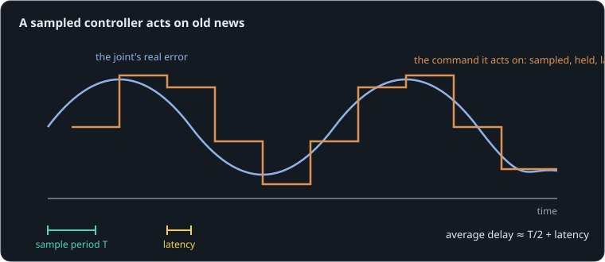

# It worked in simulation

**By the end of this lesson you will be able to:**

- work out the average delay a sampled, delayed controller adds;
- explain why delay turns a stable loop into an oscillating one;
- choose between a faster loop, less latency and softer gains.

A controller is tuned on a fast simulation and works beautifully. On the real robot, where commands go over a serial bus and servos update at 50 Hz, the same gains make the leg shake. Here the arm from the PID lesson is run by [firmware](part:joint/firmware) that reads the [encoder](part:joint/encoder) and updates the [driver](part:joint/driver) only at its loop rate, after a delay.

## Sampled and held

Firmware runs in steps. Every period T = 1/f it reads the sensors, computes a command, and holds that command until the next step. Between steps the controller is blind: the arm moves on, the command does not. On average, the command it acts on is half a period old.

**Worked example.** At 1 kHz, T = 1 ms: the command is 0.5 ms old on average. At 50 Hz, T = 20 ms: 10 ms old.

```sim-quiz
id: half-period
kind: numeric
question: A servo's loop runs at {f} Hz. On average, how old is the command it is acting on, in milliseconds? (No other delay.)
vary: { f: { min: 20, max: 1000, step: 10 } }
answer_expr: 1000 / (2 * f)
tolerance: 3%
unit: ms
hint: Half a period, T/2 = 1/(2f).
explain: "T/2 = 1/(2f): at 50 Hz, **10 ms**; at 1 kHz, 0.5 ms. Each review asks with a different rate."
concepts: [loop-latency]
```

## Latency adds on top

Reading a sensor over a bus, computing, and sending the command out all take time. That **latency** adds straight on to the sampling delay. For a whole loop, the delay the arm feels is roughly:



```text
delay ≈ T/2 + latency
```

**Worked example.** A 50 Hz loop with 10 ms of bus latency: 10 + 10 = 20 ms. A robot whose leg commands take several serial round trips can easily reach 100 ms or more.

```sim-quiz
id: total-delay
kind: numeric
question: A leg servo loop runs at {f} Hz, and its commands take 12 ms to arrive over the bus. About how much delay does the joint feel, in milliseconds?
vary: { f: { min: 25, max: 500, step: 25 } }
answer_expr: 1000 / (2 * f) + 12
tolerance: 3%
unit: ms
hint: "delay ≈ T/2 + latency."
explain: "delay ≈ T/2 + latency: at 50 Hz, 10 + 12 = **22 ms**. Faster loops shrink the first term; only faster communication shrinks the second."
concepts: [loop-latency]
```

## Why delay shakes a joint

A controller pushes the arm toward the target according to where it saw the arm. With a delay, it sees where the arm **was**. If the arm has meanwhile swung past, the controller keeps pushing the old way, adding to the overshoot instead of braking it. When the delay is a sizable fraction of the arm's natural swing, each push arrives in step with the swing, as in resonance, and feeds it energy: the loop oscillates on its own.

```sim-quiz
id: predict-slow
kind: predict
scene: slow-loop
question: "The same gains that step cleanly at 1 kHz now run at 50 Hz with 10 ms of latency (about 20 ms of delay). What will the arm do?"
options:
  - { text: "Step cleanly, just a little later", feedback: "20 ms is a large fraction of this arm's swing: the pushes come too late." }
  - { text: "Oscillate strongly around the target and keep going", correct: true, feedback: "Yes. The late pushes feed the swing instead of braking it." }
  - { text: "Stop short and stay there", feedback: "That is what too little gain does. Here the gain is fine; the timing is not." }
explain: "The arm swings between about 0.44 and 1.34 rad, over and over, with gains that were well behaved at 1 kHz."
```

```sim-scene
id: slow-loop
system: joint
title: 50 Hz and 10 ms late
caption: "The target steps to 1 rad at 0.2 s. Firmware at 50 Hz with 10 ms of latency (solid) oscillates; the ghost is the same gains at 1 kHz with no latency."
set: { firmware.rate: 50, firmware.latency: 0.01 }
companion: { label: "1 kHz, no latency", set: { firmware.rate: 1000, firmware.latency: 0 }, mode: ghost }
camera: { preset: front, zoom: 1.4 }
run: { duration_s: 1.5, frame_rate: 250 }
script: slow.rhai
plots: [arm.shaft.angle]
show: [forces, trails]
sliders:
  - { parameter: firmware.rate, label: "Loop rate", min: 20, max: 1000, step: 10, unit: Hz }
  - { parameter: firmware.latency, label: "Latency", min: 0, max: 0.05, step: 0.001, unit: s }
  - { parameter: firmware.kp, label: "kp", min: 0.5, max: 8, step: 0.25, unit: "1/rad" }
  - { parameter: firmware.kd, label: "kd", min: 0, max: 0.3, step: 0.01, unit: "s/rad" }
hints:
  - "Raise the loop rate to 200 Hz: most of the oscillation goes."
  - "Or keep 50 Hz and soften the gains: kp 1, kd 0.1 is stable, but sags further under gravity."
challenge:
  goal: "Make the arm settle: between 1.0 and 1.5 s it must stay **between 0.8 and 1.05 rad**."
  hint: "Three levers: a faster loop, less latency, or softer gains. The first two cost hardware; the last costs stiffness."
  win:
    - { observe: arm.shaft.angle, reduce: max, window: [1.0, 1.5], max: 1.05, why: "No higher than 1.05 rad after 1 s." }
    - { observe: arm.shaft.angle, reduce: min, window: [1.0, 1.5], min: 0.8, why: "No lower than 0.8 rad after 1 s." }
expect:
  - { observe: arm.shaft.angle, reduce: max, window: [1.0, 1.5], min: 1.2, why: "Still swinging high after a second: the loop oscillates." }
  - { observe: arm.shaft.angle, reduce: min, window: [1.0, 1.5], max: 0.6, why: "…and low: about 0.44 to 1.34 rad." }
```

```sim-equation
id: delay-now
scene: slow-loop
show: "delay ≈ 1/(2f) + latency"
expr: 0.5 / f + L
result: { symbol: delay, unit: s }
terms:
  f: { symbol: f, unit: Hz, param: firmware.rate }
  L: { symbol: latency, unit: s, param: firmware.latency }
caption: The delay the arm feels, from the loop's rate and latency. Move the sliders and watch the oscillation grow or fade with it.
```

The arm never settles: after a second it is still swinging from {{value scene=slow-loop observe=arm.shaft.angle reduce=min window=1.0..1.5 | 0.443 rad}} to {{value scene=slow-loop observe=arm.shaft.angle reduce=max window=1.0..1.5 | 1.343 rad}}.

```sim-quiz
id: fix
question: You cannot change this robot's 50 Hz servo bus. What can you do in the controller?
options:
  - { text: "Lower the gains: a softer, slower joint that the delay cannot destabilize", correct: true, feedback: "Yes. It costs stiffness (more sag, slower response) but restores stability." }
  - { text: "Raise kd to brake harder", feedback: "Damping acts on old speed too; with this much delay, more kd can make it worse." }
  - { text: "Nothing: the loop rate decides everything", feedback: "Gains matter too: the loop tolerates a delay only up to some fraction of its own response time." }
explain: "Every loop has a gain beyond which its delay makes it oscillate. With delay fixed, lower gains (a slower response) stay stable. With gains fixed, a faster loop or lower latency does. You pay in stiffness, or in hardware."
concepts: [loop-latency]
```

## Simulate the loop you really have

Controllers tuned on an idealized, instant loop fail on hardware for exactly this reason. The fix starts in simulation: model the real loop rate, the real bus and servo latencies, and tune there. If the hardware's loop is slower than you would like, you will see the price, oscillation or softness, before the robot does.

## Putting it in your own words

```sim-reflect
id: why-shake
prompt: Your teammate's leg controller works in simulation but shakes on the robot, whose servos update at 50 Hz over a serial bus. Explain why in a few sentences, and what they should change, first in the simulation, then on the robot.
model_answer: "A sampled loop acts on measurements that are, on average, half a period old, plus the bus and computation latency: here about 20 ms, while the simulation assumed none. With that delay the controller pushes according to where the leg was; when the delay is a significant fraction of the leg's swing, its pushes arrive in step with the motion and feed it, so gains that were stable become oscillatory. They should first put the real loop rate and latency into the simulation and retune there. On the robot: raise the loop rate or cut latency (fewer round trips, a faster bus, control on the servo), or accept softer gains, which are stable but sag more and respond more slowly."
key_points:
  - { idea: "A sampled loop is delayed by about T/2 + latency", cues: ["t/2", "half", "sample", "latency", "delay"] }
  - { idea: "Delayed pushes arrive in step with the swing and feed it", cues: ["in step", "late", "feed", "old", "was", "phase"] }
  - { idea: "Model the real loop in simulation and retune", cues: ["simulat", "model", "real loop", "retune"] }
  - { idea: "Fixes: faster loop, less latency, or softer gains", cues: ["faster", "latency", "softer", "lower gain", "round trip"] }
```

## Going further

This part is optional.

**Phase lag.** A delay d shifts a swing of angular frequency ω by ω·d radians. A loop becomes unstable when its total phase lag reaches half a cycle at the frequency where its gain is one. A 20 ms delay costs about 72° at 10 Hz. As a rule of thumb, keep the loop's delay under a tenth of its response time.

**Prediction.** If you know the delay, a model can predict where the joint is now from where it was, and the controller can act on the prediction. Walking robots with slow servos rely on this.

```sim-component
component: robot.servo_firmware
show: [summary, equations, parameters]
```

## Key ideas

- A sampled controller acts on old information: about **T/2 + latency** behind.
- Delay turns stabilizing pushes into late ones that feed the swing: gains that were stable oscillate.
- Fixes: a faster loop, less latency, or softer gains (stable but slower and less stiff).
- Simulate the real loop rate and latency, and tune there.
