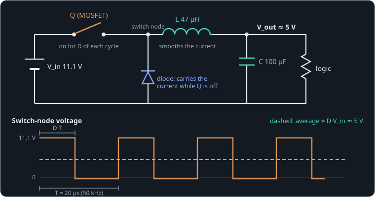

# Three subsystems on one board

**By the end of this lesson you will be able to:**

- explain why switching wastes far less power than a resistor;
- work out a buck converter's duty cycle;
- estimate how much heat an H-bridge makes from its motor current.

We will take this one idea at a time, with a short question after each.

## Meet the board

The board takes an 11 V [battery](part:board/battery) and does two jobs:

- the [regulator](part:board/regulator) makes a steady 5 V supply, the **rail**, for the logic chips;
- the [H-bridge](part:board/bridge) drives the [servo](part:board/servo) motor, in either direction.

```sim-quiz
id: board-jobs
question: Which part of the board makes the steady 5 V for the logic chips?
options:
  - { text: "The regulator", correct: true, feedback: "Yes. Its output is the 5 V rail." }
  - { text: "The H-bridge", feedback: "The H-bridge drives the motor; it does not make the 5 V." }
  - { text: "The battery", feedback: "The battery gives about 11 V; something has to bring it down to 5 V." }
explain: The regulator makes the 5 V rail; the H-bridge drives the motor. The rest of the lesson looks inside each.
```

## Why not a resistor?

The simplest way to get 5 V from 11 V is to drop the extra 6 V across a resistor. The trouble is that the resistor carries the full current, so it turns power into heat: P = V·I, with V the 6 V it drops.

**Worked example.** The logic draws 1 A at 5 V, which is 5 W of useful power. The resistor drops 11.1 − 5 = 6.1 V at the same 1 A, so it wastes 6.1 W as heat. More than half the battery's power is thrown away.

```sim-quiz
id: resistor-waste
kind: numeric
question: With the resistor method, the logic now draws 2 A. How much power does the resistor waste, in watts? (11.1 V in, 5 V out)
answer: 12.2
tolerance: 3%
unit: W
hint: The resistor still drops 6.1 V; multiply by the current.
explain: 6.1 V × 2 A = **12.2 W**, all of it heat. Double the current, double the waste.
```

## A switch wastes almost nothing

Now picture a **switch** instead. When it is fully on, there is almost no voltage across it. When it is fully off, almost no current goes through it. Either way, V·I is close to zero, so it barely warms up.

The board's switches are transistors (MOSFETs), turned fully on and fully off tens of thousands of times a second.

```sim-quiz
id: switch-loss
question: Why does a switch that is fully on waste very little power, even while it carries a large current?
options:
  - { text: "The voltage across it is almost zero, so V·I is tiny", correct: true, feedback: "Yes. Heat is V·I, and a closed switch has almost no V." }
  - { text: "Current does not make heat in a transistor", feedback: "It does; a transistor's small on-resistance still makes some heat. We come back to that at the end." }
  - { text: "The current is small", feedback: "The current can be large; it is the voltage across the switch that is small." }
explain: Power wasted is V·I in the switch. Fully on, V ≈ 0; fully off, I ≈ 0. Only the brief moments in between, and a small leftover resistance, make heat.
```

## Chopping and averaging

A switch alone gives either all 11 V or nothing. The trick is to switch fast and take the average. If the switch is on for a fraction D of each cycle, the **duty cycle**, the average voltage is D times the input:

```text
V_avg = D · V_in
```

**Worked example.** On for half of each cycle (D = 0.5), the average of 11.1 V is 5.55 V.

```sim-quiz
id: duty-cycle
kind: numeric
question: The battery gives 11.1 V and the rail should be 5 V. Ignoring losses, what fraction D of each cycle must the switch be on?
answer: 0.45
tolerance: 0.03
hint: The average is D·V_in. Set it equal to 5 V and solve for D.
explain: "D = V_out / V_in = 5 / 11.1 ≈ **0.45**. The real loop settles a little higher, to make up for the diode drop and resistances."
```

## Smoothing out the chopping

After the switch, the voltage is a fast square wave, jumping between 11 V and 0 V. An **inductor** and a **capacitor** after it smooth that out and keep only the average. Together they are called a buck converter. A controller on the board adjusts D until the output reads exactly 5 V.



Now watch it start up. The scene runs the whole board for 60 ms, in slow motion. Predict first.

```sim-quiz
id: sketch-rail
kind: sketch
scene: power-up
observe: regulator/c.p.voltage
range: [0, 6]
unit: V
question: "The regulator's switch chops 11 V on and off 50 000 times a second. Sketch what its output voltage does over the first 60 ms after power-up: drag across the chart."
explain: "The rail rises to 5 V within a few milliseconds and then stays flat, within 0.1 V, even when the bridge starts drawing current at 5 ms. The inductor and capacitor keep the average and remove almost all of the switching."
```

```sim-scene
id: power-up
system: board
title: Power-up, 60 ms in slow motion
caption: The rail rises to 5 V and holds; at 5 ms the bridge starts driving the servo at 80 % duty.
camera: { preset: iso }
run: { duration_s: 0.06, frame_rate: 4000 }
cues:
  - { at: 0.0, speed: 0.002, caption: "Buck regulator: the switch chops 11 V; the inductor and capacitor smooth it", highlight: [regulator/q, regulator/l] }
  - { at: 0.004, speed: 0.02 }
  - { at: 0.005, speed: 0.003, caption: "5 ms: the bridge starts switching at 20 kHz", highlight: [bridge] }
  - { at: 0.01, speed: 0.006 }
  - { at: 0.012, speed: 0.02 }
  - { at: 0.02, caption: "The servo spins up; the heatsink starts to warm", highlight: [servo/motor] }
  - { at: 0.045, caption: "Settled: 5 V within 1 %", pause: true }
plots: [regulator/c.p.voltage, servo/motor.shaft.speed]
show: [current, heat, power]
expect:
  - { observe: regulator/c.p.voltage, reduce: mean, window: [0.045, 0.06], min: 4.95, max: 5.05, why: "The regulator holds the rail at 5 V within 1 % once settled." }
  - { observe: regulator/c.p.voltage, reduce: max, window: [0.045, 0.06], max: 5.1, why: "The ripple left after the LC filter is small: the rail never rises above 5.1 V." }
  - { observe: regulator/c.p.voltage, reduce: min, window: [0.045, 0.06], min: 4.9, why: "…and never dips below 4.9 V, even with the bridge running." }
  - { observe: servo/motor.shaft.speed, reduce: mean, window: [0.045, 0.06], min: 1.0, why: "The bridge's 80 % command turns the servo." }
```

## Heat in the motor driver

The H-bridge uses the same kind of switches, four of them, to run the motor either way. They are not perfect: a fully-on MOSFET still has a small **on-resistance**, about 20 mΩ here. Two of them carry the motor current at any moment, so the heat is:

```text
P = I² · 2·R_on
```

**Worked example.** At 2 A: 2² × 2 × 0.02 = 0.16 W. Small, but it grows fast with current. That heat flows into the [heatsink](part:board/bridge/heatsink) and then to the air.

```sim-quiz
id: bridge-heat
question: The motor current doubles. By how much does the bridge's conduction heat change?
options:
  - { text: "It doubles", feedback: "Heat in a resistance goes as the square of the current: P = I²·R." }
  - { text: "It quadruples", correct: true, feedback: "Yes: I²·2R_on, so twice the current is four times the heat — a bit more, as R_on rises with temperature." }
  - { text: "It stays the same, because MOSFETs are switches", feedback: "A fully-on MOSFET still has its on-resistance, and current through it makes heat." }
explain: Conduction loss is I²·2R_on, so it scales with the square of the current. That is why motor drivers are sized for their peak current, not their average.
```

## In your own words

```sim-reflect
id: why-switch
prompt: In your own words, why is a switching regulator so much more efficient than a resistor dropping 11 V to 5 V?
model_answer: "A resistor drops the extra 6 V while carrying the full current, so it turns more than half the power into heat. A switch is always either fully on (almost no voltage across it) or fully off (almost no current through it), so it wastes very little; the inductor and capacitor then keep only the average of the chopped voltage. The remaining losses come from switching moments, on-resistance and the diode."
```

## Going further

This part is optional.

**The control loop.** The regulator's PI controller measures the rail and nudges the duty cycle up or down to hold it at 5 V, so the real D settles a little above 0.45, making up for the diode drop and resistances.

**Switching losses.** Besides on-resistance, a MOSFET wastes a little energy each time it switches, while it is briefly half on. That is why switching frequency is a trade-off: faster switching needs a smaller inductor but wastes more in each transition.

**A faster model.** Open the scene in the builder, select the heatsink and pin its temperature to a graph. Then swap the bridge for the averaged bridge from the library: it has the same ports and runs far faster, because it replaces the 20 kHz switching with its average.

```sim-component
component: electrical.mosfet
show: [summary, explanation, tradeoffs]
```

## Key ideas

- A resistor wastes the dropped voltage times the current; a **switch** wastes almost nothing.
- **Duty cycle:** switching on for a fraction D gives an average of D·V_in.
- The inductor and capacitor keep that average and remove the chopping.
- Conduction heat grows with the square of the current: I²·2R_on in an H-bridge.
