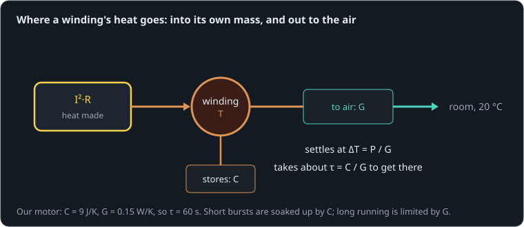

# A servo too hot to touch

**By the end of this lesson you will be able to:**

- work out how much heat a motor makes for a given torque;
- predict how hot its winding gets, and how quickly;
- tell a continuous rating from a peak one, and use both.

Hold a robot's leg still for a minute and its servos can get too hot to touch, though nothing is moving. Here our 12 V [motor](part:motor/motor) carries a steady [load](part:motor/load) of 25 mN·m for five minutes. Its [winding](part:motor/winding) stores heat and loses it through its [case to the air](part:motor/cooling).

## Torque costs heat

Current through the winding's resistance turns into heat at a rate P = I²·R. And torque needs current, τ = k·i. So the heat grows with the **square** of the torque: twice the torque, four times the heat. That is **Joule heating**, and in a small motor it is where most of the losses go.

**Worked example.** 25 mN·m needs i = 0.025/0.012 = 2.08 A. Through R = {{param motor.resistance | 2 Ω}} that makes 2.08² × 2 = 8.7 W of heat. Half the torque would make only 2.2 W.

```sim-quiz
id: heat
kind: numeric
question: Our motor (k = 0.012 N·m/A, R = 2 Ω) carries a steady {tau} N·m. How much heat does its winding make, in watts?
vary: { tau: { min: 0.005, max: 0.05, step: 0.005 } }
given: { k: motor.torque_constant, R: motor.resistance }
answer_expr: (tau / k) * (tau / k) * R
tolerance: 3%
unit: W
hints:
  - "First the current: τ = k·i."
  - "Then the heat: P = I²·R."
  - "i = τ/0.012, then i² × 2."
explain: "i = τ/k, P = i²·R. For 0.025 N·m: 2.08 A and **8.7 W**. Doubling the torque would quadruple it. Each review asks with a different load."
concepts: [joule-heating]
```

## Where the heat goes

Some of the heat warms the winding itself: its **heat capacity** C says how many joules raise it one kelvin. The rest flows out through the case into the air, faster the hotter the winding is: the **thermal conductance** G, in watts per kelvin of difference. The winding settles when everything it makes flows out:



```text
ΔT_final = P / G
```

**Worked example.** 8.7 W through G = {{param cooling.conductance | 0.15 W/K}}: ΔT = 8.7/0.15 = 58 K, so the winding would settle near 78 °C in a 20 °C room.

```sim-quiz
id: final-rise
kind: numeric
question: The winding makes {P} W, and G = 0.15 W/K. How many kelvin above the room will it settle?
vary: { P: { min: 1, max: 15, step: 0.5 } }
given: { G: cooling.conductance }
answer_expr: P / G
tolerance: 2%
unit: K
hint: "At the end, all the heat made flows out: P = G·ΔT."
explain: "ΔT = P/G: 8.7 W gives **58 K**. Better cooling (a fan, a heatsink, contact with the frame) raises G and lowers it."
concepts: [thermal-time-constant]
```

## How fast it heats

The heat capacity decides how long the winding takes to get there. It approaches its final temperature exponentially, with a **thermal time constant**:

```text
τ_th = C / G
```

**Worked example.** C = {{param winding.heat_capacity | 9 J/K}}, G = 0.15 W/K: τ_th = 60 s. After one minute it has made 63 % of its final rise, after three minutes 95 %.

```sim-quiz
id: sketch-heat
kind: sketch
scene: five-minutes
observe: winding.node.temperature
window: [0, 300]
range: [290, 400]
question: "Sketch the winding's temperature (in kelvin; 293 K is 20 °C) over the five minutes, for 8.7 W, G = 0.15 W/K and C = 9 J/K."
explain: "A curve that rises steeply, then bends over: by 60 s about two thirds of the way, and flattening by 300 s. It ends hotter than the 351 K (78 °C) the cold numbers predict, for a reason the next part explains."
```

```sim-scene
id: five-minutes
system: motor
title: Five minutes at a third of stall
caption: "The winding heats quickly at first, then more slowly as more heat escapes. The ghost carries 20 mN·m instead of 25 and settles much cooler."
companion: { label: "20 mN·m load", set: { load.torque: -0.02 }, mode: ghost }
camera: { preset: iso, zoom: 1.4 }
run: { duration_s: 300, frame_rate: 2 }
script: heat.rhai
plots: [winding.node.temperature]
show: [heat]
sliders:
  - { parameter: load.torque, label: "Load (negative: resists)", min: -0.04, max: -0.005, step: 0.001, unit: "N·m" }
  - { parameter: cooling.conductance, label: "Cooling G", min: 0.05, max: 0.6, step: 0.01, unit: "W/K" }
hints:
  - "Double the cooling: the final rise halves, and the time constant C/G halves too."
  - "Try 35 mN·m: the hot winding's resistance grows so fast that the temperature runs away."
challenge:
  goal: "Keep the winding under **100 °C (373 K)** after five minutes at the full 25 mN·m load, by improving the **cooling**."
  hint: "The rise is P/G. You need G large enough that it stays under 80 K, allowing for the hotter copper's higher resistance."
  win:
    - { observe: winding.node.temperature, reduce: final, window: [0, 300], max: 373.15, why: "Under 100 °C after five minutes." }
    - { observe: load.shaft.torque, reduce: peak, window: [100, 300], min: 0.0249, why: "Still carrying the full 25 mN·m." }
expect:
  - { observe: winding.node.temperature, reduce: mean, window: [59, 61], min: 334, max: 340, why: "After one time constant (60 s): about two thirds of the way up." }
  - { observe: winding.node.temperature, reduce: final, window: [0, 300], min: 388, max: 396, why: "After five minutes about 118 °C: hotter than P/G predicts with the cold resistance, because hot copper resists more." }
  - { observe: motor.p.current, reduce: mean, window: [290, 300], min: 2.3, max: 2.42, why: "The current creeps up from 2.08 A as the magnets weaken with heat (k falls)." }
```

The winding ended at {{value scene=five-minutes observe=winding.node.temperature reduce=final window=0..300 | 391 K}}: about 118 °C, past the 100 °C many small motors' insulation and magnets are rated for.

## Hot copper makes more heat

Copper's resistance rises about 0.39 % per kelvin, and the magnets weaken a little as they warm, so a hot motor needs slightly more current for the same torque. Both make more heat, which makes it hotter. Usually this just settles higher than the cold estimate (here 118 °C rather than 78 °C); pushed too far, it runs away.

```sim-quiz
id: hotter
question: "At 100 K above room temperature, how much has our winding's resistance grown, and what does that do to its heat at the same current?"
options:
  - { text: "About 39 % more resistance, so about 39 % more heat", correct: true, feedback: "Yes: 0.39 %/K × 100 K, and P = I²·R grows with R." }
  - { text: "It does not change: resistance is a fixed property", feedback: "Copper's resistance rises about 0.39 % for every kelvin." }
  - { text: "It falls, so the motor cools itself", feedback: "Metals resist more when hot, not less." }
explain: "R_hot = R·(1 + 0.0039 × ΔT): 2 Ω becomes 2.8 Ω at +100 K. The same current then makes 39 % more heat: the feedback that lifts the final temperature."
moment: 250
concepts: [joule-heating]
```

## Continuous and peak

A motor's **continuous rating** is the torque (or current) it can carry forever without its winding passing its limit: set by the cooling, G. Its peak rating is far higher, because for short bursts the heat capacity C soaks up the heat before much has to escape.

**Worked example.** At stall our motor draws 6 A: 72 W. The winding heats at 72/9 = 8 K per second, so it can stall for about 10 s before rising 80 K, and then needs minutes to cool.

```sim-quiz
id: stall-time
kind: numeric
question: Our motor stalls, making {P} W in its winding (C = 9 J/K). Roughly how long until it has risen 80 K, in seconds? (Short enough that little heat escapes.)
vary: { P: { min: 30, max: 100, step: 5 } }
given: { C: winding.heat_capacity }
answer_expr: C * 80 / P
tolerance: 3%
unit: s
hint: "With little escaping, all the heat raises the temperature: P·t = C·ΔT."
explain: "t = C·ΔT/P: at 72 W, 9 × 80/72 = **10 s**. A walking robot's knee takes short peaks many times a second; what matters then is the average heat, which must stay under the continuous rating."
concepts: [continuous-rating]
```

## Putting it in your own words

```sim-reflect
id: hold-hot
prompt: A teammate is surprised that a leg servo overheats while "just standing still". Explain in a few sentences, using this lesson's ideas, and suggest what to do.
model_answer: "Holding the leg against gravity needs torque, and torque needs current (τ = k·i), whether or not the joint moves. The current heats the winding at I²·R, which grows with the square of the torque, and with no motion none of the power becomes work. The winding settles where the heat made equals the heat that escapes, ΔT = P/G, after a few thermal time constants (C/G), and hot copper resists more, making it hotter still. They should reduce the holding torque (lighter leg, mass closer to the joint, a gearbox with more reduction, or a spring to carry gravity), improve cooling, or keep the average torque below the continuous rating, using the higher peak rating only for short bursts."
key_points:
  - { idea: "Holding still still needs torque, so current", cues: ["holding", "still", "torque", "current", "k·i"] }
  - { idea: "Heat is I²R: grows with torque squared", cues: ["i²r", "i^2", "i2r", "square", "joule"] }
  - { idea: "Settles at P/G after about C/G", cues: ["p/g", "time constant", "c/g", "settles", "cooling"] }
  - { idea: "Stay under the continuous rating; peaks only briefly", cues: ["continuous", "peak", "average", "rating", "reduce torque", "spring"] }
```

## Going further

This part is optional.

**Two time constants.** Real motors have at least two: the winding heats in its own copper within seconds to a minute, the case and mount over many minutes. A long-running robot can be fine for a minute and fail after ten.

**Derating.** Datasheet continuous ratings assume a room temperature (often 25 °C) and free air. Inside a warm robot body, or with the motor wrapped in plastic, G is smaller and the rating falls.

```sim-compare
id: load-sweep
system: motor
study: load
title: Winding temperature after five minutes, for four loads
caption: "Heat grows with the square of the load: 10 mN·m barely warms it, 25 mN·m passes 115 °C."
```

```sim-component
component: part.coreless_motor
show: [summary, equations, limits]
```

## Key ideas

- **Joule heating**: P = I²·R, so heat grows with the square of torque, moving or not.
- A winding stores heat in its **heat capacity** C and loses it through its **thermal conductance** G.
- It settles at ΔT = P/G, after a few **thermal time constants** C/G.
- The **continuous rating** is set by G; short peaks can go far higher because C soaks them up.
