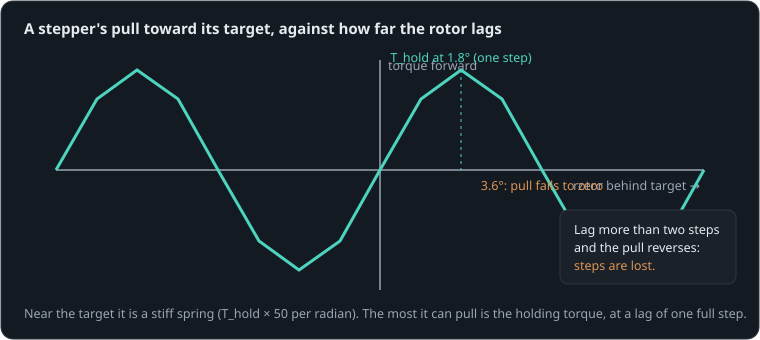

# The layer shift

**By the end of this lesson you will be able to:**

- explain how a stepper follows its driver, and what "losing steps" is;
- work out the fastest acceleration a stepper can give a load;
- plan a move that keeps it in step, with margin.

A 3D printer suddenly prints the rest of an object shifted sideways. Its motors kept stepping, its controller kept counting, and nothing noticed that the carriage had not moved. Here a [NEMA 17 stepper](part:stepper/stepper) is told, by a [move profile](part:stepper/move), to turn its [load](part:stepper/load) (the rotor plus a pulley and carriage) through exactly one revolution.

## A magnetic spring with teeth

A stepper's driver does not push the rotor directly. It sets currents in two coils, which point a magnetic field at a target angle. The toothed rotor is pulled toward that target like a stiff spring, with a torque that rises with the lag, peaks at the **holding torque** one full step (1.8°) behind, then falls again:



Two steps behind, the pull falls to zero; further, it pulls the rotor toward the **next** tooth instead. The rotor then drops back by four whole steps and has lost them. Nothing reports it: the driver only knows where it put the target.

```sim-quiz
id: lag
question: The rotor lags its target by 1.8° (one step). What is the stepper doing?
options:
  - { text: "Pulling as hard as it can: its holding torque", correct: true, feedback: "Yes: the sine peaks one step behind." }
  - { text: "Nothing: it has already lost the step", feedback: "The step is lost only past two steps of lag, where the pull falls to zero and reverses." }
  - { text: "Pulling gently: the lag is small", feedback: "One step is exactly where the pull is strongest." }
explain: "Up to one step of lag, more lag means more pull. Beyond one step the pull fades, and past two steps it reverses: the rotor slips to the next stable tooth."
concepts: [stepper-sync]
```

## Accelerating costs torque

To follow a target that speeds up, the rotor must speed up with it, and that takes torque J·α, on top of whatever the load resists with. The stepper can give at most its holding torque. So the fastest acceleration it can keep up with is:

```text
α_max = (T_hold − T_load) / J
```

**Worked example.** T_hold = {{param stepper.holding_torque | 0.45 N·m}}, the axis's friction T_load = {{param drag.torque | 0.05 N·m}}, J = {{param load.inertia | 0.0001054 kg·m²}}: α_max = 0.4/0.0001054 ≈ 3800 rad/s². Ask for more and the rotor falls behind.

```sim-quiz
id: amax
kind: numeric
question: A stepper with 0.45 N·m holding torque drives a load of {J} kg·m² against 0.05 N·m of friction. What is the fastest acceleration it can follow, in rad/s²?
vary: { J: { min: 0.00005, max: 0.0005, step: 0.00001 } }
answer_expr: (0.45 - 0.05) / J
tolerance: 3%
unit: rad/s²
hints:
  - "The stepper must supply the load's friction and J·α together."
  - "0.45 = 0.05 + J·α."
  - "α = 0.4 / J."
explain: "α_max = (T_hold − T_load)/J: for 0.0001054 kg·m², **3800 rad/s²**. Twice the load inertia halves it. Each review asks with a different load."
concepts: [acceleration-limit]
```

## Too fast a start

The move profile speeds the target up at a set acceleration, cruises at 60 rad/s, then slows to stop at exactly one turn. The scene asks for 5000 rad/s²; the companion for 2000.

```sim-quiz
id: predict-lost
kind: predict
scene: move
question: "The move asks for 5000 rad/s², more than the 3800 rad/s² the stepper can follow. Where does the rotor end up?"
options:
  - { text: "One full turn, a little late", feedback: "It cannot catch up once it has slipped: the target runs away." }
  - { text: "Hardly anywhere: it slips within milliseconds, then only buzzes", correct: true, feedback: "Yes. Once it slips, the target races ahead faster than the rotor can ever accelerate to." }
  - { text: "Half a turn", feedback: "Watch the angle chart: it falls behind almost at once." }
explain: "The rotor gets about 0.07 rad before the target is two steps ahead; then it falls back, buzzes in place, and ends about {{value scene=move observe=load.shaft.angle reduce=final window=0..0.4 | 0.126 rad}} from its start, while the driver thinks it turned 6.28 rad."
```

```sim-scene
id: move
system: stepper
title: One turn, started too hard
caption: "The target (driver) against the rotor. At 5000 rad/s² (solid) the rotor slips within milliseconds and stalls, buzzing; at 2000 rad/s² (purple) it follows the whole turn."
set: { move.accel: 5000 }
companion: { label: "2000 rad/s²", set: { move.accel: 2000 }, mode: split }
camera: { preset: iso, zoom: 1.5, yaw: 0.95, pitch: 0.45 }
run: { duration_s: 0.3, frame_rate: 1000 }
script: move.rhai
plots: [move.angle, load.shaft.angle]
phase: [{ x: move.angle, y: load.shaft.angle, title: "Rotor against target: on the diagonal while in step" }]
show: [forces]
sliders:
  - { parameter: move.accel, label: "Acceleration", min: 500, max: 20000, step: 100, unit: rad/s² }
  - { parameter: drag.torque, label: "Load friction", min: 0, max: 0.4, step: 0.01, unit: "N·m" }
hints:
  - "Find the largest acceleration that still completes the turn. How close is it to 3800 rad/s²?"
  - "Raise the load friction: the safe acceleration falls, as (T_hold − T_load)/J says."
expect:
  - { observe: load.shaft.angle, reduce: final, window: [0.0, 0.3], min: 0.1, max: 0.15, why: "At 5000 rad/s² the rotor slips at once and ends one electrical cycle (4 steps, 0.126 rad) from the start: the turn is lost." }
  - { observe: move.angle, reduce: final, window: [0.0, 0.3], min: 6.27, max: 6.29, why: "The driver completed its one turn (6.283 rad) regardless." }
```

```sim-equation
id: amax-live
scene: move
show: "α_max = (T_hold − T_load) / J"
expr: (T - L) / J
result: { symbol: α_max, unit: rad/s² }
terms:
  T: { symbol: T_hold, unit: N·m, param: stepper.holding_torque }
  L: { symbol: T_load, unit: N·m, param: drag.torque }
  J: { symbol: J, unit: kg·m², param: load.inertia }
caption: The fastest acceleration this stepper can follow with this load. Compare the move's acceleration slider with it.
```

```sim-quiz
id: why-buzz
question: After slipping, the rotor buzzes back and forth near where it stopped, while the target races away. Why can it never catch up?
options:
  - { text: "The target's teeth sweep past faster than the rotor could accelerate to follow any of them", correct: true, feedback: "Yes. Each passing tooth tugs it forward, then back: a buzz, never a catch." }
  - { text: "The driver turned off", feedback: "The driver keeps stepping; the rotor just is not following." }
  - { text: "Friction locks it", feedback: "Friction slows it, but the real problem is that each tooth's pull lasts only an instant." }
moment: 0.1
explain: "Once the target moves faster than the rotor can accelerate to match, each tooth passes before it can pull the rotor along. A stepper that has slipped needs the target to slow down (or stop) before it can lock on again."
concepts: [stepper-sync]
```

## Ramp it, with margin

A move that starts gently, speeding up at an acceleration the stepper can follow, keeps the rotor in step the whole way: the companion's 2000 rad/s² reaches the full turn. Even in this model the real limit is lower than 3800 rad/s² (about 2450): at speed, the rotor's damping (iron losses) takes torque too, 0.12 N·m at 60 rad/s. Real steppers need more margin still: their torque falls with speed (the driver runs out of voltage against the back-EMF), and they resonate at low speeds. Firmware usually plans for half the calculated limit.

## Design the move

```sim-task
id: fast-move
kind: design
scene: move
title: The fastest move that does not lose steps
goal: "Make the one-turn move **finish by 0.2 s** and **land exactly on one turn** (6.283 rad), without changing the motor or its load."
start: { move.accel: 20000 }
win:
  - { observe: load.shaft.angle, reduce: mean, window: [0.2, 0.3], min: 6.23, max: 6.33, why: "Lands on one turn, within 0.05 rad." }
  - { observe: load.shaft.angle, reduce: mean, window: [0.19, 0.2], min: 6.2, why: "Already there by 0.2 s." }
report:
  - { label: "Final angle", observe: load.shaft.angle, reduce: mean, window: [0.2, 0.3], unit: rad }
  - { label: "Angle at 0.2 s", observe: load.shaft.angle, reduce: mean, window: [0.19, 0.2], unit: rad }
hints:
  - "A move that starts too hard never finishes. What is the fastest acceleration this stepper can follow?"
  - "α_max ≈ 3800 rad/s². Stay under it, with some margin."
  - "Try about 2000 rad/s²: the move then finishes near 0.18 s. Here even 2500 slips: at speed, the rotor's damping takes torque too."
solution: { move.accel: 2000 }
```

## Putting it in your own words

```sim-reflect
id: layer-shift
prompt: Explain to a teammate, in a few sentences, why their 3D printer's print shifted sideways halfway through, and what settings would prevent it.
model_answer: "A stepper follows its driver's target like a stiff magnetic spring whose pull peaks at the holding torque one step behind and reverses past two. Accelerating the carriage takes torque J·α on top of friction; if a move asks for more acceleration (or meets more resistance) than the holding torque can supply, the rotor falls more than two steps behind and slips, losing whole steps. Nothing measures the real position, so the printer carries on shifted. Lower the acceleration (and jerk) limits to well under (T_hold − T_load)/J, reduce friction or moving mass, raise the driver current within the motor's rating, or add an encoder to detect slips."
key_points:
  - { idea: "The rotor follows the target like a spring, strongest one step behind", cues: ["spring", "holding torque", "one step", "follows", "target"] }
  - { idea: "Too much acceleration or load makes it fall behind and slip", cues: ["acceleration", "j·α", "too fast", "load", "slip", "lose steps"] }
  - { idea: "Open loop: nothing notices", cues: ["open loop", "open-loop", "no encoder", "doesn't know", "counts"] }
  - { idea: "Fix: ramp gently, with margin", cues: ["ramp", "lower acceleration", "margin", "jerk", "slower", "encoder"] }
```

## Going further

This part is optional.

**Microstepping.** Drivers can set the coil currents to in-between values, placing the target at a fraction of a step. It smooths motion and quiets the motor, but does not add torque: the pull still peaks one full step behind.

**Closed-loop steppers.** Adding an encoder lets the driver see the lag and never push the target more than a step ahead: effectively turning the stepper into a servo.

```sim-compare
id: accel-sweep
system: stepper
study: acceleration
title: Final angle for four accelerations
caption: "At 500 and 2000 rad/s² the stepper completes the turn; at 5000 and beyond it slips at once and ends near where it started."
```

```sim-component
component: part.stepper_motor
show: [summary, equations, tradeoffs]
```

## Key ideas

- A stepper's rotor follows the driver's target like a stiff magnetic spring, pulling hardest (its **holding torque**) one step behind.
- Past two steps of lag the pull reverses and whole steps are lost, unnoticed: the stepper is open loop.
- The fastest acceleration it can follow is α_max = (T_hold − T_load)/J.
- Ramp every move gently, with margin (about half α_max), and keep friction and moving mass down.
