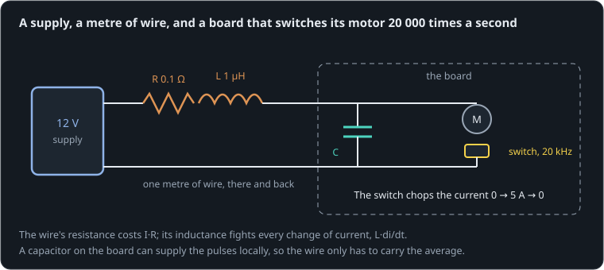

# The board that squeals

**By the end of this lesson you will be able to:**

- estimate the voltage a wire loses to its resistance, and the spike it makes from its inductance;
- explain why a switching driver needs a capacitor right at its power input;
- size that capacitor for a ripple you can accept.

A motor driver works on a short bench lead, but on a long one it squeals, resets, or blows a capacitor. Here a [bench supply](part:bus/bench) feeds a board through a metre of thin wire, with [resistance](part:bus/wire_r) and [inductance](part:bus/wire_l). On the board a [MOSFET](part:bus/switch) switches a [motor](part:bus/motor) at 20 kHz, 50 % duty, and a [bus capacitor](part:bus/cap) sits across the power input. The lead is modest: 0.1 Ω and 1 µH.

```sim-quiz
id: guess-culprit
pretest: true
question: On a long lead, what do you expect troubles a 20 kHz motor driver more?
options:
  - { text: "The lead's resistance", feedback: "Keep this guess in mind; the lesson compares the two." }
  - { text: "The lead's inductance", correct: true, feedback: "That is what the scene will show." }
  - { text: "Neither: a metre of wire is nothing", feedback: "Keep this guess in mind; the lesson compares the two." }
concepts: [wiring-drop]
```

## A wire is a resistor

Every wire has some resistance: thin and long means more. A metre of 22 AWG wire has about 0.05 Ω, so a metre-long lead, there and back, has 0.1 Ω. It costs voltage in proportion to the current, like a battery's internal resistance:

```text
V = I·R
```

**Worked example.** Carrying an average of 2.6 A, our lead of {{param wire_r.resistance | 0.1 Ω}} drops 0.26 V. At the 5 A the motor draws while the switch is on, 0.5 V.

```sim-quiz
id: dc-drop
kind: numeric
question: A lead of 0.1 Ω carries {I} A. How much voltage does the board lose to it?
vary: { I: { min: 1, max: 20, step: 1 } }
given: { R: wire_r.resistance }
answer_expr: I * R
tolerance: 2%
unit: V
hint: V = I·R.
explain: "V = I·R: 5 A through 0.1 Ω loses **0.5 V**. Thicker or shorter wire lowers it. Each review asks with a different current."
concepts: [wiring-drop]
```

## A wire is also an inductor

A loop of wire stores energy in its magnetic field, and fights any change in its current with a voltage: its **inductance** L, about 1 µH per metre of loop. It does not care how big the current is, only how fast it changes:

```text
V = L · di/dt
```

**Worked example.** Our switch turns 5 A on or off in about a microsecond. Through the lead's 1 µH that asks for 1e-6 × 5/1e-6 = 5 V: a dip when the current starts, a spike when it stops.

```sim-quiz
id: spike
kind: numeric
question: A lead of 1 µH has its current switched by {di} A in 1 µs. What voltage does its inductance produce?
vary: { di: { min: 1, max: 20, step: 1 } }
answer_expr: 1e-6 * di / 1e-6
tolerance: 2%
unit: V
hint: V = L·di/dt, with di/dt in amps per second.
explain: "V = L·di/dt: 5 A in 1 µs through 1 µH is **5 V**. Faster switching or more current means bigger spikes."
concepts: [wiring-drop]
```



## The chopped current

The motor's own inductance keeps its current nearly steady: while the switch is off, it flows round through the [freewheel diode](part:bus/diode). But the supply only delivers current while the switch is on. So the wire has to carry 5 A pulses, 20 000 times a second, starting and stopping within microseconds.

```sim-quiz
id: predict-bounce
kind: predict
scene: switching
question: "Suppose the board has only a small 1 µF capacitor at its input. What will the board's voltage do while the motor switches?"
options:
  - { text: "Stay near 12 V, dipping slightly while the switch is on", feedback: "That is what a large capacitor would give. With 1 µF, the wire's inductance dominates." }
  - { text: "Leap far below and above 12 V at every switching edge", correct: true, feedback: "Yes. The lead's inductance fights each change of current; with little capacitance to absorb it, the board's voltage swings by volts." }
  - { text: "Fall steadily as the motor speeds up", feedback: "The motor is held still here; the bouncing comes from the switching." }
explain: "With only 1 µF the board's voltage swings between about 9 and 15 V, and wider as the motor's current grows: dips when the switch turns on, spikes above the supply when it turns off. A 16 V capacitor or chip would be at its limit."
```

```sim-scene
id: switching
system: bus
title: Switching at 20 kHz through a long lead
caption: "The first quarter millisecond of switching. With 1 µF on the board (solid), the voltage leaps between about 9 and 15 V. The ghost has a 1000 µF bulk capacitor: the voltage barely moves, and the wire's current is smooth."
set: { cap.capacitance: 0.000001 }
companion: { label: "1000 µF bulk capacitor", set: { cap.capacitance: 0.001 }, mode: ghost }
camera: { preset: iso, zoom: 1.5 }
run: { duration_s: 0.00025, frame_rate: 2000000 }
script: switching.rhai
plots: [sense.reading]
show: [current]
sliders:
  - { parameter: cap.capacitance, label: "Bus capacitor", min: 0.000001, max: 0.002, step: 0.000001, unit: F }
hints:
  - "Try 100 µF: the swing shrinks, but the lead and capacitor still ring near 16 kHz, close to the switching."
  - "Try 1000 µF: the ring moves down to 5 kHz, well below the switching, and the wire carries a smooth current."
challenge:
  goal: "Choose a **bus capacitor** that keeps the board between **11 V and 12.5 V** throughout its last 0.1 ms."
  hint: "The ripple is roughly I·D·(1 − D)/(f·C), and the lead's resonance 1/(2π·√(L·C)) should sit well below 20 kHz."
  win:
    - { observe: sense.reading, reduce: min, window: [0.00015, 0.00025], min: 11.0, why: "Never below 11 V." }
    - { observe: sense.reading, reduce: max, window: [0.00015, 0.00025], max: 12.5, why: "Never above 12.5 V." }
expect:
  - { observe: sense.reading, reduce: max, window: [0.00015, 0.00025], min: 14.8, max: 16.0, why: "Switching off 4.5 A through 1 µH of lead with only 1 µF to catch it: the board spikes above 15 V." }
  - { observe: sense.reading, reduce: min, window: [0.00015, 0.00025], min: 8.5, max: 9.5, why: "Switching on, the lead cannot deliver the current fast enough: the board dips to about 9 V." }
  - { observe: motor.p.current, reduce: mean, window: [0.00015, 0.00025], min: 3.3, max: 4.0, why: "The motor's own inductance keeps its current nearly steady through the switching (about 3.6 A here), rising toward 5 A over the next milliseconds." }
```

The board swung up to {{value scene=switching observe=sense.reading reduce=max window=0.00015..0.00025 | 15.3 V}} and down to {{value scene=switching observe=sense.reading reduce=min window=0.00015..0.00025 | 9.1 V}} from a 12 V supply.

```sim-quiz
id: why-spike
question: The board's voltage rises above the 12 V supply every time the switch turns off. Where does the extra voltage come from?
options:
  - { text: "The lead's inductance: stopping its current makes a voltage that adds to the supply", correct: true, feedback: "Yes. The current in the lead cannot stop at once; it charges the small capacitor above 12 V." }
  - { text: "The motor's back-EMF", feedback: "The motor is held still here: no back-EMF at all." }
  - { text: "The supply overshoots", feedback: "The supply is steady at 12 V; the spike is on the board's side of the lead." }
moment: 0.0002
explain: "When the switch opens, the lead's current has nowhere to go but into the capacitor, charging it above the supply until the current reverses: L·di/dt in action."
concepts: [wiring-drop]
```

## A capacitor at the board

A capacitor right at the board's power input is a local reservoir. While the switch is on it supplies the pulse; while it is off the lead refills it. The lead then carries only the average current, which changes slowly, so its inductance hardly matters. That is **decoupling**: separating the fast pulses from the long wires.

How much the reservoir's voltage ripples depends on how much charge each pulse takes and how big it is:

```text
ΔV ≈ I·D·(1 − D) / (f·C)
```

**Worked example.** I = 5 A, D = 0.5, f = 20 kHz, C = 1000 µF: ΔV ≈ 5 × 0.25/(20 000 × 0.001) = 0.06 V. With 1 µF the formula says 60 V, which only means the capacitor is far too small and the lead's inductance takes over, as the scene showed.

```sim-quiz
id: size-cap
kind: numeric
question: "A driver switches 5 A at 20 kHz and 50 % duty. What capacitance keeps the ripple to {dv} V, in microfarads?"
vary: { dv: { min: 0.05, max: 1, step: 0.05 } }
answer_expr: 5 * 0.25 / (20000 * dv) * 1e6
tolerance: 3%
unit: µF
hint: "Solve ΔV = I·D·(1 − D)/(f·C) for C, then convert to µF."
explain: "C = I·D·(1 − D)/(f·ΔV): for 0.1 V, 5 × 0.25/(20 000 × 0.1) = 625 µF. Designers pick the next size up, low-ESR, and add small ceramics right at the switch for the fastest edges."
concepts: [decoupling]
```

## Putting it in your own words

```sim-reflect
id: why-cap
prompt: A teammate's motor driver resets when powered through a long lead but works on a short one. Explain what the lead does, and why a capacitor at the board's input fixes it.
model_answer: "The lead has resistance, which drops I·R, and inductance, which opposes changes of current with L·di/dt. A switching driver draws its current in fast pulses, so every switching edge asks the lead to change its current within microseconds, and the inductance answers with volts: dips when the switch turns on (enough to brown out the logic) and spikes above the supply when it turns off. A capacitor at the board's input supplies each pulse locally and is refilled between them, so the lead only carries the slowly changing average. It must be big enough for the ripple I·D·(1 − D)/(f·C) to be small, and its resonance with the lead should be well below the switching frequency."
key_points:
  - { idea: "Wire resistance drops I·R", cues: ["i·r", "ir", "resistance", "drop"] }
  - { idea: "Wire inductance makes L·di/dt spikes at every edge", cues: ["inductance", "l·di/dt", "di/dt", "spike", "edge"] }
  - { idea: "The driver draws current in fast pulses", cues: ["pulse", "pwm", "switching", "chopped", "20 khz"] }
  - { idea: "A local capacitor supplies the pulses; the wire carries the average", cues: ["capacitor", "reservoir", "local", "average", "decoupl"] }
```

## Going further

This part is optional.

**Where the capacitor sits matters.** A capacitor 10 cm away has 100 nH of its own leads, which is part of the same problem. Big electrolytics go near the input; small ceramics (100 nF–10 µF) go right at each switch and chip.

**Twisting the leads.** Inductance comes from the area of the current's loop. Running the supply and return wires together, twisted, cuts it several times.

```sim-compare
id: cap-sweep
system: bus
study: capacitor
title: The board's lowest and highest voltage after 3 ms of switching, for four capacitors
caption: "1 µF lets the lead ring between about 8 and 16 V; 1000 µF holds the board within 0.1 V."
```

```sim-component
component: electrical.capacitor
show: [summary, equations]
```

## Key ideas

- A lead costs I·R, and its **inductance** fights every change of current with L·di/dt.
- A switching driver draws current in fast pulses: long leads make dips and spikes at every edge.
- **Decoupling**: a capacitor at the board supplies the pulses, and the lead carries only the average.
- Size it for ripple ΔV ≈ I·D·(1 − D)/(f·C), and keep its resonance with the lead well below the switching frequency.
