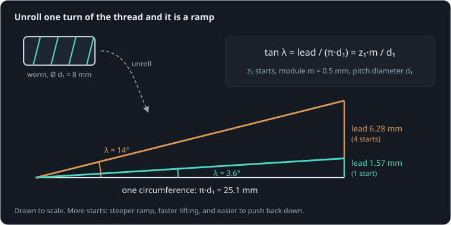
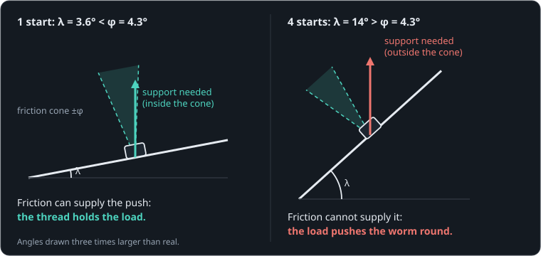

# The winch

Before the new idea, bring back the last one. Recalling it yourself, before looking, strengthens it more than rereading would.

```sim-recall
id: recall-motor
of: motor-torque-speed
prompt: "Without looking back: what did the motor lesson say about how a DC motor's torque and its speed are set? Write a few lines, then tick what you remembered."
key_points:
  - { idea: "Torque comes from current: τ = k·i", cues: ["k·i", "k*i", "ki", "current+torque"] }
  - { idea: "Spinning makes a back-EMF: e = k·ω", cues: ["back emf", "k·ω", "k*w", "generator"] }
  - { idea: "The supply is shared: V = R·i + k·ω", cues: ["budget", "r·i", "ri", "shared", "v = "] }
```


**By the end of this lesson you will be able to:**

- explain self-locking as a comparison between two angles;
- calculate a worm's lead angle from its size and number of starts;
- say what a designer gives up to get a gearbox that holds its load.

A small 12 V [motor](part:winch/motor) winds a rope onto a Ø20 mm [drum](part:winch/drum) through a 30:1 [worm gearbox](part:winch/gearbox), lifting a 2 kg [load](part:winch/load). At 1.2 s the power switches off. Before you watch, decide what you expect.

```sim-quiz
id: predict-hold
kind: predict
scene: lift-and-hold
question: The motor lifts the load for 1.2 s, then its supply switches off. What will the 2 kg load do?
options:
  - { text: "Fall back down freely", feedback: "Nothing but the gearbox stands between the load and the motor, so it could have — but it did not." }
  - { text: "Run back down slowly, braked by the motor", feedback: "That is what a spur gearbox does. This one did something else." }
  - { text: "Stay exactly where it stopped", correct: true, feedback: "It holds, with no brake anywhere in the system." }
explain: The drum creeps less than 2 thousandths of a radian in the 0.6 s after power-off. The rest of this lesson is about why.
```

```sim-scene
id: lift-and-hold
system: winch
title: Lift, then power off
caption: The supply switches off at 1.2 s. The worm holds the drum where it stopped.
camera: { preset: iso, zoom: 1.1 }
run: { duration_s: 2.0, frame_rate: 60 }
script: lift-and-hold.rhai
plots: [drum.shaft.speed, motor.p.current]
show: [forces, trails]
expect:
  - { observe: drum.shaft.speed, reduce: mean, window: [0.7, 1.1], min: 24.0, max: 29.0, why: "The drum lifts at about 26.6 rad/s: 30:1 below the motor, which runs where its torque meets the load's." }
  - { observe: drum.shaft.angle, reduce: change, window: [1.4, 2.0], min: -0.002, max: 0.002, why: "After power-off the drum creeps less than 2 mrad in 0.6 s: the worm is self-locking." }
```

The load stays put, and there is no brake anywhere in this system. The rest of the lesson finds out why, one step at a time.

## A worm is a screw

Look at the [worm](part:winch/gearbox/worm): it is a short shaft with a spiral thread, just like a screw. The [wheel](part:winch/gearbox/mesh) is like the nut that the screw drives. Each turn of the worm moves the wheel on by one tooth.

When the power is off, the load pulls on the rope and tries to turn the wheel backwards. The wheel's teeth then push **along** the worm's thread, trying to make the screw turn.

```sim-quiz
id: worm-is-screw
question: With the power off, the load tries to turn the wheel backwards. What does the wheel try to do to the worm?
options:
  - { text: "Push along the thread, trying to make the worm turn", correct: true, feedback: "Yes. Like pushing on a nut to try to turn its screw." }
  - { text: "Nothing: the wheel and worm are not touching", feedback: "They are meshed: the wheel's teeth sit in the worm's thread." }
  - { text: "Pull the worm sideways out of its bearings", feedback: "The bearings hold it in place; what matters is whether the push along the thread can make it turn." }
explain: The whole question is whether that push along the thread can turn the worm. Whether it can depends on how steep the thread is, and on friction.
```

## The thread's slope: the lead angle

Imagine unwrapping one turn of the thread and laying it flat. You get a ramp. Its length is once around the worm, and its rise is how far the thread advances in that turn. The ramp's angle is the **lead angle**, λ.



Some worms have several separate threads side by side, like the stripes on a candy cane. These are called **starts**. More starts means the thread climbs further in each turn.

```sim-quiz
id: steeper-ramp
question: Two worms have the same diameter. One has one start, the other four. Which unrolled ramp is steeper?
options:
  - { text: "The four-start worm", correct: true, feedback: "Yes. Its thread climbs four times as far in one turn, over the same length." }
  - { text: "The one-start worm", feedback: "Same length around, but the one-start thread climbs less in each turn, so its ramp is gentler." }
  - { text: "They are the same", feedback: "The length around is the same, but the rise per turn is not." }
explain: Same length around, four times the rise, so the four-start ramp is steeper. The figure shows both.
```

## Working out the lead angle

For a worm, the rise is set by the tooth size m (the module) and the number of separate threads z₁ (the "starts"), and the length by the worm's diameter d₁:

```text
tan λ = z₁·m / d₁
```

**Worked example.** A worm with two starts, m = 0.5 mm and d₁ = 10 mm: tan λ = 2 × 0.5 / 10 = 0.1, so λ = arctan 0.1 ≈ 5.7°.

```sim-quiz
id: lead-angle
kind: numeric
question: Our worm has one start (z₁ = 1), module m = 0.5 mm and diameter d₁ = 8 mm. What is its lead angle λ, in degrees?
answer: 3.58
tolerance: 0.15
unit: °
hint: z₁·m / d₁ = 0.5 / 8 = 0.0625. Now take the arctangent, as in the worked example.
explain: tan λ = 1 × 0.5 / 8 = 0.0625, so λ = arctan 0.0625 ≈ **3.58°**. A very gentle ramp.
```

## Friction's limit: the friction angle

Put a block on a ramp and tilt the ramp up slowly. At first the block stays put: friction holds it. At some angle it starts to slide. That steepest angle a block can rest on is the **friction angle**, φ, and it depends only on how grippy the two surfaces are (the friction coefficient μ):

```text
tan φ = μ
```

**Worked example.** Rubber on concrete has μ ≈ 0.7, so φ = arctan 0.7 ≈ 35°: a steep ramp before anything slides. Polished steel on oiled brass is far slipperier.

```sim-quiz
id: friction-angle
kind: numeric
question: Our worm is steel on lubricated brass, μ ≈ 0.07. What is the friction angle φ, in degrees?
answer: 4.0
tolerance: 0.15
unit: °
hint: Take the arctangent of 0.07.
explain: "φ = arctan 0.07 ≈ **4.0°**. A slippery pair, so only very gentle ramps hold."
```

## The rule: compare the two angles

Now the two ideas meet. The wheel's tooth sits on the worm's thread like the block on its ramp, and the load tries to push it down the slope.

- If the thread is **shallower** than the friction angle (λ ≤ φ), friction can hold, and the worm does not turn. This is **self-locking**.
- If it is steeper (λ > φ), the load slides down the thread, turning the worm backwards.



Our worm: λ ≈ 3.6°, and φ ≈ 4.0°. Just shallow enough, so it holds. Notice that the load's weight does not appear anywhere in the rule. A heavier load presses harder, and friction grows with it.

```sim-quiz
id: what-unlocks
question: Which single change would make this worm drive let the load run back down?
options:
  - { text: "Give the worm more starts", correct: true, feedback: "Yes: more starts means a longer lead, a steeper ramp and a larger λ. Past φ it back-drives." }
  - { text: "Hang a heavier load on the drum", feedback: "Self-locking compares two angles; neither depends on the load. A heavier load presses harder, and friction grows with it." }
  - { text: "Use a stickier material pair (higher μ)", feedback: "Higher μ raises the friction angle φ, which holds even better." }
  - { text: "Use a wheel with more teeth", feedback: "That raises the ratio, but the worm's thread — and so λ — stays the same." }
explain: Only λ and φ matter. λ grows with starts and module and shrinks with worm diameter; φ grows with friction. The load's size does not enter.
```

## The price: efficiency

The friction that holds the load does not switch off while lifting. The motor has to push the thread "up the ramp" against that same friction the whole time. With these numbers only about 45 % of the motor's power reaches the drum; the rest turns into heat in the gearbox.

```sim-quiz
id: worm-price
question: A designer makes the worm's friction lower (better oil) so it lifts more efficiently. What risk does that bring?
options:
  - { text: "The worm may stop holding the load", correct: true, feedback: "Yes. Lower μ means a smaller φ; if it drops below λ, self-locking is gone." }
  - { text: "The motor will draw more current", feedback: "Lower friction means less current for the same lift." }
  - { text: "The ratio will change", feedback: "The ratio is set by the starts and the teeth, not by friction." }
explain: "Holding and efficiency pull in opposite directions, because both come from the same friction. That is the central trade-off of a self-locking worm."
```

## More starts, less holding

A worm with more starts has a steeper thread. Four starts give λ ≈ 14°, far above φ. The scene below is the same winch with only that one number changed. It also changes the ratio: each worm turn now moves the wheel on four teeth, so the gearbox is 7.5:1 and the load lifts about four times faster (until it reaches the end stop at the drum).

```sim-quiz
id: predict-four
kind: predict
scene: four-starts
question: With four starts (λ ≈ 14°, well above φ ≈ 4°), what will the load do after the power goes off?
options:
  - { text: "Hold, like before", feedback: "λ is now well above φ: the cone cannot supply the push." }
  - { text: "Run the gearbox backwards, slowed only by the motor", correct: true, feedback: "It back-drives. The shorted motor then acts as a brake." }
explain: The drum settles near −33 rad/s after power-off — the speed at which the motor's generated current makes enough braking torque. That matches a back-driving efficiency of tan(λ − φ)/tan λ ≈ 0.69 at 7.5:1.
```

```sim-scene
id: four-starts
system: winch
title: Four-start worm
caption: Same winch, four starts (7.5:1). The load lifts faster, reaches the end stop at the drum, and runs the gearbox backwards once the power goes off.
set: { gearbox/mesh.worm_starts: 4 }
companion: { label: "One start (the original)", set: { gearbox/mesh.worm_starts: 1 }, mode: split }
camera: { preset: side, focus: gearbox }
run: { duration_s: 2.0, frame_rate: 60 }
cues:
  - { at: 0.0, speed: 0.04, caption: "Four starts: steeper thread, more efficient lifting" }
  - { at: 0.15, speed: 0.5 }
  - { at: 0.62, speed: 0.04, caption: "The load reaches the end stop at the drum: the motor stalls against it" }
  - { at: 0.7, speed: 0.01 }
  - { at: 0.79, speed: 0.04 }
  - { at: 0.9, speed: 0.5 }
  - { at: 1.15, speed: 0.04 }
  - { at: 1.2, caption: "Power off: the load now drives the worm", highlight: [gearbox/worm] }
  - { at: 1.4, speed: 0.5 }
plots: [drum.shaft.speed]
show: [forces, trails]
expect:
  - { observe: drum.shaft.speed, reduce: mean, window: [1.6, 2.0], max: -0.1, why: "With λ above φ the load back-drives the gearbox: the drum turns backwards after power-off." }
```

The load runs back down, turning the worm and the motor backwards. It does not fall freely: the motor, spun backwards, acts as a generator and a brake.

## Find the fault

Here is a real-world puzzle. This winch was rebuilt with a new wheel, and now it lets the load run back down when the power goes off, although it still has one start. Open its copy in the builder, find what changed, fix it, and let the simulation check your fix.

```sim-task
id: rebuilt-winch
kind: fault
scene: lift-and-hold
title: The rebuilt winch no longer holds
goal: "After the rebuild the winch still **lifts**, but after power-off the load **runs back down**. Find the parameter that changed and put it right, so that the drum holds still after power-off and the winch still lifts."
start: { gearbox/mesh.friction: 0.03 }
win:
  - { observe: drum.shaft.angle, reduce: change, window: [1.4, 2.0], min: -0.002, max: 0.002, why: "The drum holds still after power-off (less than 2 mrad of creep)." }
  - { observe: drum.shaft.speed, reduce: mean, window: [0.7, 1.1], min: 20, why: "The winch still lifts, at 20 rad/s or more at the drum." }
report:
  - { label: "Lift speed", observe: drum.shaft.speed, reduce: mean, window: [0.7, 1.1], unit: rad/s }
  - { label: "Drum creep after power-off", observe: drum.shaft.angle, reduce: change, window: [1.4, 2.0], unit: rad }
hints:
  - "Self-locking compares two angles. Which of them could a new wheel change?"
  - "The lead angle depends on the worm alone. The friction angle depends on the pair of materials in contact."
  - "Look at the worm-wheel mesh's friction coefficient: is its friction angle still above the 3.6° lead angle?"
solution: { gearbox/mesh.friction: 0.07 }
```

## Worm, spur or planetary?

The system file keeps a saved comparison of three gearboxes with the same 30:1 ratio: the worm, a spur train and a planetary set. Run it to see the trade-off in one table.

```sim-compare
id: gearboxes
system: winch
study: gearboxes
title: Three 30:1 gearboxes on the same winch
caption: Lift speed and motor current while lifting, and how far the drum turns in the 0.6 s after power-off.
```

The worm is the only one that holds. It is also the slowest and draws the most current. Designs that need both efficiency and holding usually pair an efficient gearbox with a separate brake.

```sim-reflect
id: hold-costs
prompt: A colleague wants a self-locking worm drive for a lift because "then we don't need a brake". In a few sentences, explain what that choice costs, using the ideas of this lesson.
model_answer: "Self-locking needs a lead angle below the friction angle, so the same friction that holds the load also resists lifting it: this worm passes only about 45 % of the motor's power to the drum. The motor must be larger and runs hotter, lifting is slower, and the holding depends on friction staying high — lubrication, wear and vibration can reduce it. An efficient gearbox plus a real brake is often the better design."
```

## Going further

This part is optional.

**Thread flanks.** A worm's thread faces are angled (the normal pressure angle φₙ, about 20°), which makes the contact slightly grippier than a flat ramp: tan φ = μ / cos φₙ. For μ = 0.07 that gives φ ≈ 4.3° instead of 4.0°.

**How strongly it back-drives.** When λ > φ, the fraction of the load's power that gets back through to the worm is η_back = tan(λ − φ) / tan λ. For four starts that is about 0.69, which sets how fast the load runs down against the motor's braking: about 33 rad/s at the drum in the scene.

```sim-component
component: rotational.worm_gear
show: [summary, explanation, equations, tradeoffs]
```

## Key ideas

- A worm is a screw; the load pushes along its thread like a block on a ramp.
- **Lead angle** λ: the thread's slope, tan λ = z₁·m / d₁.
- **Friction angle** φ: the steepest slope friction can hold, tan φ ≈ μ.
- **Self-locking when λ ≤ φ.** The load's size does not decide it.
- Holding costs efficiency: the friction that holds the load also resists lifting it.
